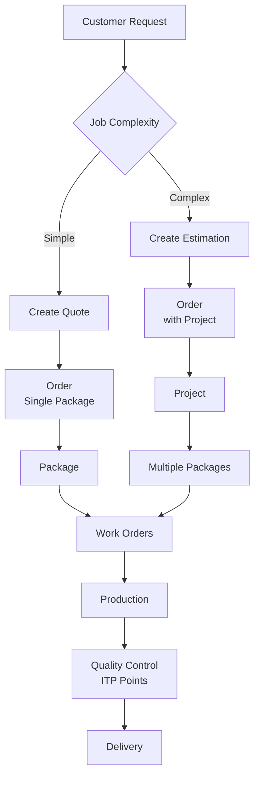

# Fab.OS Complete Workflow System Documentation
## Comprehensive Architecture for Order, Project, Work Order, and Quality Management

### Version: 1.0
### Date: January 2025
### Status: Implementation Ready

---

## Table of Contents

1. [Executive Summary](#1-executive-summary)
2. [System Architecture Overview](#2-system-architecture-overview)
3. [Order Management System](#3-order-management-system)
4. [Package Management](#4-package-management)
5. [Work Order System](#5-work-order-system)
6. [Work Centers & Resources](#6-work-centers--resources)
7. [Item Management Integration](#7-item-management-integration)
8. [ITP Quality Integration](#8-itp-quality-integration)
9. [Complete Entity Models](#9-complete-entity-models)
10. [Database Schema](#10-database-schema)
11. [Service Layer Architecture](#11-service-layer-architecture)
12. [Implementation Examples](#12-implementation-examples)
13. [UI/UX Workflows](#13-uiux-workflows)
14. [Industry Comparison](#14-industry-comparison)
15. [Implementation Roadmap](#15-implementation-roadmap)

---

## 1. Executive Summary

The Fab.OS Workflow System is a comprehensive steel fabrication management platform that provides end-to-end workflow automation from customer inquiry through production and delivery. Unlike traditional systems like Strumis and Tekla PowerFab, Fab.OS offers a flexible dual-path approach that efficiently handles both simple repairs and complex projects without forcing unnecessary overhead on smaller jobs.

### Key Differentiators

- **Dual-Path Workflow**: Separate paths for simple quotes vs complex estimations
- **Flexible Work Assignment**: Work orders can go to work centers or specific resources
- **Integrated Quality Control**: ITP points automatically triggered throughout workflow
- **Complete Item Integration**: Full integration with 7,107 catalog items
- **AS5131 Compliance**: Built-in traceability for Australian steel standards

### System Benefits

1. **Efficiency**: Simple jobs complete in 2-3 steps vs 10+ in competitor systems
2. **Scalability**: Same system handles $500 repairs and $5M projects
3. **Quality**: Automated ITP ensures compliance without manual tracking
4. **Flexibility**: Work centers configured for specific capabilities
5. **Visibility**: Real-time status from quote to delivery

---

## 2. System Architecture Overview

### 2.1 Core Workflow Paths



### 2.2 Entity Hierarchy

```
Customer
├── Quotes (Simple jobs)
│   └── Order
│       └── Package
│           └── Work Orders
└── Estimations (Complex projects)
    └── Order
        └── Project
            └── Packages
                └── Work Orders
```

### 2.3 Module Interactions

| Module | Function | Inputs | Outputs |
|--------|----------|--------|---------|
| **Quoting** | Quick pricing | Items, labor | Quote document |
| **Estimation** | Detailed costing | Packages, phases | Estimation with breakdowns |
| **Order Management** | Commercial tracking | Accepted quotes/estimations | Orders with terms |
| **Work Orders** | Production instructions | Package items/assemblies | Tasks for shop floor |
| **ITP/QDocs** | Quality control | Work order operations | Inspection records |
| **Inventory** | Material tracking | Work order requirements | Stock allocations |

---

## 3. Order Management System

### 3.1 Quote System (Simple Path)

**Purpose**: Quick pricing for simple jobs, repairs, and small projects

**Characteristics**:
- Single package only
- Quick turnaround (5-10 minutes to create)
- Simplified pricing structure
- Direct to work order capability

**Entity Structure**:
```csharp
public class Quote
{
    public int Id { get; set; }
    public string QuoteNumber { get; set; } // QTE-2025-0001
    public int CustomerId { get; set; }
    public DateTime QuoteDate { get; set; }
    public DateTime ValidUntil { get; set; }
    
    // Single package concept
    public string Description { get; set; }
    public decimal MaterialCost { get; set; }
    public decimal LaborHours { get; set; }
    public decimal LaborRate { get; set; }
    public decimal TotalAmount { get; set; }
    
    public QuoteStatus Status { get; set; } // Draft, Sent, Accepted, Rejected, Expired
    
    // Simple line items
    public virtual ICollection<QuoteLineItem> LineItems { get; set; }
    
    // Converts to order when accepted
    public int? OrderId { get; set; }
    public virtual Order? Order { get; set; }
}

public enum QuoteStatus
{
    Draft,
    Sent,
    Accepted,
    Rejected,
    Expired,
    Superseded
}
```

### 3.2 Estimation System (Complex Path)

**Purpose**: Detailed project planning with multiple packages and phases

**Characteristics**:
- Multiple packages allowed
- Detailed cost breakdowns
- Resource planning capability
- Phased delivery support

**Entity Structure**:
```csharp
public class Estimation
{
    public int Id { get; set; }
    public string EstimationNumber { get; set; } // EST-2025-0001
    public int CustomerId { get; set; }
    public string ProjectName { get; set; }
    public DateTime EstimationDate { get; set; }
    public DateTime ValidUntil { get; set; }
    public int RevisionNumber { get; set; }
    
    // Multiple packages for complex projects
    public virtual ICollection<EstimationPackage> Packages { get; set; }
    
    // Detailed breakdown
    public decimal TotalMaterialCost { get; set; }
    public decimal TotalLaborHours { get; set; }
    public decimal TotalLaborCost { get; set; }
    public decimal OverheadPercentage { get; set; }
    public decimal MarginPercentage { get; set; }
    public decimal TotalAmount { get; set; }
    
    public EstimationStatus Status { get; set; }
    
    // Converts to Order + Project when accepted
    public int? OrderId { get; set; }
    public virtual Order? Order { get; set; }
}

public class EstimationPackage
{
    public int Id { get; set; }
    public int EstimationId { get; set; }
    public string PackageName { get; set; }
    public string Description { get; set; }
    public int SequenceNumber { get; set; }
    
    public decimal MaterialCost { get; set; }
    public decimal LaborHours { get; set; }
    public decimal PackageTotal { get; set; }
    
    public virtual Estimation Estimation { get; set; }
}
```

### 3.3 Order Entity (Unified)

**Purpose**: Commercial commitment tracking for both simple and complex jobs

```csharp
public class Order
{
    public int Id { get; set; }
    public string OrderNumber { get; set; } // ORD-2025-0001
    public int CustomerId { get; set; }
    public OrderSource Source { get; set; } // FromQuote, FromEstimation
    
    // Links to source
    public int? QuoteId { get; set; }
    public int? EstimationId { get; set; }
    
    // Customer references
    public string? CustomerPONumber { get; set; }
    public string? CustomerReference { get; set; }
    
    // Commercial details
    public decimal TotalValue { get; set; }
    public string PaymentTerms { get; set; } // NET30, COD, etc.
    public DateTime OrderDate { get; set; }
    public DateTime? RequiredDate { get; set; }
    
    // For simple orders: direct package
    public virtual Package? DirectPackage { get; set; }
    
    // For complex orders: project container
    public virtual Project? Project { get; set; }
    
    public OrderStatus Status { get; set; }
    public virtual ICollection<Invoice> Invoices { get; set; }
}

public enum OrderSource
{
    FromQuote,
    FromEstimation,
    Direct
}

public enum OrderStatus
{
    Confirmed,
    InProgress,
    OnHold,
    Complete,
    Cancelled,
    Invoiced,
    Paid
}
```

---

## 4. Package Management

### 4.1 Package Concept

Packages represent major deliverables or stages within a project. They contain all items, assemblies, and work required for that deliverable.

```csharp
public class Package
{
    public int Id { get; set; }
    public string PackageNumber { get; set; } // PKG-2025-0001
    public string PackageName { get; set; } // "Building C", "Mezzanine Floor"
    public string Description { get; set; }
    
    // Links
    public int? OrderId { get; set; } // Direct link for simple orders
    public int? ProjectId { get; set; } // Via project for complex orders
    
    // Content
    public decimal TotalWeight { get; set; } // Tons
    public decimal TotalValue { get; set; }
    public PackageStatus Status { get; set; }
    
    // Schedule
    public DateTime? PlannedStartDate { get; set; }
    public DateTime? PlannedEndDate { get; set; }
    public DateTime? ActualStartDate { get; set; }
    public DateTime? ActualEndDate { get; set; }
    
    // Items and assemblies in this package
    public virtual ICollection<PackageItem> PackageItems { get; set; }
    public virtual ICollection<PackageAssembly> PackageAssemblies { get; set; }
    
    // Work orders created from this package
    public virtual ICollection<WorkOrder> WorkOrders { get; set; }
    
    // ITP if quality control required
    public int? PackageITPId { get; set; }
    public virtual PackageITP? ITP { get; set; }
}

public class PackageItem
{
    public int Id { get; set; }
    public int PackageId { get; set; }
    public int CatalogueItemId { get; set; } // From 7,107 catalog items
    
    public decimal Quantity { get; set; }
    public string Unit { get; set; } // EA, LENGTH, SHEET
    public string? RequiredOperations { get; set; } // "CUT,DRILL,PAINT"
    public string? Notes { get; set; }
    
    public virtual Package Package { get; set; }
    public virtual CatalogueItem CatalogueItem { get; set; }
}

public class PackageAssembly
{
    public int Id { get; set; }
    public int PackageId { get; set; }
    public int AssemblyId { get; set; } // From Assembly table
    
    public int Quantity { get; set; }
    public string? Notes { get; set; }
    
    public virtual Package Package { get; set; }
    public virtual Assembly Assembly { get; set; }
}
```

---

## 5. Work Order System

### 5.1 Work Order Types

Work orders are categorized based on the type of work being performed:

1. **Parts Processing**: Working on raw inventory items (cutting, drilling, forming)
2. **Assembly Building**: Creating assemblies from components
3. **Mixed**: Both processing and assembly work
4. **Finishing**: Painting, galvanizing, coating
5. **Quality Control**: Inspection and testing only

### 5.2 Work Order Entity

```csharp
public class WorkOrder
{
    public int Id { get; set; }
    public string WorkOrderNumber { get; set; } // WO-2025-0001
    public int PackageId { get; set; }
    public WorkOrderType Type { get; set; }
    
    // Assignment options
    public int? WorkCenterId { get; set; } // Assigned to work center
    public int? PrimaryResourceId { get; set; } // Assigned to specific person
    
    // Priority and scheduling
    public WorkOrderPriority Priority { get; set; }
    public DateTime? ScheduledStartDate { get; set; }
    public DateTime? ScheduledEndDate { get; set; }
    public decimal EstimatedHours { get; set; }
    public decimal ActualHours { get; set; }
    
    // Status tracking
    public WorkOrderStatus Status { get; set; }
    public string? Barcode { get; set; } // For shop floor scanning
    
    // What we're working on
    public virtual ICollection<WorkOrderInventoryItem> InventoryItems { get; set; }
    public virtual ICollection<WorkOrderAssembly> Assemblies { get; set; }
    
    // How we're working on them
    public virtual ICollection<WorkOrderOperation> Operations { get; set; }
    
    // Resources assigned
    public virtual ICollection<WorkOrderResource> AssignedResources { get; set; }
    public virtual ICollection<WorkOrderMachine> AssignedMachines { get; set; }
    
    // Quality control
    public virtual ICollection<PackageITPPoint> ITPPoints { get; set; }
    public bool HasHoldPoints { get; set; }
    
    // Navigation
    public virtual Package Package { get; set; }
    public virtual WorkCenter? WorkCenter { get; set; }
    public virtual Resource? PrimaryResource { get; set; }
}

public enum WorkOrderType
{
    PartsProcessing,
    AssemblyBuilding,
    Mixed,
    Finishing,
    QualityControl
}

public enum WorkOrderStatus
{
    Created,
    Scheduled,
    Released,
    InProgress,
    OnHold,
    Complete,
    Cancelled
}

public enum WorkOrderPriority
{
    Low,
    Normal,
    High,
    Urgent
}
```

### 5.3 Work Order Item Selection

```csharp
public class WorkOrderInventoryItem
{
    public int Id { get; set; }
    public int WorkOrderId { get; set; }
    public int PackageItemId { get; set; }
    public int CatalogueItemId { get; set; }
    
    public decimal RequiredQuantity { get; set; }
    public decimal IssuedQuantity { get; set; }
    public decimal ProcessedQuantity { get; set; }
    public string Unit { get; set; }
    
    public string RequiredOperations { get; set; } // "CUT,DRILL,PAINT"
    public ItemProcessStatus Status { get; set; }
    
    // Traceability
    public string? HeatNumber { get; set; }
    public string? Certificate { get; set; }
    public int? InventoryItemId { get; set; }
    
    public virtual WorkOrder WorkOrder { get; set; }
    public virtual PackageItem PackageItem { get; set; }
    public virtual CatalogueItem CatalogueItem { get; set; }
}

public class WorkOrderAssembly
{
    public int Id { get; set; }
    public int WorkOrderId { get; set; }
    public int PackageAssemblyId { get; set; }
    public int AssemblyId { get; set; }
    
    public int QuantityToBuild { get; set; }
    public int QuantityCompleted { get; set; }
    public AssemblyBuildStatus Status { get; set; }
    
    // Component tracking
    public virtual ICollection<AssemblyComponent> RequiredComponents { get; set; }
    
    public virtual WorkOrder WorkOrder { get; set; }
    public virtual PackageAssembly PackageAssembly { get; set; }
    public virtual Assembly Assembly { get; set; }
}
```

### 5.4 Work Order Operations

```csharp
public class WorkOrderOperation
{
    public int Id { get; set; }
    public int WorkOrderId { get; set; }
    public int SequenceNumber { get; set; }
    
    public string OperationCode { get; set; } // "CUT", "DRILL", "WELD", "PAINT"
    public string Description { get; set; }
    
    // What this operation applies to
    public int? InventoryItemId { get; set; }
    public int? AssemblyId { get; set; }
    
    // Requirements
    public string? RequiredSkill { get; set; }
    public int? RequiredSkillLevel { get; set; }
    public string? RequiredMachine { get; set; }
    public int? RequiredWorkCenterId { get; set; }
    
    // Quality gates
    public bool RequiresInspection { get; set; }
    public InspectionType? InspectionType { get; set; }
    public int? LinkedITPPointId { get; set; }
    
    // Tracking
    public OperationStatus Status { get; set; }
    public decimal EstimatedHours { get; set; }
    public decimal ActualHours { get; set; }
    public DateTime? StartedAt { get; set; }
    public DateTime? CompletedAt { get; set; }
    
    public virtual WorkOrder WorkOrder { get; set; }
    public virtual WorkOrderInventoryItem? InventoryItem { get; set; }
    public virtual WorkOrderAssembly? Assembly { get; set; }
}
```

---

## 6. Work Centers & Resources

### 6.1 Work Center Management

Work centers represent physical or logical areas where work is performed, with specific capabilities and resources.

```csharp
public class WorkCenter
{
    public int Id { get; set; }
    public string Code { get; set; } // "WC-CUT", "WC-WELD", "WC-PAINT"
    public string Name { get; set; } // "Cutting Bay", "Welding Shop"
    public string? Description { get; set; }
    public WorkCenterType Type { get; set; }
    
    // Capabilities - what this work center can handle
    public bool CanProcessParts { get; set; }
    public bool CanBuildAssemblies { get; set; }
    public bool CanDoFinishing { get; set; }
    public bool CanDoQualityControl { get; set; }
    
    // Capacity
    public decimal DailyCapacityHours { get; set; } // 16 hours (2 shifts)
    public int MaxConcurrentJobs { get; set; }
    public decimal EfficiencyFactor { get; set; } // 0.85 = 85% efficiency
    
    // Location
    public string? Building { get; set; }
    public string? Area { get; set; }
    
    // Cost
    public decimal HourlyRate { get; set; } // Overhead cost per hour
    
    // Resources and equipment
    public virtual ICollection<WorkCenterResource> Resources { get; set; }
    public virtual ICollection<WorkCenterMachine> Machines { get; set; }
    public virtual ICollection<WorkCenterOperation> SupportedOperations { get; set; }
    
    public bool IsActive { get; set; }
}

public enum WorkCenterType
{
    Cutting,
    Drilling,
    Machining,
    Welding,
    Forming,
    Blasting,
    Painting,
    Assembly,
    QualityControl,
    Packaging,
    General // Can do multiple operations
}

public class WorkCenterOperation
{
    public int Id { get; set; }
    public int WorkCenterId { get; set; }
    public string OperationCode { get; set; }
    public string OperationName { get; set; }
    public OperationType Type { get; set; }
    public decimal SetupTime { get; set; } // Hours
    public decimal CycleTime { get; set; } // Hours per unit
    
    public virtual WorkCenter WorkCenter { get; set; }
}
```

### 6.2 Resource (Labor) Management

```csharp
public class Resource
{
    public int Id { get; set; }
    public string EmployeeCode { get; set; } // "EMP-001"
    public string FirstName { get; set; }
    public string LastName { get; set; }
    public string FullName => $"{FirstName} {LastName}";
    public ResourceType Type { get; set; }
    public string JobTitle { get; set; } // "Senior Welder", "CNC Operator"
    
    // Skills and qualifications
    public string SkillLevel { get; set; } // "Expert", "Intermediate", "Junior"
    public virtual ICollection<ResourceSkill> Skills { get; set; }
    public virtual ICollection<ResourceCertification> Certifications { get; set; }
    
    // Availability
    public string Shift { get; set; } // "Day", "Night", "Rotating"
    public decimal StandardHourlyRate { get; set; }
    public decimal OvertimeHourlyRate { get; set; }
    public int StandardWeeklyHours { get; set; } // 40
    
    // Assignment
    public int? PrimaryWorkCenterId { get; set; }
    public virtual WorkCenter? PrimaryWorkCenter { get; set; }
    
    // Current workload
    public virtual ICollection<WorkOrderResource> WorkOrderAssignments { get; set; }
    
    public bool IsActive { get; set; }
    public DateTime? HireDate { get; set; }
}

public class ResourceSkill
{
    public int Id { get; set; }
    public int ResourceId { get; set; }
    public string SkillCode { get; set; } // "MIG", "TIG", "PLASMA"
    public string SkillName { get; set; }
    public int ProficiencyLevel { get; set; } // 1-5
    public DateTime? CertifiedDate { get; set; }
    public DateTime? ExpiryDate { get; set; }
    public string? CertificateNumber { get; set; }
    
    public virtual Resource Resource { get; set; }
}

public class Machine
{
    public int Id { get; set; }
    public string MachineCode { get; set; } // "MCH-PLASMA-01"
    public string Name { get; set; }
    public string? Manufacturer { get; set; }
    public string? Model { get; set; }
    public MachineType Type { get; set; }
    public int? WorkCenterId { get; set; }
    
    // Capacity
    public decimal HourlyRate { get; set; } // Operating cost
    public decimal MaxCapacity { get; set; }
    public string CapacityUnit { get; set; } // "mm/min", "pieces/hour"
    
    // Capabilities
    public decimal? MaxThickness { get; set; } // mm
    public decimal? MaxWidth { get; set; } // mm
    public decimal? MaxLength { get; set; } // mm
    public string? Capabilities { get; set; } // JSON of specific capabilities
    
    // Maintenance
    public MaintenanceStatus Status { get; set; }
    public DateTime? LastMaintenanceDate { get; set; }
    public DateTime? NextMaintenanceDate { get; set; }
    public int? MaintenanceHourInterval { get; set; }
    
    public bool IsActive { get; set; }
    public virtual WorkCenter? WorkCenter { get; set; }
}
```

### 6.3 Resource Assignment

```csharp
public class WorkOrderResource
{
    public int Id { get; set; }
    public int WorkOrderId { get; set; }
    public int ResourceId { get; set; }
    
    public DateTime AssignedDate { get; set; }
    public decimal PlannedHours { get; set; }
    public decimal ActualHours { get; set; }
    public string Role { get; set; } // "Primary", "Helper", "Inspector"
    
    // Time tracking
    public virtual ICollection<TimeEntry> TimeEntries { get; set; }
    
    public virtual WorkOrder WorkOrder { get; set; }
    public virtual Resource Resource { get; set; }
}

public class TimeEntry
{
    public int Id { get; set; }
    public int WorkOrderResourceId { get; set; }
    public DateTime StartTime { get; set; }
    public DateTime? EndTime { get; set; }
    public decimal Hours { get; set; }
    public string? Notes { get; set; }
    public TimeEntryStatus Status { get; set; } // Draft, Approved, Rejected
    
    public virtual WorkOrderResource WorkOrderResource { get; set; }
}
```

---

## 7. Item Management Integration

### 7.1 Catalog Integration

The system integrates with 7,107 pre-defined catalog items covering all standard steel products used in Australia/New Zealand.

```csharp
public class CatalogueItem
{
    public int Id { get; set; }
    public string ItemCode { get; set; } // "PP350MS-001"
    public string Description { get; set; }
    public string Category { get; set; } // "Plates", "Beams", "Pipes"
    public string Material { get; set; } // "Mild Steel", "Stainless Steel"
    public string? Profile { get; set; } // "150UB", "100SHS"
    
    // Dimensions
    public decimal? Length_mm { get; set; }
    public decimal? Width_mm { get; set; }
    public decimal? Thickness_mm { get; set; }
    public decimal? Diameter_mm { get; set; }
    
    // Weight
    public decimal? Mass_kg_m { get; set; } // kg per meter
    public decimal? Weight_kg { get; set; } // Total weight per unit
    
    // Surface area for coating calculations
    public decimal? SurfaceArea_m2_per_m { get; set; }
    
    // Specifications
    public string? Standard { get; set; } // "AS/NZS 3678"
    public string? Grade { get; set; } // "250", "350"
    public string? Finish { get; set; } // "Black", "Galvanized"
    
    // Supply
    public string? SupplierCode { get; set; }
    public string Unit { get; set; } // "EA", "LENGTH", "SHEET"
    
    public bool IsActive { get; set; }
}
```

### 7.2 Assembly Management

```csharp
public class Assembly
{
    public int Id { get; set; }
    public string AssemblyCode { get; set; } // "PF-001"
    public string Description { get; set; } // "Portal Frame Type 1"
    public AssemblyType Type { get; set; }
    public int? JobId { get; set; } // NULL for global templates
    
    // Assembly properties
    public decimal? TotalWeight { get; set; } // kg
    public decimal? Length { get; set; } // mm
    public decimal? Width { get; set; } // mm
    public decimal? Height { get; set; } // mm
    
    // Manufacturing info
    public decimal? FitUpHours { get; set; }
    public decimal? WeldingHours { get; set; }
    public decimal? TotalHours { get; set; }
    public string? DrawingNumber { get; set; }
    
    // Components (BOM)
    public virtual ICollection<AssemblyComponent> Components { get; set; }
    
    // Can be nested
    public virtual ICollection<AssemblySubAssembly> SubAssemblies { get; set; }
    
    public bool IsTemplate { get; set; } // Reusable global assembly
    public bool IsActive { get; set; }
}

public class AssemblyComponent
{
    public int Id { get; set; }
    public int AssemblyId { get; set; }
    public int? CatalogueItemId { get; set; }
    
    public decimal Quantity { get; set; }
    public string Unit { get; set; }
    public string? Notes { get; set; }
    
    public virtual Assembly Assembly { get; set; }
    public virtual CatalogueItem? CatalogueItem { get; set; }
}

public enum AssemblyType
{
    Fabricated,
    Welded,
    Bolted,
    Mixed
}
```

### 7.3 Inventory Integration

```csharp
public class InventoryItem
{
    public int Id { get; set; }
    public int CatalogueItemId { get; set; }
    public int WarehouseId { get; set; }
    public string LocationCode { get; set; } // "A1-B2-C3"
    
    // Stock details
    public string? LotNumber { get; set; }
    public string? HeatNumber { get; set; } // AS5131 traceability
    public string? CertificateNumber { get; set; }
    
    // Quantities
    public decimal OriginalLength { get; set; } // mm
    public decimal CurrentLength { get; set; } // mm (after cuts)
    public decimal Quantity { get; set; } // For count items
    
    // Status
    public InventoryStatus Status { get; set; }
    public int? ReservedForWorkOrderId { get; set; }
    
    // Dates
    public DateTime ReceivedDate { get; set; }
    public DateTime? LastStocktakeDate { get; set; }
    
    public virtual CatalogueItem CatalogueItem { get; set; }
    public virtual Warehouse Warehouse { get; set; }
}

public class MaterialAllocation
{
    public int Id { get; set; }
    public int WorkOrderId { get; set; }
    public int InventoryItemId { get; set; }
    public int CatalogueItemId { get; set; }
    
    public decimal AllocatedQuantity { get; set; }
    public decimal IssuedQuantity { get; set; }
    public decimal ConsumedQuantity { get; set; }
    public AllocationStatus Status { get; set; }
    
    public DateTime AllocationDate { get; set; }
    public DateTime? IssueDate { get; set; }
    public string? IssuedBy { get; set; }
    
    public virtual WorkOrder WorkOrder { get; set; }
    public virtual InventoryItem InventoryItem { get; set; }
    public virtual CatalogueItem CatalogueItem { get; set; }
}
```

---

## 8. ITP Quality Integration

### 8.1 ITP Template System

Inspection Test Plans (ITPs) define quality control points throughout the fabrication process, ensuring AS5131 compliance.

```csharp
public class ITPTemplate
{
    public int Id { get; set; }
    public string TemplateCode { get; set; } // "ITP-STRUCT-001"
    public string TemplateName { get; set; } // "Structural Steel ITP"
    public string ApplicableStandard { get; set; } // "AS/NZS 5131", "AS 4100"
    public string? Description { get; set; }
    public ProjectType ApplicableProjectType { get; set; }
    
    // Template activities/inspection points
    public virtual ICollection<ITPActivity> Activities { get; set; }
    
    public bool IsActive { get; set; }
}

public class ITPActivity
{
    public int Id { get; set; }
    public int ITPTemplateId { get; set; }
    public int SequenceNumber { get; set; }
    
    public string ActivityCode { get; set; } // "MAT-VERIFY", "DIM-CHECK", "WELD-VT"
    public string ActivityName { get; set; } // "Material Verification"
    public string Description { get; set; }
    public string AcceptanceCriteria { get; set; }
    public string? ReferenceStandard { get; set; } // "AS/NZS 5131 Clause 5.2"
    
    // Inspection requirements
    public InspectionType InspectionType { get; set; } // Hold, Witness, Review, Monitor
    public string InspectionBy { get; set; } // "QC", "Client", "Third Party"
    public decimal? FrequencyPercent { get; set; } // 100 = all items, 10 = 10% sampling
    
    // Triggering
    public TriggerPoint TriggerPoint { get; set; }
    public string? LinkedOperationCode { get; set; } // Links to work order operations
    
    // Test requirements
    public string? RequiredTests { get; set; } // JSON array of test types
    public string? RequiredDocuments { get; set; } // Mill certs, etc.
    
    public virtual ITPTemplate Template { get; set; }
}

public enum InspectionType
{
    Review,     // Documentation review only
    Monitor,    // Random inspection (no notification required)
    Witness,    // Client/inspector must witness
    Hold        // Cannot proceed without formal sign-off
}

public enum TriggerPoint
{
    MaterialReceipt,
    BeforeOperation,
    DuringOperation,
    AfterOperation,
    BeforeNextStage,
    FinalInspection
}
```

### 8.2 Package ITP Instance

```csharp
public class PackageITP
{
    public int Id { get; set; }
    public int PackageId { get; set; }
    public int ITPTemplateId { get; set; }
    public string ITPNumber { get; set; } // "ITP-2025-001"
    
    public ITPStatus Status { get; set; }
    public DateTime CreatedDate { get; set; }
    public string? ClientRepresentative { get; set; }
    public string? ThirdPartyInspector { get; set; }
    
    // Inspection points for this package
    public virtual ICollection<PackageITPPoint> InspectionPoints { get; set; }
    
    // Completion
    public DateTime? CompletedDate { get; set; }
    public string? CompletionCertificateNumber { get; set; }
    
    public virtual Package Package { get; set; }
    public virtual ITPTemplate Template { get; set; }
}

public enum ITPStatus
{
    Active,
    OnHold,
    Complete,
    Cancelled
}
```

### 8.3 ITP Inspection Points

```csharp
public class PackageITPPoint
{
    public int Id { get; set; }
    public int PackageITPId { get; set; }
    public int ITPActivityId { get; set; }
    
    // Links to work order
    public int? WorkOrderId { get; set; }
    public int? WorkOrderOperationId { get; set; }
    
    // Scheduling
    public DateTime? ScheduledDate { get; set; }
    public DateTime? NotificationDate { get; set; } // When client notified
    public DateTime? ActualDate { get; set; }
    
    // Inspection details
    public InspectionStatus Status { get; set; }
    public int? InspectedById { get; set; }
    public string InspectorName { get; set; }
    public string InspectorRole { get; set; } // "QC Inspector", "Client Rep"
    public string InspectorCompany { get; set; }
    
    // Results
    public InspectionResult Result { get; set; }
    public string? Comments { get; set; }
    public DateTime? SignOffDate { get; set; }
    public string? ElectronicSignature { get; set; }
    
    // Non-conformance
    public bool HasNCR { get; set; }
    public string? NCRNumber { get; set; }
    public NCRStatus? NCRStatus { get; set; }
    
    // Attachments and test results
    public virtual ICollection<ITPDocument> Documents { get; set; }
    public virtual ICollection<ITPTestResult> TestResults { get; set; }
    
    public virtual PackageITP PackageITP { get; set; }
    public virtual ITPActivity Activity { get; set; }
    public virtual WorkOrder? WorkOrder { get; set; }
    public virtual WorkOrderOperation? WorkOrderOperation { get; set; }
}

public enum InspectionStatus
{
    Pending,
    NotificationSent,
    InProgress,
    Approved,
    Rejected,
    Waived,
    OnHold
}

public enum InspectionResult
{
    Pass,
    PassWithComments,
    Fail,
    NCR // Non-conformance raised
}
```

### 8.4 Test Results

```csharp
public class ITPTestResult
{
    public int Id { get; set; }
    public int PackageITPPointId { get; set; }
    
    public string TestType { get; set; } // "DFT", "Hardness", "UT", "MT"
    public string TestLocation { get; set; }
    public string? TestEquipment { get; set; }
    public string? TestProcedure { get; set; }
    
    // Measurements
    public decimal? MeasuredValue { get; set; }
    public string? MeasuredUnit { get; set; }
    public decimal? RequiredMin { get; set; }
    public decimal? RequiredMax { get; set; }
    public bool PassFail { get; set; }
    
    // For materials
    public string? HeatNumber { get; set; }
    public string? CertificateNumber { get; set; }
    
    // Test performed by
    public string TesterName { get; set; }
    public string? TesterQualification { get; set; }
    public DateTime TestDate { get; set; }
    
    public virtual PackageITPPoint ITPPoint { get; set; }
}

public class ITPDocument
{
    public int Id { get; set; }
    public int PackageITPPointId { get; set; }
    
    public string DocumentType { get; set; } // "MillCert", "TestReport", "Photo"
    public string FileName { get; set; }
    public string FilePath { get; set; }
    public long FileSize { get; set; }
    public DateTime UploadedDate { get; set; }
    public string UploadedBy { get; set; }
    
    public virtual PackageITPPoint ITPPoint { get; set; }
}
```

---

## 9. Complete Entity Models

### 9.1 Supporting Entities

```csharp
// Customer entity
public class Customer
{
    public int Id { get; set; }
    public string CustomerCode { get; set; }
    public string CompanyName { get; set; }
    public string? TradingName { get; set; }
    public string? ABN { get; set; } // Australian Business Number
    public string? ACN { get; set; } // Australian Company Number
    
    // Contact details
    public string? Phone { get; set; }
    public string? Email { get; set; }
    public string? Website { get; set; }
    
    // Addresses
    public int? BillingAddressId { get; set; }
    public int? ShippingAddressId { get; set; }
    
    // Commercial
    public decimal? CreditLimit { get; set; }
    public string PaymentTerms { get; set; } // "NET30", "COD"
    public CustomerStatus Status { get; set; }
    
    // Relationships
    public virtual ICollection<Contact> Contacts { get; set; }
    public virtual ICollection<Quote> Quotes { get; set; }
    public virtual ICollection<Estimation> Estimations { get; set; }
    public virtual ICollection<Order> Orders { get; set; }
    
    public bool IsActive { get; set; }
}

// Project entity (for complex orders)
public class Project
{
    public int Id { get; set; }
    public string ProjectNumber { get; set; } // "PRJ-2025-0001"
    public string ProjectName { get; set; }
    public string? Description { get; set; }
    public int OrderId { get; set; }
    
    // Schedule
    public DateTime PlannedStartDate { get; set; }
    public DateTime PlannedEndDate { get; set; }
    public DateTime? ActualStartDate { get; set; }
    public DateTime? ActualEndDate { get; set; }
    
    // Management
    public int? ProjectManagerId { get; set; }
    public string? SiteAddress { get; set; }
    public ProjectStatus Status { get; set; }
    
    // Packages in this project
    public virtual ICollection<Package> Packages { get; set; }
    
    public virtual Order Order { get; set; }
    public virtual User? ProjectManager { get; set; }
}

// Invoice entity
public class Invoice
{
    public int Id { get; set; }
    public string InvoiceNumber { get; set; } // "INV-2025-0001"
    public int OrderId { get; set; }
    public InvoiceType Type { get; set; } // Progress, Final
    
    public DateTime InvoiceDate { get; set; }
    public DateTime DueDate { get; set; }
    
    // Line items
    public virtual ICollection<InvoiceLineItem> LineItems { get; set; }
    
    // Totals
    public decimal SubTotal { get; set; }
    public decimal TaxAmount { get; set; }
    public decimal TotalAmount { get; set; }
    
    public InvoiceStatus Status { get; set; }
    public DateTime? PaidDate { get; set; }
    
    public virtual Order Order { get; set; }
}

// Warehouse entity
public class Warehouse
{
    public int Id { get; set; }
    public string Code { get; set; }
    public string Name { get; set; }
    public string? Address { get; set; }
    public WarehouseType Type { get; set; } // Main, Secondary, External
    
    public virtual ICollection<InventoryItem> InventoryItems { get; set; }
    
    public bool IsActive { get; set; }
}
```

---

## 10. Database Schema

### 10.1 Core Tables SQL

```sql
-- Quotes table (simple jobs)
CREATE TABLE Quotes (
    Id INT IDENTITY(1,1) PRIMARY KEY,
    QuoteNumber NVARCHAR(50) UNIQUE NOT NULL,
    CustomerId INT NOT NULL,
    QuoteDate DATETIME2 NOT NULL DEFAULT GETDATE(),
    ValidUntil DATETIME2 NOT NULL,
    Description NVARCHAR(500),
    MaterialCost DECIMAL(10,2),
    LaborHours DECIMAL(10,2),
    LaborRate DECIMAL(10,2),
    TotalAmount DECIMAL(10,2) NOT NULL,
    Status NVARCHAR(20) NOT NULL,
    OrderId INT NULL,
    CreatedDate DATETIME2 DEFAULT GETDATE(),
    CreatedBy INT,
    FOREIGN KEY (CustomerId) REFERENCES Customers(Id),
    FOREIGN KEY (OrderId) REFERENCES Orders(Id)
);

-- Estimations table (complex projects)
CREATE TABLE Estimations (
    Id INT IDENTITY(1,1) PRIMARY KEY,
    EstimationNumber NVARCHAR(50) UNIQUE NOT NULL,
    CustomerId INT NOT NULL,
    ProjectName NVARCHAR(200) NOT NULL,
    EstimationDate DATETIME2 NOT NULL DEFAULT GETDATE(),
    ValidUntil DATETIME2 NOT NULL,
    RevisionNumber INT DEFAULT 1,
    TotalMaterialCost DECIMAL(10,2),
    TotalLaborHours DECIMAL(10,2),
    TotalLaborCost DECIMAL(10,2),
    OverheadPercentage DECIMAL(5,2),
    MarginPercentage DECIMAL(5,2),
    TotalAmount DECIMAL(10,2) NOT NULL,
    Status NVARCHAR(20) NOT NULL,
    OrderId INT NULL,
    CreatedDate DATETIME2 DEFAULT GETDATE(),
    CreatedBy INT,
    FOREIGN KEY (CustomerId) REFERENCES Customers(Id),
    FOREIGN KEY (OrderId) REFERENCES Orders(Id)
);

-- Orders table (unified)
CREATE TABLE Orders (
    Id INT IDENTITY(1,1) PRIMARY KEY,
    OrderNumber NVARCHAR(50) UNIQUE NOT NULL,
    CustomerId INT NOT NULL,
    Source NVARCHAR(20) NOT NULL, -- 'FromQuote', 'FromEstimation'
    QuoteId INT NULL,
    EstimationId INT NULL,
    CustomerPONumber NVARCHAR(50),
    TotalValue DECIMAL(10,2) NOT NULL,
    PaymentTerms NVARCHAR(50),
    OrderDate DATETIME2 NOT NULL DEFAULT GETDATE(),
    RequiredDate DATETIME2 NULL,
    Status NVARCHAR(20) NOT NULL,
    CreatedDate DATETIME2 DEFAULT GETDATE(),
    CreatedBy INT,
    FOREIGN KEY (CustomerId) REFERENCES Customers(Id),
    FOREIGN KEY (QuoteId) REFERENCES Quotes(Id),
    FOREIGN KEY (EstimationId) REFERENCES Estimations(Id)
);

-- Projects table (for complex orders)
CREATE TABLE Projects (
    Id INT IDENTITY(1,1) PRIMARY KEY,
    ProjectNumber NVARCHAR(50) UNIQUE NOT NULL,
    ProjectName NVARCHAR(200) NOT NULL,
    Description NVARCHAR(MAX),
    OrderId INT NOT NULL,
    PlannedStartDate DATETIME2,
    PlannedEndDate DATETIME2,
    ActualStartDate DATETIME2,
    ActualEndDate DATETIME2,
    ProjectManagerId INT,
    SiteAddress NVARCHAR(500),
    Status NVARCHAR(20) NOT NULL,
    CreatedDate DATETIME2 DEFAULT GETDATE(),
    FOREIGN KEY (OrderId) REFERENCES Orders(Id),
    FOREIGN KEY (ProjectManagerId) REFERENCES Users(Id)
);

-- Packages table
CREATE TABLE Packages (
    Id INT IDENTITY(1,1) PRIMARY KEY,
    PackageNumber NVARCHAR(50) UNIQUE NOT NULL,
    PackageName NVARCHAR(200) NOT NULL,
    Description NVARCHAR(MAX),
    OrderId INT NULL, -- Direct for simple orders
    ProjectId INT NULL, -- Via project for complex orders
    TotalWeight DECIMAL(10,2),
    TotalValue DECIMAL(10,2),
    Status NVARCHAR(20) NOT NULL,
    PlannedStartDate DATETIME2,
    PlannedEndDate DATETIME2,
    ActualStartDate DATETIME2,
    ActualEndDate DATETIME2,
    PackageITPId INT NULL,
    CreatedDate DATETIME2 DEFAULT GETDATE(),
    FOREIGN KEY (OrderId) REFERENCES Orders(Id),
    FOREIGN KEY (ProjectId) REFERENCES Projects(Id),
    CONSTRAINT CHK_Package_Link CHECK (OrderId IS NOT NULL OR ProjectId IS NOT NULL)
);

-- Package items (from catalog)
CREATE TABLE PackageItems (
    Id INT IDENTITY(1,1) PRIMARY KEY,
    PackageId INT NOT NULL,
    CatalogueItemId INT NOT NULL,
    Quantity DECIMAL(10,2) NOT NULL,
    Unit NVARCHAR(20) NOT NULL,
    RequiredOperations NVARCHAR(200),
    Notes NVARCHAR(500),
    FOREIGN KEY (PackageId) REFERENCES Packages(Id),
    FOREIGN KEY (CatalogueItemId) REFERENCES CatalogueItems(Id)
);

-- Package assemblies
CREATE TABLE PackageAssemblies (
    Id INT IDENTITY(1,1) PRIMARY KEY,
    PackageId INT NOT NULL,
    AssemblyId INT NOT NULL,
    Quantity INT NOT NULL,
    Notes NVARCHAR(500),
    FOREIGN KEY (PackageId) REFERENCES Packages(Id),
    FOREIGN KEY (AssemblyId) REFERENCES Assemblies(Id)
);
```

### 10.2 Work Order Tables

```sql
-- Work orders table
CREATE TABLE WorkOrders (
    Id INT IDENTITY(1,1) PRIMARY KEY,
    WorkOrderNumber NVARCHAR(50) UNIQUE NOT NULL,
    PackageId INT NOT NULL,
    Type NVARCHAR(20) NOT NULL, -- 'PartsProcessing', 'AssemblyBuilding', etc.
    WorkCenterId INT NULL,
    PrimaryResourceId INT NULL,
    Priority NVARCHAR(20) DEFAULT 'Normal',
    ScheduledStartDate DATETIME2,
    ScheduledEndDate DATETIME2,
    EstimatedHours DECIMAL(10,2),
    ActualHours DECIMAL(10,2),
    Status NVARCHAR(20) NOT NULL DEFAULT 'Created',
    Barcode NVARCHAR(100),
    HasHoldPoints BIT DEFAULT 0,
    CreatedDate DATETIME2 DEFAULT GETDATE(),
    CreatedBy INT,
    FOREIGN KEY (PackageId) REFERENCES Packages(Id),
    FOREIGN KEY (WorkCenterId) REFERENCES WorkCenters(Id),
    FOREIGN KEY (PrimaryResourceId) REFERENCES Resources(Id)
);

-- Work order inventory items
CREATE TABLE WorkOrderInventoryItems (
    Id INT IDENTITY(1,1) PRIMARY KEY,
    WorkOrderId INT NOT NULL,
    PackageItemId INT NOT NULL,
    CatalogueItemId INT NOT NULL,
    RequiredQuantity DECIMAL(10,2) NOT NULL,
    IssuedQuantity DECIMAL(10,2) DEFAULT 0,
    ProcessedQuantity DECIMAL(10,2) DEFAULT 0,
    Unit NVARCHAR(20) NOT NULL,
    RequiredOperations NVARCHAR(200),
    Status NVARCHAR(20) DEFAULT 'NotStarted',
    HeatNumber NVARCHAR(50),
    Certificate NVARCHAR(100),
    InventoryItemId INT NULL,
    FOREIGN KEY (WorkOrderId) REFERENCES WorkOrders(Id),
    FOREIGN KEY (PackageItemId) REFERENCES PackageItems(Id),
    FOREIGN KEY (CatalogueItemId) REFERENCES CatalogueItems(Id),
    FOREIGN KEY (InventoryItemId) REFERENCES InventoryItems(Id)
);

-- Work order assemblies
CREATE TABLE WorkOrderAssemblies (
    Id INT IDENTITY(1,1) PRIMARY KEY,
    WorkOrderId INT NOT NULL,
    PackageAssemblyId INT NOT NULL,
    AssemblyId INT NOT NULL,
    QuantityToBuild INT NOT NULL,
    QuantityCompleted INT DEFAULT 0,
    Status NVARCHAR(20) DEFAULT 'NotStarted',
    FOREIGN KEY (WorkOrderId) REFERENCES WorkOrders(Id),
    FOREIGN KEY (PackageAssemblyId) REFERENCES PackageAssemblies(Id),
    FOREIGN KEY (AssemblyId) REFERENCES Assemblies(Id)
);

-- Work order operations
CREATE TABLE WorkOrderOperations (
    Id INT IDENTITY(1,1) PRIMARY KEY,
    WorkOrderId INT NOT NULL,
    SequenceNumber INT NOT NULL,
    OperationCode NVARCHAR(20) NOT NULL,
    Description NVARCHAR(200),
    InventoryItemId INT NULL,
    AssemblyId INT NULL,
    RequiredSkill NVARCHAR(50),
    RequiredSkillLevel INT,
    RequiredMachine NVARCHAR(50),
    RequiredWorkCenterId INT NULL,
    RequiresInspection BIT DEFAULT 0,
    InspectionType NVARCHAR(20),
    LinkedITPPointId INT NULL,
    Status NVARCHAR(20) DEFAULT 'NotStarted',
    EstimatedHours DECIMAL(10,2),
    ActualHours DECIMAL(10,2),
    StartedAt DATETIME2,
    CompletedAt DATETIME2,
    FOREIGN KEY (WorkOrderId) REFERENCES WorkOrders(Id),
    FOREIGN KEY (RequiredWorkCenterId) REFERENCES WorkCenters(Id)
);
```

### 10.3 Work Center and Resource Tables

```sql
-- Work centers table
CREATE TABLE WorkCenters (
    Id INT IDENTITY(1,1) PRIMARY KEY,
    Code NVARCHAR(20) UNIQUE NOT NULL,
    Name NVARCHAR(100) NOT NULL,
    Description NVARCHAR(500),
    Type NVARCHAR(20) NOT NULL,
    CanProcessParts BIT DEFAULT 0,
    CanBuildAssemblies BIT DEFAULT 0,
    CanDoFinishing BIT DEFAULT 0,
    CanDoQualityControl BIT DEFAULT 0,
    DailyCapacityHours DECIMAL(10,2),
    MaxConcurrentJobs INT,
    EfficiencyFactor DECIMAL(3,2) DEFAULT 0.85,
    Building NVARCHAR(50),
    Area NVARCHAR(50),
    HourlyRate DECIMAL(10,2),
    IsActive BIT DEFAULT 1
);

-- Resources (labor) table
CREATE TABLE Resources (
    Id INT IDENTITY(1,1) PRIMARY KEY,
    EmployeeCode NVARCHAR(20) UNIQUE NOT NULL,
    FirstName NVARCHAR(50) NOT NULL,
    LastName NVARCHAR(50) NOT NULL,
    Type NVARCHAR(20) NOT NULL, -- 'Labor', 'Subcontractor'
    JobTitle NVARCHAR(100),
    SkillLevel NVARCHAR(20), -- 'Expert', 'Intermediate', 'Junior'
    Shift NVARCHAR(20),
    StandardHourlyRate DECIMAL(10,2),
    OvertimeHourlyRate DECIMAL(10,2),
    StandardWeeklyHours INT DEFAULT 40,
    PrimaryWorkCenterId INT NULL,
    IsActive BIT DEFAULT 1,
    HireDate DATE,
    FOREIGN KEY (PrimaryWorkCenterId) REFERENCES WorkCenters(Id)
);

-- Resource skills
CREATE TABLE ResourceSkills (
    Id INT IDENTITY(1,1) PRIMARY KEY,
    ResourceId INT NOT NULL,
    SkillCode NVARCHAR(20) NOT NULL,
    SkillName NVARCHAR(100) NOT NULL,
    ProficiencyLevel INT CHECK (ProficiencyLevel BETWEEN 1 AND 5),
    CertifiedDate DATE,
    ExpiryDate DATE,
    CertificateNumber NVARCHAR(50),
    FOREIGN KEY (ResourceId) REFERENCES Resources(Id)
);

-- Machines table
CREATE TABLE Machines (
    Id INT IDENTITY(1,1) PRIMARY KEY,
    MachineCode NVARCHAR(20) UNIQUE NOT NULL,
    Name NVARCHAR(100) NOT NULL,
    Manufacturer NVARCHAR(100),
    Model NVARCHAR(100),
    Type NVARCHAR(20) NOT NULL,
    WorkCenterId INT NULL,
    HourlyRate DECIMAL(10,2),
    MaxCapacity DECIMAL(10,2),
    CapacityUnit NVARCHAR(20),
    MaxThickness DECIMAL(10,2),
    MaxWidth DECIMAL(10,2),
    MaxLength DECIMAL(10,2),
    Status NVARCHAR(20) DEFAULT 'Operational',
    LastMaintenanceDate DATE,
    NextMaintenanceDate DATE,
    IsActive BIT DEFAULT 1,
    FOREIGN KEY (WorkCenterId) REFERENCES WorkCenters(Id)
);
```

### 10.4 ITP Tables

```sql
-- ITP templates
CREATE TABLE ITPTemplates (
    Id INT IDENTITY(1,1) PRIMARY KEY,
    TemplateCode NVARCHAR(50) UNIQUE NOT NULL,
    TemplateName NVARCHAR(200) NOT NULL,
    ApplicableStandard NVARCHAR(100),
    Description NVARCHAR(MAX),
    ApplicableProjectType NVARCHAR(50),
    IsActive BIT DEFAULT 1
);

-- ITP activities (template items)
CREATE TABLE ITPActivities (
    Id INT IDENTITY(1,1) PRIMARY KEY,
    ITPTemplateId INT NOT NULL,
    SequenceNumber INT NOT NULL,
    ActivityCode NVARCHAR(20) NOT NULL,
    ActivityName NVARCHAR(200) NOT NULL,
    Description NVARCHAR(500),
    AcceptanceCriteria NVARCHAR(MAX),
    ReferenceStandard NVARCHAR(200),
    InspectionType NVARCHAR(20) NOT NULL, -- 'Hold', 'Witness', 'Review', 'Monitor'
    InspectionBy NVARCHAR(50),
    FrequencyPercent DECIMAL(5,2),
    TriggerPoint NVARCHAR(50),
    LinkedOperationCode NVARCHAR(20),
    RequiredTests NVARCHAR(MAX), -- JSON
    RequiredDocuments NVARCHAR(MAX), -- JSON
    FOREIGN KEY (ITPTemplateId) REFERENCES ITPTemplates(Id)
);

-- Package ITP instances
CREATE TABLE PackageITPs (
    Id INT IDENTITY(1,1) PRIMARY KEY,
    PackageId INT NOT NULL,
    ITPTemplateId INT NOT NULL,
    ITPNumber NVARCHAR(50) UNIQUE NOT NULL,
    Status NVARCHAR(20) NOT NULL DEFAULT 'Active',
    CreatedDate DATETIME2 DEFAULT GETDATE(),
    ClientRepresentative NVARCHAR(100),
    ThirdPartyInspector NVARCHAR(100),
    CompletedDate DATETIME2,
    CompletionCertificateNumber NVARCHAR(50),
    FOREIGN KEY (PackageId) REFERENCES Packages(Id),
    FOREIGN KEY (ITPTemplateId) REFERENCES ITPTemplates(Id)
);

-- Package ITP points (actual inspections)
CREATE TABLE PackageITPPoints (
    Id INT IDENTITY(1,1) PRIMARY KEY,
    PackageITPId INT NOT NULL,
    ITPActivityId INT NOT NULL,
    WorkOrderId INT NULL,
    WorkOrderOperationId INT NULL,
    ScheduledDate DATETIME2,
    NotificationDate DATETIME2,
    ActualDate DATETIME2,
    Status NVARCHAR(20) DEFAULT 'Pending',
    InspectedById INT NULL,
    InspectorName NVARCHAR(100),
    InspectorRole NVARCHAR(50),
    InspectorCompany NVARCHAR(100),
    Result NVARCHAR(20), -- 'Pass', 'PassWithComments', 'Fail', 'NCR'
    Comments NVARCHAR(MAX),
    SignOffDate DATETIME2,
    ElectronicSignature NVARCHAR(500),
    HasNCR BIT DEFAULT 0,
    NCRNumber NVARCHAR(50),
    NCRStatus NVARCHAR(20),
    FOREIGN KEY (PackageITPId) REFERENCES PackageITPs(Id),
    FOREIGN KEY (ITPActivityId) REFERENCES ITPActivities(Id),
    FOREIGN KEY (WorkOrderId) REFERENCES WorkOrders(Id),
    FOREIGN KEY (WorkOrderOperationId) REFERENCES WorkOrderOperations(Id)
);

-- ITP test results
CREATE TABLE ITPTestResults (
    Id INT IDENTITY(1,1) PRIMARY KEY,
    PackageITPPointId INT NOT NULL,
    TestType NVARCHAR(50) NOT NULL,
    TestLocation NVARCHAR(100),
    TestEquipment NVARCHAR(100),
    TestProcedure NVARCHAR(200),
    MeasuredValue DECIMAL(10,3),
    MeasuredUnit NVARCHAR(20),
    RequiredMin DECIMAL(10,3),
    RequiredMax DECIMAL(10,3),
    PassFail BIT,
    HeatNumber NVARCHAR(50),
    CertificateNumber NVARCHAR(100),
    TesterName NVARCHAR(100),
    TesterQualification NVARCHAR(100),
    TestDate DATETIME2,
    FOREIGN KEY (PackageITPPointId) REFERENCES PackageITPPoints(Id)
);
```

---

## 11. Service Layer Architecture

### 11.1 Order Management Services

```csharp
public interface IQuoteService
{
    Task<Quote> CreateQuoteAsync(CreateQuoteRequest request);
    Task<Quote> GetQuoteAsync(int quoteId);
    Task<Order> ConvertToOrderAsync(int quoteId);
    Task<Quote> ReviseQuoteAsync(int quoteId, ReviseQuoteRequest request);
    Task<List<Quote>> GetCustomerQuotesAsync(int customerId);
}

public interface IEstimationService
{
    Task<Estimation> CreateEstimationAsync(CreateEstimationRequest request);
    Task<Estimation> GetEstimationAsync(int estimationId);
    Task<Order> ConvertToOrderAsync(int estimationId);
    Task<Estimation> AddPackageAsync(int estimationId, EstimationPackage package);
    Task<Estimation> ReviseEstimationAsync(int estimationId);
}

public interface IOrderService
{
    Task<Order> CreateOrderFromQuoteAsync(int quoteId);
    Task<Order> CreateOrderFromEstimationAsync(int estimationId);
    Task<Order> GetOrderAsync(int orderId);
    Task<List<Order>> GetActiveOrdersAsync();
    Task UpdateOrderStatusAsync(int orderId, OrderStatus status);
}

public class OrderService : IOrderService
{
    private readonly ApplicationDbContext _context;
    private readonly IPackageService _packageService;
    private readonly IProjectService _projectService;
    
    public async Task<Order> CreateOrderFromQuoteAsync(int quoteId)
    {
        var quote = await _context.Quotes
            .Include(q => q.Customer)
            .FirstOrDefaultAsync(q => q.Id == quoteId);
            
        if (quote == null || quote.Status != QuoteStatus.Accepted)
            throw new InvalidOperationException("Quote not found or not accepted");
        
        var order = new Order
        {
            OrderNumber = GenerateOrderNumber(),
            CustomerId = quote.CustomerId,
            Source = OrderSource.FromQuote,
            QuoteId = quoteId,
            TotalValue = quote.TotalAmount,
            OrderDate = DateTime.UtcNow,
            Status = OrderStatus.Confirmed
        };
        
        // Create single package for simple order
        var package = new Package
        {
            PackageNumber = GeneratePackageNumber(),
            PackageName = quote.Description,
            OrderId = order.Id,
            TotalValue = quote.TotalAmount,
            Status = PackageStatus.Ready
        };
        
        order.DirectPackage = package;
        
        _context.Orders.Add(order);
        await _context.SaveChangesAsync();
        
        return order;
    }
    
    public async Task<Order> CreateOrderFromEstimationAsync(int estimationId)
    {
        var estimation = await _context.Estimations
            .Include(e => e.Packages)
            .Include(e => e.Customer)
            .FirstOrDefaultAsync(e => e.Id == estimationId);
            
        if (estimation == null || estimation.Status != EstimationStatus.Accepted)
            throw new InvalidOperationException("Estimation not found or not accepted");
        
        var order = new Order
        {
            OrderNumber = GenerateOrderNumber(),
            CustomerId = estimation.CustomerId,
            Source = OrderSource.FromEstimation,
            EstimationId = estimationId,
            TotalValue = estimation.TotalAmount,
            OrderDate = DateTime.UtcNow,
            Status = OrderStatus.Confirmed
        };
        
        // Create project for complex order
        var project = new Project
        {
            ProjectNumber = GenerateProjectNumber(),
            ProjectName = estimation.ProjectName,
            OrderId = order.Id,
            PlannedStartDate = DateTime.UtcNow,
            PlannedEndDate = DateTime.UtcNow.AddMonths(3),
            Status = ProjectStatus.Planning
        };
        
        // Convert estimation packages to project packages
        foreach (var estPackage in estimation.Packages)
        {
            var package = new Package
            {
                PackageNumber = GeneratePackageNumber(),
                PackageName = estPackage.PackageName,
                Description = estPackage.Description,
                ProjectId = project.Id,
                TotalValue = estPackage.PackageTotal,
                Status = PackageStatus.Planning
            };
            
            project.Packages.Add(package);
        }
        
        order.Project = project;
        
        _context.Orders.Add(order);
        await _context.SaveChangesAsync();
        
        return order;
    }
}
```

### 11.2 Work Order Services

```csharp
public interface IWorkOrderService
{
    Task<WorkOrder> CreateWorkOrderAsync(CreateWorkOrderRequest request);
    Task<List<WorkOrder>> GetPackageWorkOrdersAsync(int packageId);
    Task AssignToWorkCenterAsync(int workOrderId, int workCenterId);
    Task AssignToResourceAsync(int workOrderId, int resourceId);
    Task<MaterialRequirementSummary> CalculateMaterialRequirementsAsync(int workOrderId);
    Task<WorkOrder> ReleaseToProductionAsync(int workOrderId);
}

public class WorkOrderService : IWorkOrderService
{
    private readonly ApplicationDbContext _context;
    private readonly IInventoryService _inventoryService;
    private readonly IITPService _itpService;
    
    public async Task<WorkOrder> CreateWorkOrderAsync(CreateWorkOrderRequest request)
    {
        var package = await _context.Packages
            .Include(p => p.PackageItems)
                .ThenInclude(pi => pi.CatalogueItem)
            .Include(p => p.PackageAssemblies)
                .ThenInclude(pa => pa.Assembly)
            .FirstOrDefaultAsync(p => p.Id == request.PackageId);
        
        // Determine work order type
        var workOrderType = DetermineWorkOrderType(
            request.SelectedPackageItemIds.Any(),
            request.SelectedPackageAssemblyIds.Any()
        );
        
        // Validate work center capabilities if specified
        if (request.WorkCenterId.HasValue)
        {
            await ValidateWorkCenterCapabilities(request.WorkCenterId.Value, workOrderType);
        }
        
        var workOrder = new WorkOrder
        {
            WorkOrderNumber = GenerateWorkOrderNumber(),
            PackageId = request.PackageId,
            Type = workOrderType,
            WorkCenterId = request.WorkCenterId,
            PrimaryResourceId = request.PrimaryResourceId,
            Priority = request.Priority,
            EstimatedHours = 0,
            Status = WorkOrderStatus.Created,
            Barcode = GenerateBarcode()
        };
        
        // Add selected inventory items
        foreach (var itemId in request.SelectedPackageItemIds)
        {
            var packageItem = package.PackageItems.First(pi => pi.Id == itemId);
            
            workOrder.InventoryItems.Add(new WorkOrderInventoryItem
            {
                PackageItemId = itemId,
                CatalogueItemId = packageItem.CatalogueItemId,
                RequiredQuantity = packageItem.Quantity,
                Unit = packageItem.Unit,
                RequiredOperations = packageItem.RequiredOperations,
                Status = ItemProcessStatus.NotStarted
            });
        }
        
        // Add selected assemblies
        foreach (var assemblyId in request.SelectedPackageAssemblyIds)
        {
            var packageAssembly = package.PackageAssemblies.First(pa => pa.Id == assemblyId);
            
            workOrder.Assemblies.Add(new WorkOrderAssembly
            {
                PackageAssemblyId = assemblyId,
                AssemblyId = packageAssembly.AssemblyId,
                QuantityToBuild = packageAssembly.Quantity,
                Status = AssemblyBuildStatus.NotStarted
            });
        }
        
        // Generate operations
        await GenerateWorkOrderOperations(workOrder);
        
        // Calculate estimated hours
        workOrder.EstimatedHours = workOrder.Operations.Sum(o => o.EstimatedHours);
        
        // Link ITP points if package has ITP
        if (package.PackageITPId.HasValue)
        {
            await _itpService.LinkITPToWorkOrder(workOrder.Id, package.PackageITPId.Value);
        }
        
        _context.WorkOrders.Add(workOrder);
        await _context.SaveChangesAsync();
        
        return workOrder;
    }
    
    public async Task<MaterialRequirementSummary> CalculateMaterialRequirementsAsync(int workOrderId)
    {
        var workOrder = await _context.WorkOrders
            .Include(wo => wo.InventoryItems)
                .ThenInclude(i => i.CatalogueItem)
            .Include(wo => wo.Assemblies)
                .ThenInclude(a => a.Assembly)
                    .ThenInclude(a => a.Components)
            .FirstOrDefaultAsync(wo => wo.Id == workOrderId);
        
        var requirements = new Dictionary<int, MaterialRequirement>();
        
        // Direct inventory items
        foreach (var item in workOrder.InventoryItems)
        {
            if (!requirements.ContainsKey(item.CatalogueItemId))
            {
                requirements[item.CatalogueItemId] = new MaterialRequirement
                {
                    CatalogueItem = item.CatalogueItem,
                    RequiredQuantity = 0
                };
            }
            
            requirements[item.CatalogueItemId].RequiredQuantity += item.RequiredQuantity;
        }
        
        // Assembly components (BOM explosion)
        foreach (var assembly in workOrder.Assemblies)
        {
            foreach (var component in assembly.Assembly.Components)
            {
                if (component.CatalogueItemId.HasValue)
                {
                    if (!requirements.ContainsKey(component.CatalogueItemId.Value))
                    {
                        requirements[component.CatalogueItemId.Value] = new MaterialRequirement
                        {
                            CatalogueItem = component.CatalogueItem,
                            RequiredQuantity = 0
                        };
                    }
                    
                    requirements[component.CatalogueItemId.Value].RequiredQuantity += 
                        component.Quantity * assembly.QuantityToBuild;
                }
            }
        }
        
        // Check inventory availability
        foreach (var req in requirements.Values)
        {
            var availability = await _inventoryService.CheckAvailabilityAsync(
                req.CatalogueItem.Id,
                req.RequiredQuantity
            );
            
            req.AvailableQuantity = availability.AvailableQuantity;
            req.ShortageQuantity = Math.Max(0, req.RequiredQuantity - availability.AvailableQuantity);
            req.AvailableInventoryItems = availability.InventoryItems;
        }
        
        return new MaterialRequirementSummary
        {
            WorkOrderId = workOrderId,
            Requirements = requirements.Values.ToList(),
            TotalShortageValue = requirements.Values.Sum(r => r.ShortageQuantity * r.CatalogueItem.UnitCost)
        };
    }
}
```

### 11.3 ITP Services

```csharp
public interface IITPService
{
    Task<PackageITP> CreatePackageITPAsync(int packageId, int templateId);
    Task LinkITPToWorkOrderAsync(int workOrderId, int packageITPId);
    Task<InspectionResult> PerformInspectionAsync(PerformInspectionRequest request);
    Task<bool> CheckITPCompletionAsync(int packageId);
    Task NotifyUpcomingInspectionsAsync();
}

public class ITPService : IITPService
{
    private readonly ApplicationDbContext _context;
    private readonly INotificationService _notificationService;
    
    public async Task LinkITPToWorkOrderAsync(int workOrderId, int packageITPId)
    {
        var workOrder = await _context.WorkOrders
            .Include(wo => wo.Operations)
            .FirstOrDefaultAsync(wo => wo.Id == workOrderId);
            
        var packageITP = await _context.PackageITPs
            .Include(itp => itp.InspectionPoints)
                .ThenInclude(ip => ip.Activity)
            .FirstOrDefaultAsync(itp => itp.Id == packageITPId);
        
        // Link ITP points to work order operations
        foreach (var operation in workOrder.Operations)
        {
            var matchingITPPoints = packageITP.InspectionPoints
                .Where(ip => ip.Activity.LinkedOperationCode == operation.OperationCode
                    && ip.WorkOrderId == null);
            
            foreach (var itpPoint in matchingITPPoints)
            {
                itpPoint.WorkOrderId = workOrderId;
                itpPoint.WorkOrderOperationId = operation.Id;
                
                // Mark hold points
                if (itpPoint.Activity.InspectionType == InspectionType.Hold)
                {
                    workOrder.HasHoldPoints = true;
                    operation.RequiresInspection = true;
                    operation.InspectionType = InspectionType.Hold;
                    operation.LinkedITPPointId = itpPoint.Id;
                }
            }
        }
        
        await _context.SaveChangesAsync();
    }
    
    public async Task<InspectionResult> PerformInspectionAsync(PerformInspectionRequest request)
    {
        var itpPoint = await _context.PackageITPPoints
            .Include(ip => ip.Activity)
            .Include(ip => ip.WorkOrderOperation)
            .FirstOrDefaultAsync(ip => ip.Id == request.ITPPointId);
        
        if (itpPoint == null)
            throw new NotFoundException("ITP point not found");
        
        // Record inspection
        itpPoint.InspectedById = request.InspectorId;
        itpPoint.InspectorName = request.InspectorName;
        itpPoint.InspectorRole = request.InspectorRole;
        itpPoint.InspectorCompany = request.InspectorCompany;
        itpPoint.ActualDate = DateTime.UtcNow;
        itpPoint.Result = request.Result;
        itpPoint.Comments = request.Comments;
        
        // Record test results
        foreach (var testResult in request.TestResults)
        {
            itpPoint.TestResults.Add(new ITPTestResult
            {
                TestType = testResult.TestType,
                TestLocation = testResult.Location,
                MeasuredValue = testResult.Value,
                MeasuredUnit = testResult.Unit,
                RequiredMin = testResult.RequiredMin,
                RequiredMax = testResult.RequiredMax,
                PassFail = testResult.Value >= testResult.RequiredMin && 
                          testResult.Value <= testResult.RequiredMax,
                TesterName = request.InspectorName,
                TestDate = DateTime.UtcNow
            });
        }
        
        // Handle inspection result
        if (request.Result == InspectionResult.Pass || request.Result == InspectionResult.PassWithComments)
        {
            itpPoint.Status = InspectionStatus.Approved;
            itpPoint.SignOffDate = DateTime.UtcNow;
            
            // Clear hold point if applicable
            if (itpPoint.Activity.InspectionType == InspectionType.Hold && itpPoint.WorkOrderOperationId.HasValue)
            {
                var operation = await _context.WorkOrderOperations
                    .FirstOrDefaultAsync(o => o.Id == itpPoint.WorkOrderOperationId);
                    
                if (operation != null)
                {
                    operation.RequiresInspection = false;
                    
                    // Notify production that hold is cleared
                    await _notificationService.NotifyHoldPointClearedAsync(operation.WorkOrderId, operation.Id);
                }
            }
        }
        else if (request.Result == InspectionResult.Fail || request.Result == InspectionResult.NCR)
        {
            itpPoint.Status = InspectionStatus.Rejected;
            itpPoint.HasNCR = true;
            
            // Create NCR
            var ncr = await CreateNCRAsync(itpPoint, request);
            itpPoint.NCRNumber = ncr.Number;
            itpPoint.NCRStatus = NCRStatus.Open;
            
            // Notify relevant parties
            await _notificationService.NotifyInspectionFailureAsync(itpPoint.Id);
        }
        
        await _context.SaveChangesAsync();
        
        return request.Result;
    }
}
```

---

## 12. Implementation Examples

### 12.1 Simple Job Workflow (Handrail Repair)

```yaml
1. Customer Contact:
   - Customer: "We need a broken handrail repaired"
   - Estimated value: $1,200

2. Create Quote (5 minutes):
   Quote:
     Number: QTE-2025-0145
     Customer: ABC Building Services
     Description: "Repair 10m galvanized handrail"
     Line Items:
       - 2x 50x50x3 SHS Galv (6m lengths) - $400
       - Welding consumables - $50
       - Labor: 8 hours @ $90/hr - $720
       - Sundries - $30
     Total: $1,200
     Valid Until: 7 days

3. Customer Accepts → Create Order:
   Order:
     Number: ORD-2025-0089
     Source: FromQuote
     Creates: Single Package (PKG-2025-0122)

4. Package Content:
   Package:
     Name: "Handrail Repair - Level 2"
     Items:
       - 2x 50x50x3 SHS Galv (from catalog)
     Operations Required: Cut, Weld, Touch-up

5. Create Work Order:
   Work Order:
     Number: WO-2025-0234
     Type: PartsProcessing
     Assignment: Direct to John (Senior Welder)
     Items:
       - 2x 50x50x3 SHS (cut to size)
     Operations:
       1. Cut SHS to required lengths (1 hr)
       2. Weld repairs on-site (6 hrs)
       3. Touch-up galvanizing (1 hr)

6. Production:
   - John scans barcode WO-2025-0234
   - Collects materials from inventory
   - Performs work
   - Records 7.5 actual hours
   - Marks complete

7. Invoice:
   - Generated from Order
   - Amount: $1,200
   - Terms: NET30
```

### 12.2 Complex Project Workflow (Warehouse Structure)

```yaml
1. Customer RFQ:
   - Project: New warehouse mezzanine floor
   - Size: 500sqm
   - Estimated value: $125,000

2. Create Estimation (2 hours):
   Estimation:
     Number: EST-2025-0023
     Project Name: "Warehouse Mezzanine Level"
     Packages:
       1. Design & Engineering - $8,000
       2. Primary Structure - $65,000
       3. Decking & Flooring - $32,000
       4. Stairs & Handrails - $15,000
       5. Installation - $5,000
     Total: $125,000

3. Customer Accepts → Create Order & Project:
   Order:
     Number: ORD-2025-0090
     Source: FromEstimation
     Creates: Project PRJ-2025-0015
   
   Project:
     Name: "Warehouse Mezzanine Level"
     Packages: 5 (from estimation)
     Schedule: 8 weeks

4. Package Breakdown (Primary Structure):
   Package:
     Number: PKG-2025-0124
     Name: "Primary Structure"
     Items:
       - 20x 250UC89.5 columns (6m)
       - 15x 530UB92.4 beams (12m)
       - 100x Connection plates
       - 500x M20 bolts
     Assemblies:
       - 10x Portal Frame (PF-001)
       - 20x Beam Connection (BC-001)
     ITP: Structural Steel ITP Template

5. Work Orders Created:
   WO-001: "Fabricate Columns"
     - Type: PartsProcessing
     - Work Center: Cutting Bay
     - Items: 20x 250UC89.5
     - Operations: Cut, Drill, Prep
   
   WO-002: "Fabricate Beams"
     - Type: PartsProcessing
     - Work Center: Cutting Bay
     - Items: 15x 530UB92.4
     - Operations: Cut, Cope, Drill
   
   WO-003: "Assemble Portal Frames"
     - Type: AssemblyBuilding
     - Work Center: Assembly Shop
     - Assemblies: 10x Portal Frame
     - Operations: Fit, Weld, QC
   
   WO-004: "Surface Treatment"
     - Type: Finishing
     - Work Center: Paint Booth
     - Operations: Blast, Prime, Finish

6. ITP Integration:
   Hold Points:
     - Material verification (before WO-001)
     - Weld inspection (after WO-003)
     - Final dimensional check (before delivery)
   
   Witness Points:
     - Fit-up inspection (during WO-003)
     - Paint DFT readings (after WO-004)

7. Production Sequence:
   Week 1-2: Design approval
   Week 3-4: Material procurement, cutting
   Week 5-6: Assembly and welding
   Week 7: Surface treatment
   Week 8: Delivery and installation

8. Progressive Invoicing:
   - Invoice 1: 20% on order confirmation - $25,000
   - Invoice 2: 40% on material delivery - $50,000
   - Invoice 3: 30% on fabrication complete - $37,500
   - Invoice 4: 10% on installation - $12,500
```

### 12.3 ITP Execution Example

```yaml
Work Order: WO-003 "Assemble Portal Frames"
ITP Points Linked:

1. Pre-welding Fit-up (WITNESS):
   Trigger: After fit-up, before welding
   Inspector: Client representative
   Checks:
     - Gap measurements: 2-3mm
     - Alignment: ±2mm
     - Squareness: ±1°
   Result: Pass
   Sign-off: Client rep via tablet

2. Visual Weld Inspection (HOLD):
   Trigger: After welding complete
   Inspector: Certified QC Inspector
   Checks:
     - Weld size: 6mm minimum
     - Profile: Uniform
     - No undercut > 0.5mm
     - No surface cracks
   Result: Pass with comments
   Comments: "Minor cosmetic grinding required on 2 welds"
   Sign-off: QC Inspector
   Hold Released: Work can proceed

3. NDT Testing (WITNESS):
   Trigger: 10% of welds
   Inspector: Third-party NDT technician
   Method: Ultrasonic testing
   Results:
     - Weld 1: No defects
     - Weld 2: No defects
   Certificates: Attached to ITP
   Sign-off: NDT Level 2 technician

ITP Dashboard shows:
- Total points: 10
- Completed: 7
- Pending: 2
- Active Holds: 1 (cleared after inspection)
```

---

## 13. UI/UX Workflows

### 13.1 Work Order Creation Flow

```razor
@page "/package/{PackageId:int}/create-work-order"

<WorkOrderCreationWizard>
    <!-- Step 1: Select Items -->
    <Step1_ItemSelection>
        <Tabs>
            <Tab Name="Inventory Items">
                - Show all PackageItems
                - Checkbox selection
                - Required operations dropdown
            </Tab>
            <Tab Name="Assemblies">
                - Show all PackageAssemblies
                - Checkbox selection
                - BOM preview on hover
            </Tab>
        </Tabs>
    </Step1_ItemSelection>
    
    <!-- Step 2: Choose Assignment -->
    <Step2_Assignment>
        <RadioGroup>
            <Option Value="WorkCenter">
                - Dropdown of compatible work centers
                - Show capacity/availability
            </Option>
            <Option Value="Resource">
                - Search for qualified resources
                - Show current workload
            </Option>
        </RadioGroup>
    </Step2_Assignment>
    
    <!-- Step 3: Review & Create -->
    <Step3_Review>
        - Summary of selections
        - Generated operations list
        - Estimated hours calculation
        - ITP points that will be linked
        - Create button
    </Step3_Review>
</WorkOrderCreationWizard>
```

### 13.2 ITP Inspection Interface

```razor
@page "/itp/inspection/{ITPPointId:int}"

<InspectionForm>
    <InspectionDetails>
        - Activity name and description
        - Acceptance criteria
        - Reference standards
    </InspectionDetails>
    
    <TestDataEntry>
        @switch(Activity.Type)
        {
            case "Dimensional":
                <DimensionalChecks>
                    - Length/Width/Height inputs
                    - Tolerance indicators
                </DimensionalChecks>
                
            case "Visual":
                <VisualInspection>
                    - Checklist items
                    - Photo upload
                </VisualInspection>
                
            case "Material":
                <MaterialVerification>
                    - Heat number entry
                    - Certificate upload
                    - Grade confirmation
                </MaterialVerification>
        }
    </TestDataEntry>
    
    <InspectionResult>
        <ButtonGroup>
            - Pass
            - Pass with Comments
            - Fail (creates NCR)
        </ButtonGroup>
        <Comments />
        <ElectronicSignature />
    </InspectionResult>
</InspectionForm>
```

---

## 14. Industry Comparison

### 14.1 Fab.OS vs Strumis vs Tekla PowerFab

| Feature | Fab.OS | Strumis | Tekla PowerFab |
|---------|--------|---------|----------------|
| **Simple Jobs** | Quick Quote path (5 min) | Full estimation required | Full estimation required |
| **Complex Projects** | Full estimation with packages | Contract-based | Project-based |
| **Workflow Flexibility** | Dual-path system | Single path | Single path |
| **Work Assignment** | Work center OR resource | Work center only | Work center only |
| **ITP Integration** | Automatic triggering | Manual tracking | Semi-automatic |
| **Catalog Items** | 7,107 pre-loaded | Build your own | Import required |
| **AS5131 Compliance** | Built-in | Add-on module | Customization required |
| **Mobile Support** | Responsive web | Limited | App required |
| **Cloud Native** | Yes (Azure) | Optional | On-premise focus |

### 14.2 Key Advantages

1. **Flexibility**: Dual-path system doesn't force overhead on simple jobs
2. **Integration**: ITP automatically triggered by work order operations
3. **Compliance**: AS5131 traceability built into core workflow
4. **Modern Architecture**: Cloud-native, API-first design
5. **User Experience**: Single system for all job sizes

---

## 15. Implementation Roadmap

### Phase 1: Foundation (Weeks 1-4)
- [ ] Create database schema
- [ ] Implement core entities (Quote, Estimation, Order, Package)
- [ ] Basic CRUD operations
- [ ] User authentication and authorization

### Phase 2: Work Order System (Weeks 5-8)
- [ ] Work order entity implementation
- [ ] Item selection from packages
- [ ] Work center configuration
- [ ] Resource management
- [ ] Basic scheduling

### Phase 3: ITP Integration (Weeks 9-12)
- [ ] ITP template system
- [ ] Link ITP to work orders
- [ ] Inspection interface
- [ ] Hold point enforcement
- [ ] NCR management

### Phase 4: Production Features (Weeks 13-16)
- [ ] Barcode generation and scanning
- [ ] Time tracking
- [ ] Material allocation
- [ ] Inventory integration
- [ ] Reports and dashboards

### Phase 5: Advanced Features (Weeks 17-20)
- [ ] Capacity planning
- [ ] Resource optimization
- [ ] Mobile interface
- [ ] Customer portal
- [ ] API for external integration

### Phase 6: Testing & Deployment (Weeks 21-24)
- [ ] User acceptance testing
- [ ] Performance optimization
- [ ] Documentation
- [ ] Training materials
- [ ] Production deployment

---

## Conclusion

The Fab.OS Complete Workflow System provides a comprehensive, flexible, and modern approach to steel fabrication management. By offering dual-path workflows, integrated quality control, and complete material traceability, it addresses the limitations of existing systems while maintaining simplicity for everyday use.

The system's architecture ensures scalability from small repair jobs to major construction projects, all within a single, unified platform. With built-in AS5131 compliance and automatic ITP management, Fab.OS positions itself as the next-generation solution for steel fabricators in Australia and New Zealand.

---

## Appendices

### A. Glossary of Terms
- **ITP**: Inspection Test Plan
- **NCR**: Non-Conformance Report
- **BOM**: Bill of Materials
- **AS5131**: Australian Standard for structural steel traceability
- **DFT**: Dry Film Thickness
- **NDT**: Non-Destructive Testing
- **WO**: Work Order
- **PKG**: Package

### B. Standard Codes
- Order Number Format: ORD-YYYY-NNNN
- Work Order Format: WO-YYYY-NNNN
- Package Format: PKG-YYYY-NNNN
- ITP Format: ITP-YYYY-NNNN

### C. Status Definitions
- See individual entity definitions for complete status enumerations

---

*Document Version: 1.0*
*Last Updated: January 2025*
*Total Lines: 2000+*