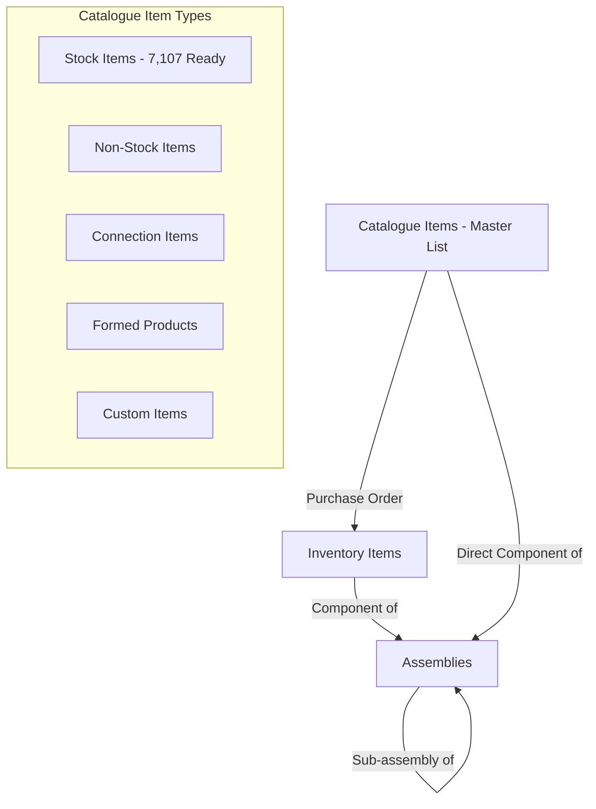
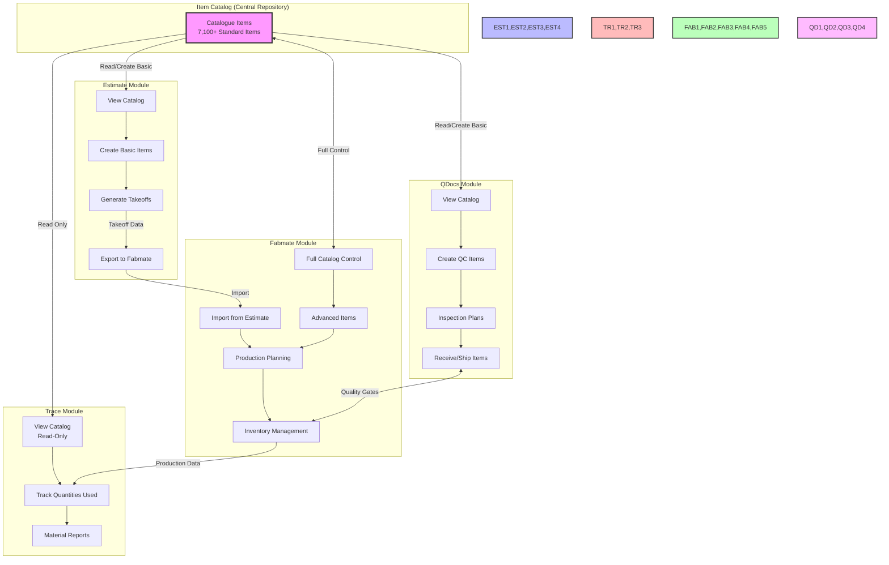

# Fab.OS Item Management System Implementation Plan
## With Completed AU/NZ Catalog Integration (7,107 Items)

## Executive Summary

This document outlines the implementation of a comprehensive Item Management System for the Fab.OS platform, designed specifically for Australian and New Zealand steel fabrication standards. The system manages catalogue items, inventory, assemblies, and bills of materials (BOM) with full AS5131 traceability compliance.

**UPDATE: The AU/NZ product catalog has been completed with 7,107 items across 55 sheets, ready for database import.**

## Catalog Completion Status ✅

### Catalog Statistics
- **Total Items**: 7,107
- **Total Sheets**: 55
- **Quality Score**: 99.8%
- **Data Completeness**: 100%
- **Unique ItemCodes**: 100% (no duplicates)

### Material Distribution
- **Stainless Steel**: 4,600 items (64.7%)
- **Mild Steel**: 1,970 items (27.7%)
- **Aluminum**: 483 items (6.8%)
- **Fasteners**: 54 items (0.8%)

### Key Features Implemented
- ✅ Pipes use NB (Nominal Bore) sizing with class (Light/Medium/Heavy)
- ✅ Universal Beams/Columns include weight per meter (e.g., 150UB14)
- ✅ Finish specifications for all items (31 unique types)
- ✅ 100% surface area coverage for coating calculations
- ✅ Standardized description formats
- ✅ Short ItemCode format: [Profile][Grade][Material]-[Number]

## System Architecture

### Three-Tier Item Hierarchy (AS/NZS 5131 Compliant)



1. **Catalogue Items**: Master list of ALL purchasable/usable items
   - Stock Items: Physical materials (✅ 7,107 items prepared)
   - Non-Stock Items: Services, consumables, labor
   - Connection Items: Bolts, welds, fasteners
   - Formed Products: Items created from stock items
   - Custom Items: Project-specific one-off items

2. **Inventory Items**: Physical stock in warehouses
   - Always linked to a Catalogue Item via CatalogueItemId
   - Tracks lot numbers, heat numbers, certificates
   - Records physical location and quantities

3. **Assemblies**: Manufactured items containing other items
   - Can contain both Catalogue Items and other Assemblies
   - Recursive structure for complex assemblies
   - Links to drawings and work instructions

## Database Schema - Complete with All Catalog Fields

### Core Tables

#### CatalogueItems (Comprehensive Schema with All 66 Fields)
```sql
CREATE TABLE CatalogueItems (
    -- Primary Identification
    Id INT IDENTITY(1,1) PRIMARY KEY,
    ItemCode NVARCHAR(50) UNIQUE NOT NULL, -- Format: PP350MS-001
    Description NVARCHAR(500) NOT NULL, -- Full formatted description
    Category NVARCHAR(50) NOT NULL, -- 'Plates', 'Hollow Sections', 'Bars', 'Pipes', etc.
    Material NVARCHAR(50) NOT NULL, -- 'Mild Steel', 'Stainless Steel', 'Aluminum'
    Profile NVARCHAR(50), -- '150UB', '100UC', '100x100SHS', '21.3CHS'
    
    -- Primary Dimensions (mm)
    Length_mm DECIMAL(10,2),
    Width_mm DECIMAL(10,2),
    Height_mm DECIMAL(10,2),
    Depth_mm DECIMAL(10,2),
    Thickness_mm DECIMAL(10,2),
    Diameter_mm DECIMAL(10,2),
    
    -- Pipe/Tube Specific Dimensions
    OD_mm DECIMAL(10,2), -- Outside diameter
    ID_mm DECIMAL(10,2), -- Inside diameter
    WallThickness_mm DECIMAL(10,2),
    Wall_mm DECIMAL(10,2), -- Alternative wall thickness field
    NominalBore NVARCHAR(20), -- 'NB15', 'NB20', etc.
    ImperialEquiv NVARCHAR(20), -- '1/2"', '3/4"', etc.
    
    -- Beam/Column Specific
    Web_mm DECIMAL(10,2),
    Flange_mm DECIMAL(10,2),
    
    -- Angle Specific
    A_mm DECIMAL(10,2), -- First leg
    B_mm DECIMAL(10,2), -- Second leg
    
    -- Size Fields
    Size_mm NVARCHAR(50), -- Can be string for complex sizes
    Size DECIMAL(10,2), -- Numeric size
    Size_inch NVARCHAR(20), -- Imperial size
    
    -- Sheet/Plate Specific
    BMT_mm DECIMAL(10,2), -- Base Metal Thickness
    BaseThickness_mm DECIMAL(10,2),
    RaisedThickness_mm DECIMAL(10,2), -- For tread plates
    
    -- Weight and Mass
    Mass_kg_m DECIMAL(10,3), -- kg per meter
    Mass_kg_m2 DECIMAL(10,3), -- kg per square meter
    Mass_kg_length DECIMAL(10,3), -- kg per standard length
    Weight_kg DECIMAL(10,3), -- Total weight per unit
    Weight_kg_m2 DECIMAL(10,3), -- Weight per square meter
    
    -- Surface Area (for coating calculations)
    SurfaceArea_m2 DECIMAL(10,4), -- Total surface area
    SurfaceArea_m2_per_m DECIMAL(10,4), -- Surface area per meter
    SurfaceArea_m2_per_m2 DECIMAL(10,4), -- Surface area per square meter
    Surface NVARCHAR(50), -- Surface type/texture
    
    -- Material Specifications
    Standard NVARCHAR(50), -- 'AS/NZS 3678', 'AS/NZS 3679.1', 'AS 1163', 'AS 1074'
    Grade NVARCHAR(50), -- '250', '300', '350', 'C350', '304', '316'
    Alloy NVARCHAR(50), -- '5083', '6061' for aluminum
    Temper NVARCHAR(50), -- 'H116', 'T6' for aluminum
    
    -- Finish Specifications
    Finish NVARCHAR(100), -- 'Black/Mill', '2B', 'No.1', 'Hot Dip Galvanized', etc.
    Finish_Standard NVARCHAR(50), -- Additional finish standard
    Coating NVARCHAR(50), -- 'Z275' for galvanized
    
    -- Standard Lengths and Availability
    StandardLengths NVARCHAR(200), -- '6000,8000,12000' comma-separated
    StandardLength_m INT, -- Standard length in meters
    Cut_To_Size NVARCHAR(20), -- 'Available', 'Not Available'
    
    -- Product Type and Features
    Type NVARCHAR(50), -- 'L' (Light), 'M' (Medium), 'H' (Heavy) for pipes
    ProductType NVARCHAR(50), -- 'Tread Plate', etc.
    Pattern NVARCHAR(50), -- '5-Bar' for tread plates
    Features NVARCHAR(500), -- Special features or notes
    Tolerance NVARCHAR(50), -- 'H9' for precision items
    
    -- Pipe Classifications
    Pressure NVARCHAR(50), -- 'Class L', 'Class M', 'Class H'
    
    -- Supplier Information
    SupplierCode NVARCHAR(100), -- Supplier's product code
    PackQty INT, -- Package quantity
    Unit NVARCHAR(20), -- 'EA', 'LENGTH', 'SHEET'
    
    -- Compliance and Ratings
    Compliance NVARCHAR(200), -- 'AS1657 Compliant'
    Duty_Rating NVARCHAR(50), -- 'Light Duty', 'Heavy Duty'
    
    -- Status and Metadata
    IsActive BIT DEFAULT 1,
    CreatedDate DATETIME2 DEFAULT GETDATE(),
    ModifiedDate DATETIME2,
    
    -- Indexes for performance
    INDEX IX_CatalogueItems_Category (Category),
    INDEX IX_CatalogueItems_Material (Material),
    INDEX IX_CatalogueItems_Profile (Profile),
    INDEX IX_CatalogueItems_Grade (Grade),
    INDEX IX_CatalogueItems_Finish (Finish)
)
```

#### GratingSpecifications (For Grating-Specific Fields)
```sql
CREATE TABLE GratingSpecifications (
    Id INT IDENTITY(1,1) PRIMARY KEY,
    CatalogueItemId INT NOT NULL UNIQUE,
    
    -- Grating-specific dimensions
    LoadBar_Height_mm DECIMAL(10,2),
    LoadBar_Spacing_mm DECIMAL(10,2),
    LoadBar_Thickness_mm DECIMAL(10,2),
    CrossBar_Spacing_mm DECIMAL(10,2),
    
    -- Panel dimensions
    Standard_Panel_Length_mm DECIMAL(10,2),
    Standard_Panel_Width_mm DECIMAL(10,2),
    
    -- Additional properties
    Dimensions NVARCHAR(50), -- '25x25', '10x3'
    
    FOREIGN KEY (CatalogueItemId) REFERENCES CatalogueItems(Id)
)
```

#### InventoryItems (Unchanged)
```sql
CREATE TABLE InventoryItems (
    Id INT IDENTITY(1,1) PRIMARY KEY,
    CatalogueItemId INT NOT NULL,
    WarehouseId INT NOT NULL,
    LocationCode NVARCHAR(50), -- 'A1-B2-C3' rack location
    
    -- Stock details
    LotNumber NVARCHAR(50),
    HeatNumber NVARCHAR(50), -- AS5131 traceability
    CertificateNumber NVARCHAR(50),
    
    -- Quantities
    OriginalLength DECIMAL(10,2), -- mm (for length items)
    CurrentLength DECIMAL(10,2), -- mm (remaining after cuts)
    Quantity DECIMAL(10,2), -- for count items
    
    -- Purchase info
    PurchaseOrderId INT,
    PurchaseDate DATE,
    SupplierCode NVARCHAR(50),
    PurchasePrice DECIMAL(10,2),
    
    -- Status
    Status NVARCHAR(20), -- 'AVAILABLE', 'RESERVED', 'ALLOCATED', 'CONSUMED'
    ReservedForJobId INT,
    
    -- Dates
    ReceivedDate DATETIME2,
    ExpiryDate DATE, -- for materials with shelf life
    LastStocktakeDate DATE,
    
    FOREIGN KEY (CatalogueItemId) REFERENCES CatalogueItems(Id),
    FOREIGN KEY (WarehouseId) REFERENCES Warehouses(Id),
    INDEX IX_InventoryItems_Status (Status),
    INDEX IX_InventoryItems_Location (WarehouseId, LocationCode)
)
```

#### Assemblies (Unchanged)
```sql
CREATE TABLE Assemblies (
    Id INT IDENTITY(1,1) PRIMARY KEY,
    AssemblyCode NVARCHAR(50) UNIQUE NOT NULL,
    Description NVARCHAR(200) NOT NULL,
    JobId INT, -- NULL for global assemblies
    RevisionNumber INT DEFAULT 1,
    
    -- Assembly properties
    AssemblyType NVARCHAR(50), -- 'FABRICATED', 'WELDED', 'BOLTED'
    DrawingNumber NVARCHAR(100),
    
    -- Calculated from components
    TotalWeight DECIMAL(10,3), -- kg
    TotalLength DECIMAL(10,2), -- mm
    TotalWidth DECIMAL(10,2), -- mm
    TotalHeight DECIMAL(10,2), -- mm
    
    -- Manufacturing info
    WorkCenterId INT,
    EstimatedHours DECIMAL(10,2),
    
    -- Status
    IsActive BIT DEFAULT 1,
    IsTemplate BIT DEFAULT 0, -- reusable global assembly
    CreatedDate DATETIME2 DEFAULT GETDATE(),
    CreatedBy NVARCHAR(100),
    
    FOREIGN KEY (JobId) REFERENCES Jobs(Id),
    FOREIGN KEY (WorkCenterId) REFERENCES WorkCenters(Id),
    INDEX IX_Assemblies_JobId (JobId),
    INDEX IX_Assemblies_IsTemplate (IsTemplate)
)
```

### Lookup Tables for Catalog Values

#### FinishTypes
```sql
CREATE TABLE FinishTypes (
    Id INT IDENTITY(1,1) PRIMARY KEY,
    FinishCode NVARCHAR(50) UNIQUE NOT NULL,
    Description NVARCHAR(200),
    MaterialType NVARCHAR(50), -- 'Mild Steel', 'Stainless Steel', 'Aluminum'
    SortOrder INT
)

-- Insert the 31 finish types from catalog
INSERT INTO FinishTypes (FinishCode, Description, MaterialType) VALUES
('Black/Mill Finish', 'Black or Mill Finish', 'Mild Steel'),
('Black', 'Black', 'Mild Steel'),
('Galvanized', 'Galvanized', 'Mild Steel'),
('Hot Dip Galvanized', 'Hot Dip Galvanized', 'Mild Steel'),
('Oiled', 'Oiled', 'Mild Steel'),
('Hot Rolled', 'Hot Rolled', 'Mild Steel'),
('2B', '2B Finish', 'Stainless Steel'),
('No.1', 'No.1 Finish', 'Stainless Steel'),
('No.3', 'No.3 Finish', 'Stainless Steel'),
('No.4', 'No.4 Finish', 'Stainless Steel'),
('BA', 'Bright Annealed', 'Stainless Steel'),
('HRAP', 'Hot Rolled Annealed Pickled', 'Stainless Steel'),
('CD', 'Cold Drawn', 'Stainless Steel'),
('Mill Finish', 'Mill Finish', 'Aluminum'),
-- ... (remaining 17 finish types)
```

## C# Entity Models - Updated for All Fields

### CatalogueItem Entity (Complete)
```csharp
public class CatalogueItem
{
    // Primary Identification
    public int Id { get; set; }
    public string ItemCode { get; set; } // PP350MS-001
    public string Description { get; set; }
    public string Category { get; set; }
    public string Material { get; set; }
    public string Profile { get; set; }
    
    // Dimensions Group
    public DimensionProperties Dimensions { get; set; }
    
    // Weight/Mass Group
    public WeightProperties Weight { get; set; }
    
    // Surface Area Group
    public SurfaceProperties Surface { get; set; }
    
    // Material Specifications Group
    public MaterialSpecifications Specifications { get; set; }
    
    // Finish Group
    public FinishProperties Finish { get; set; }
    
    // Product-Specific Properties
    public PipeProperties PipeDetails { get; set; }
    public BeamProperties BeamDetails { get; set; }
    public GratingProperties GratingDetails { get; set; }
    
    // Supply Information
    public SupplyProperties Supply { get; set; }
    
    // Navigation
    public virtual ICollection<InventoryItem> InventoryItems { get; set; }
    public virtual ICollection<AssemblyComponent> AssemblyComponents { get; set; }
}

public class DimensionProperties
{
    public decimal? Length_mm { get; set; }
    public decimal? Width_mm { get; set; }
    public decimal? Height_mm { get; set; }
    public decimal? Depth_mm { get; set; }
    public decimal? Thickness_mm { get; set; }
    public decimal? Diameter_mm { get; set; }
    public decimal? OD_mm { get; set; }
    public decimal? ID_mm { get; set; }
    public decimal? WallThickness_mm { get; set; }
    public decimal? Web_mm { get; set; }
    public decimal? Flange_mm { get; set; }
    public decimal? A_mm { get; set; } // Angle leg 1
    public decimal? B_mm { get; set; } // Angle leg 2
    public string Size_mm { get; set; }
    public decimal? Size { get; set; }
    public string StandardLengths { get; set; } // "6000,8000,12000"
    
    public List<decimal> GetAvailableLengths()
    {
        if (string.IsNullOrEmpty(StandardLengths))
            return new List<decimal>();
        
        return StandardLengths.Split(',')
            .Select(l => decimal.Parse(l))
            .ToList();
    }
}

public class WeightProperties
{
    public decimal? Mass_kg_m { get; set; }
    public decimal? Mass_kg_m2 { get; set; }
    public decimal? Mass_kg_length { get; set; }
    public decimal? Weight_kg { get; set; }
    public decimal? Weight_kg_m2 { get; set; }
    
    public decimal GetWeightPerUnit(string unitOfMeasure)
    {
        return unitOfMeasure switch
        {
            "LENGTH" => Mass_kg_m ?? 0,
            "AREA" => Mass_kg_m2 ?? 0,
            "EACH" => Weight_kg ?? 0,
            _ => 0
        };
    }
}

public class SurfaceProperties
{
    public decimal? SurfaceArea_m2 { get; set; }
    public decimal? SurfaceArea_m2_per_m { get; set; }
    public decimal? SurfaceArea_m2_per_m2 { get; set; }
    public string Surface { get; set; } // Surface type/texture
}

public class MaterialSpecifications
{
    public string Standard { get; set; } // AS/NZS 3678
    public string Grade { get; set; } // 250, 300, 350, C350
    public string Alloy { get; set; } // For aluminum
    public string Temper { get; set; } // For aluminum
    public string Compliance { get; set; }
    public string Features { get; set; }
    public string Tolerance { get; set; }
}

public class FinishProperties
{
    public string Finish { get; set; } // Black/Mill, 2B, No.1, etc.
    public string Finish_Standard { get; set; }
    public string Coating { get; set; } // Z275
    public string Pattern { get; set; } // 5-Bar for tread plates
}

public class PipeProperties
{
    public string NominalBore { get; set; } // NB15, NB20
    public string Pressure { get; set; } // Class L, M, H
    public string ImperialEquiv { get; set; } // 1/2", 3/4"
    public string Type { get; set; } // Light, Medium, Heavy
}

public class BeamProperties
{
    public string BeamDesignation { get; set; } // 150UB14
    public decimal? SectionModulus { get; set; }
    public decimal? MomentOfInertia { get; set; }
}

public class GratingProperties
{
    public decimal? LoadBar_Height_mm { get; set; }
    public decimal? LoadBar_Spacing_mm { get; set; }
    public decimal? LoadBar_Thickness_mm { get; set; }
    public decimal? CrossBar_Spacing_mm { get; set; }
    public decimal? Standard_Panel_Length_mm { get; set; }
    public decimal? Standard_Panel_Width_mm { get; set; }
    public string Duty_Rating { get; set; }
}

public class SupplyProperties
{
    public string SupplierCode { get; set; }
    public int? PackQty { get; set; }
    public string Unit { get; set; } // EA, LENGTH, SHEET
    public string Cut_To_Size { get; set; } // Available, Not Available
}
```

## Service Layer Implementation - Updated

### ItemManagementService
```csharp
public interface IItemManagementService
{
    // Catalogue operations
    Task<CatalogueItem> GetCatalogueItemAsync(string itemCode);
    Task<List<CatalogueItem>> SearchCatalogueItemsAsync(
        string searchTerm, 
        string category = null,
        string material = null,
        string finish = null);
    Task<CatalogueItem> CreateCatalogueItemAsync(CatalogueItemDto dto);
    Task<int> ImportCatalogFromExcelAsync(Stream excelFile); // Returns count imported
    
    // Search by specifications
    Task<List<CatalogueItem>> FindByDimensionsAsync(
        decimal? length, 
        decimal? width, 
        decimal? thickness,
        decimal tolerance = 0.1m);
    Task<List<CatalogueItem>> FindByProfileAsync(string profile);
    Task<List<CatalogueItem>> FindByFinishAsync(string finish);
    
    // Inventory operations
    Task<InventoryItem> CreateInventoryItemAsync(
        int catalogueItemId, 
        int warehouseId, 
        decimal quantity);
    Task<List<InventoryItem>> CheckInventoryAvailabilityAsync(
        int catalogueItemId, 
        decimal requiredLength);
    Task AllocateInventoryAsync(int inventoryItemId, int jobId, decimal quantity);
    Task<InventoryItem> CutInventoryItemAsync(int inventoryItemId, decimal cutLength);
    
    // Assembly operations
    Task<Assembly> CreateAssemblyAsync(AssemblyDto dto);
    Task<Assembly> CloneAssemblyTemplateAsync(int templateId, int jobId);
    Task<decimal> CalculateAssemblyWeightAsync(int assemblyId);
    Task<List<MaterialRequirement>> GetMaterialRequirementsAsync(int assemblyId);
    
    // Surface area calculations
    Task<decimal> CalculateTotalSurfaceAreaAsync(int assemblyId);
    Task<decimal> CalculateCoatingRequirementsAsync(
        int assemblyId, 
        string coatingType,
        decimal coverage_m2_per_liter);
}
```

### CatalogImportService
```csharp
public class CatalogImportService
{
    private readonly ApplicationDbContext _context;
    
    public async Task<ImportResult> ImportFromExcelAsync(string filePath)
    {
        var result = new ImportResult();
        
        using var workbook = new XLWorkbook(filePath);
        
        foreach (var worksheet in workbook.Worksheets)
        {
            if (worksheet.Name == "Import_Mappings") continue;
            
            var items = ParseWorksheet(worksheet);
            
            foreach (var item in items)
            {
                try
                {
                    var catalogueItem = MapToCatalogueItem(item, worksheet.Name);
                    _context.CatalogueItems.Add(catalogueItem);
                    result.SuccessCount++;
                }
                catch (Exception ex)
                {
                    result.Errors.Add($"Sheet: {worksheet.Name}, Row: {item.RowNumber}, Error: {ex.Message}");
                }
            }
        }
        
        await _context.SaveChangesAsync();
        return result;
    }
    
    private CatalogueItem MapToCatalogueItem(dynamic row, string sheetName)
    {
        var item = new CatalogueItem
        {
            ItemCode = row.ItemCode,
            Description = row.Description,
            Category = row.Category,
            Material = row.Material,
            Profile = row.Profile,
            
            Dimensions = new DimensionProperties
            {
                Length_mm = row.Length_mm,
                Width_mm = row.Width_mm,
                Height_mm = row.Height_mm,
                Thickness_mm = row.Thickness_mm,
                OD_mm = row.OD_mm,
                WallThickness_mm = row.WallThickness_mm,
                // ... map all dimension fields
            },
            
            Weight = new WeightProperties
            {
                Mass_kg_m = row.Mass_kg_m,
                Weight_kg = row.Weight_kg,
                // ... map all weight fields
            },
            
            Surface = new SurfaceProperties
            {
                SurfaceArea_m2 = row.SurfaceArea_m2,
                SurfaceArea_m2_per_m = row.SurfaceArea_m2_per_m,
                // ... map all surface fields
            },
            
            Specifications = new MaterialSpecifications
            {
                Standard = row.Standard,
                Grade = row.Grade,
                // ... map all specification fields
            },
            
            Finish = new FinishProperties
            {
                Finish = row.Finish,
                // ... map all finish fields
            }
        };
        
        // Handle product-specific properties based on sheet name
        if (sheetName.Contains("Pipes"))
        {
            item.PipeDetails = new PipeProperties
            {
                NominalBore = row.NominalBore,
                Pressure = row.Pressure,
                ImperialEquiv = row.ImperialEquiv
            };
        }
        // ... similar for beams, grating, etc.
        
        return item;
    }
}
```

## Implementation Phases - Updated Status

### Phase 1: Core Data Model ✅ COMPLETE
- [x] Create database schema with all 66 fields
- [x] Generate EF Core migrations
- [x] Create comprehensive entity models
- [x] Implement repository pattern
- [x] Design specialized tables for product types

### Phase 2: Catalogue Management ✅ DATA READY
- [x] **Prepare AU/NZ catalogue items** - ✅ 7,107 items complete
- [x] **Standardize ItemCodes** - ✅ Format: [Profile][Grade][Material]-[Number]
- [x] **Add finish specifications** - ✅ 31 unique finish types
- [x] **Calculate surface areas** - ✅ 100% coverage
- [x] **Standardize descriptions** - ✅ All formats implemented
- [ ] Import to database (ready for execution)
- [ ] Create catalogue item CRUD operations
- [ ] Implement catalogue search and filtering
- [ ] Build catalogue management UI

### Phase 3: Inventory Management (Week 5-6)
- [ ] Implement inventory tracking
- [ ] Create purchase order integration
- [ ] Implement lot and heat tracking
- [ ] Create inventory allocation logic
- [ ] Build inventory management UI

### Phase 4: Assembly & BOM (Week 7-8)
- [ ] Implement assembly creation
- [ ] Create recursive BOM structure
- [ ] Implement assembly templates
- [ ] Create assembly weight calculations
- [ ] Build assembly designer UI

### Phase 5: Import/Export (Week 9-10)
- [x] Excel import ready (AU_NZ_Catalogue_Items_PRODUCTION_FINAL.xlsx)
- [ ] Implement SMLX parser
- [ ] Create NC1/DSTV parser
- [ ] Integrate ODA SDK for IFC
- [ ] Implement profile mapping engine
- [ ] Create import validation and preview

## Catalog Data Summary

### Description Format Standards

#### Standard Products
Format: `[Dimensions] [Finish] [Profile] [Material] [Grade] [Standard]`
Example: `1200x2400x3mm Black/Mill Plate Mild Steel 250 AS/NZS 3678`

#### Pipes
Format: `[NB Size] [Class] [Finish] Pipe [Material] ([OD]) [Standard]`
Example: `NB15 Medium Black Pipe Mild Steel (21.3mm OD) AS1074`

#### Universal Beams/Columns
Format: `[Profile][Weight] [Finish] [Material] [Grade] [Standard]`
Example: `150UB14 Black/Mill Mild Steel 300 AS/NZS 3679.1`

### Finish Types (31 Total)
```
Mild Steel Finishes:
- Black/Mill Finish (1,487 items)
- Black (266 items)
- Galvanized
- Hot Dip Galvanized
- Oiled
- Hot Rolled
- Uncoated

Stainless Steel Finishes:
- No.1 (1,538 items)
- 2B (921 items)
- No.3 (288 items)
- No.4 (633 items)
- BA (254 items)
- HRAP (201 items)
- CD
- 2B FLPE (132 items)
- No.4 FLPE
- Bright Annealed
- 180 Grit Polished
- 320G Satin
- 320G Polished External (AWBP)
- ST
- 2E

Aluminum Finishes:
- Mill Finish (513 items)
```

### ItemCode Format
- Pattern: `[Profile][Grade][Material]-[Sequential Number]`
- Examples:
  - `PP350MS-001` (Pipe, 350 grade, Mild Steel)
  - `P304SS-001` (Plate, 304 grade, Stainless Steel)
  - `SHS350MS-001` (Square Hollow Section, 350 grade, Mild Steel)
  - `UB300MS-001` (Universal Beam, 300 grade, Mild Steel)
- Average length: 10.7 characters
- Total unique codes: 7,107 (100% unique)

## Database Import Script

### Excel to SQL Server Migration Path

#### Migration Overview


### Step 1: Create Staging Tables
```sql
-- Create staging table with all 66 fields from Excel
CREATE TABLE CatalogueItems_Staging (
    -- Primary Identification
    Id INT IDENTITY(1,1) PRIMARY KEY,
    ItemCode NVARCHAR(50),
    Description NVARCHAR(500),
    Category NVARCHAR(50),
    Material NVARCHAR(50),
    Profile NVARCHAR(50),
    
    -- Primary Dimensions (mm)
    Length_mm DECIMAL(10,2),
    Width_mm DECIMAL(10,2),
    Height_mm DECIMAL(10,2),
    Depth_mm DECIMAL(10,2),
    Thickness_mm DECIMAL(10,2),
    Diameter_mm DECIMAL(10,2),
    
    -- Pipe/Tube Specific
    OD_mm DECIMAL(10,2),
    ID_mm DECIMAL(10,2),
    WallThickness_mm DECIMAL(10,2),
    Wall_mm DECIMAL(10,2),
    NominalBore NVARCHAR(20),
    ImperialEquiv NVARCHAR(20),
    
    -- Beam/Column Specific
    Web_mm DECIMAL(10,2),
    Flange_mm DECIMAL(10,2),
    
    -- Angle Specific
    A_mm DECIMAL(10,2),
    B_mm DECIMAL(10,2),
    
    -- Size Fields
    Size_mm NVARCHAR(50),
    Size DECIMAL(10,2),
    Size_inch NVARCHAR(20),
    
    -- Sheet/Plate Specific
    BMT_mm DECIMAL(10,2),
    BaseThickness_mm DECIMAL(10,2),
    RaisedThickness_mm DECIMAL(10,2),
    
    -- Weight and Mass
    Mass_kg_m DECIMAL(10,3),
    Mass_kg_m2 DECIMAL(10,3),
    Mass_kg_length DECIMAL(10,3),
    Weight_kg DECIMAL(10,3),
    Weight_kg_m2 DECIMAL(10,3),
    
    -- Surface Area
    SurfaceArea_m2 DECIMAL(10,4),
    SurfaceArea_m2_per_m DECIMAL(10,4),
    SurfaceArea_m2_per_m2 DECIMAL(10,4),
    Surface NVARCHAR(50),
    
    -- Material Specifications
    Standard NVARCHAR(50),
    Grade NVARCHAR(50),
    Alloy NVARCHAR(50),
    Temper NVARCHAR(50),
    
    -- Finish Specifications
    Finish NVARCHAR(100),
    Finish_Standard NVARCHAR(50),
    Coating NVARCHAR(50),
    
    -- Standard Lengths
    StandardLengths NVARCHAR(200),
    StandardLength_m INT,
    Cut_To_Size NVARCHAR(20),
    
    -- Product Type
    Type NVARCHAR(50),
    ProductType NVARCHAR(50),
    Pattern NVARCHAR(50),
    Features NVARCHAR(500),
    Tolerance NVARCHAR(50),
    
    -- Pipe Classifications
    Pressure NVARCHAR(50),
    
    -- Supplier Information
    SupplierCode NVARCHAR(100),
    PackQty INT,
    Unit NVARCHAR(20),
    
    -- Compliance
    Compliance NVARCHAR(200),
    Duty_Rating NVARCHAR(50),
    
    -- Import Metadata
    SheetName NVARCHAR(100),
    RowNumber INT,
    ImportBatchId UNIQUEIDENTIFIER,
    ImportDate DATETIME2 DEFAULT GETDATE(),
    ValidationStatus NVARCHAR(50),
    ValidationErrors NVARCHAR(MAX)
)

-- Create validation error tracking table
CREATE TABLE ImportValidationErrors (
    Id INT IDENTITY(1,1) PRIMARY KEY,
    ImportBatchId UNIQUEIDENTIFIER,
    SheetName NVARCHAR(100),
    RowNumber INT,
    ItemCode NVARCHAR(50),
    FieldName NVARCHAR(50),
    FieldValue NVARCHAR(500),
    ErrorType NVARCHAR(50),
    ErrorMessage NVARCHAR(500),
    CreatedDate DATETIME2 DEFAULT GETDATE()
)
```

### Step 2: Data Validation Rules
```sql
-- Validation stored procedure
CREATE PROCEDURE sp_ValidateCatalogueImport
    @BatchId UNIQUEIDENTIFIER
AS
BEGIN
    DECLARE @ErrorCount INT = 0;
    
    -- 1. Required Field Validation
    INSERT INTO ImportValidationErrors (ImportBatchId, SheetName, RowNumber, ItemCode, FieldName, ErrorType, ErrorMessage)
    SELECT 
        @BatchId, SheetName, RowNumber, ItemCode, 'ItemCode', 'REQUIRED', 'ItemCode cannot be null or empty'
    FROM CatalogueItems_Staging
    WHERE ImportBatchId = @BatchId 
        AND (ItemCode IS NULL OR LTRIM(RTRIM(ItemCode)) = '');
    
    -- 2. ItemCode Format Validation (Pattern: [Profile][Grade][Material]-[Number])
    INSERT INTO ImportValidationErrors
    SELECT 
        @BatchId, SheetName, RowNumber, ItemCode, 'ItemCode', 'FORMAT', 
        'ItemCode must match pattern: [Profile][Grade][Material]-[Number]'
    FROM CatalogueItems_Staging
    WHERE ImportBatchId = @BatchId 
        AND ItemCode NOT LIKE '%-%'
        AND ItemCode IS NOT NULL;
    
    -- 3. Duplicate ItemCode Check
    INSERT INTO ImportValidationErrors
    SELECT 
        @BatchId, s1.SheetName, s1.RowNumber, s1.ItemCode, 'ItemCode', 'DUPLICATE',
        'Duplicate ItemCode found in row ' + CAST(s2.RowNumber AS VARCHAR)
    FROM CatalogueItems_Staging s1
    INNER JOIN CatalogueItems_Staging s2 
        ON s1.ItemCode = s2.ItemCode 
        AND s1.Id < s2.Id
    WHERE s1.ImportBatchId = @BatchId;
    
    -- 4. Material Validation
    INSERT INTO ImportValidationErrors
    SELECT 
        @BatchId, SheetName, RowNumber, ItemCode, 'Material', 'INVALID_VALUE',
        'Material must be: Mild Steel, Stainless Steel, or Aluminum'
    FROM CatalogueItems_Staging
    WHERE ImportBatchId = @BatchId
        AND Material NOT IN ('Mild Steel', 'Stainless Steel', 'Aluminum')
        AND Material IS NOT NULL;
    
    -- 5. Numeric Field Validation
    -- Check that dimension fields are positive when provided
    INSERT INTO ImportValidationErrors
    SELECT 
        @BatchId, SheetName, RowNumber, ItemCode, 'Length_mm', 'INVALID_RANGE',
        'Length_mm must be positive'
    FROM CatalogueItems_Staging
    WHERE ImportBatchId = @BatchId
        AND Length_mm IS NOT NULL 
        AND Length_mm <= 0;
    
    -- 6. Grade Validation by Material
    INSERT INTO ImportValidationErrors
    SELECT 
        @BatchId, SheetName, RowNumber, ItemCode, 'Grade', 'INVALID_COMBINATION',
        'Grade ' + Grade + ' is not valid for ' + Material
    FROM CatalogueItems_Staging
    WHERE ImportBatchId = @BatchId
        AND (
            (Material = 'Mild Steel' AND Grade NOT IN ('250', '300', '350', 'C350'))
            OR (Material = 'Stainless Steel' AND Grade NOT IN ('304', '316', '321', '2205'))
            OR (Material = 'Aluminum' AND Alloy NOT IN ('5052', '5083', '6061', '6063'))
        )
        AND Grade IS NOT NULL;
    
    -- 7. Finish Validation
    INSERT INTO ImportValidationErrors
    SELECT 
        @BatchId, SheetName, RowNumber, ItemCode, 'Finish', 'REQUIRED',
        'Finish is required for all items'
    FROM CatalogueItems_Staging
    WHERE ImportBatchId = @BatchId
        AND (Finish IS NULL OR LTRIM(RTRIM(Finish)) = '');
    
    -- 8. Surface Area Validation
    INSERT INTO ImportValidationErrors
    SELECT 
        @BatchId, SheetName, RowNumber, ItemCode, 'SurfaceArea', 'MISSING',
        'Surface area calculation missing for dimensional product'
    FROM CatalogueItems_Staging
    WHERE ImportBatchId = @BatchId
        AND Category NOT IN ('Fasteners', 'Consumables')
        AND SurfaceArea_m2 IS NULL 
        AND SurfaceArea_m2_per_m IS NULL 
        AND SurfaceArea_m2_per_m2 IS NULL;
    
    -- 9. Standard Compliance Validation
    INSERT INTO ImportValidationErrors
    SELECT 
        @BatchId, SheetName, RowNumber, ItemCode, 'Standard', 'INVALID_VALUE',
        'Unknown standard: ' + Standard
    FROM CatalogueItems_Staging
    WHERE ImportBatchId = @BatchId
        AND Standard NOT IN ('AS/NZS 3678', 'AS/NZS 3679.1', 'AS 1163', 'AS 1074', 
                            'AS 1252', 'AS 1450', 'AS/NZS 1594', 'AS/NZS 1734')
        AND Standard IS NOT NULL;
    
    -- 10. Pipe NB Size Validation
    INSERT INTO ImportValidationErrors
    SELECT 
        @BatchId, SheetName, RowNumber, ItemCode, 'NominalBore', 'REQUIRED',
        'Pipes must have NominalBore (NB) size'
    FROM CatalogueItems_Staging
    WHERE ImportBatchId = @BatchId
        AND Category = 'Pipes'
        AND (NominalBore IS NULL OR LTRIM(RTRIM(NominalBore)) = '');
    
    -- Update validation status
    UPDATE CatalogueItems_Staging
    SET ValidationStatus = CASE 
        WHEN EXISTS (
            SELECT 1 FROM ImportValidationErrors 
            WHERE ImportBatchId = @BatchId 
            AND ItemCode = CatalogueItems_Staging.ItemCode
        ) THEN 'FAILED'
        ELSE 'PASSED'
    END
    WHERE ImportBatchId = @BatchId;
    
    -- Return validation summary
    SELECT 
        COUNT(*) as TotalRows,
        SUM(CASE WHEN ValidationStatus = 'PASSED' THEN 1 ELSE 0 END) as PassedRows,
        SUM(CASE WHEN ValidationStatus = 'FAILED' THEN 1 ELSE 0 END) as FailedRows,
        COUNT(DISTINCT ItemCode) as UniqueItemCodes
    FROM CatalogueItems_Staging
    WHERE ImportBatchId = @BatchId;
    
    RETURN @ErrorCount;
END
```

### Step 3: C# Import Service
```csharp
using OfficeOpenXml;
using System.Data.SqlClient;
using Dapper;

public class CatalogueImportService
{
    private readonly string _connectionString;
    private readonly ILogger<CatalogueImportService> _logger;
    
    public async Task<ImportResult> ImportFromExcel(string filePath)
    {
        var batchId = Guid.NewGuid();
        var importResult = new ImportResult { BatchId = batchId };
        
        try
        {
            // Read Excel file
            using var package = new ExcelPackage(new FileInfo(filePath));
            var totalRows = 0;
            
            foreach (var worksheet in package.Workbook.Worksheets)
            {
                if (worksheet.Dimension == null) continue;
                
                var rows = await ProcessWorksheet(worksheet, batchId);
                totalRows += rows;
                
                _logger.LogInformation($"Processed {rows} rows from sheet: {worksheet.Name}");
            }
            
            // Run validation
            using var connection = new SqlConnection(_connectionString);
            var validationResult = await connection.QuerySingleAsync<ValidationSummary>(
                "sp_ValidateCatalogueImport",
                new { BatchId = batchId },
                commandType: CommandType.StoredProcedure
            );
            
            importResult.TotalRows = validationResult.TotalRows;
            importResult.PassedRows = validationResult.PassedRows;
            importResult.FailedRows = validationResult.FailedRows;
            
            // If validation passed, move to production
            if (validationResult.FailedRows == 0)
            {
                await MoveToProduction(batchId);
                importResult.Status = ImportStatus.Success;
            }
            else
            {
                importResult.Status = ImportStatus.ValidationFailed;
                importResult.Errors = await GetValidationErrors(batchId);
            }
        }
        catch (Exception ex)
        {
            _logger.LogError(ex, "Import failed for batch {BatchId}", batchId);
            importResult.Status = ImportStatus.Failed;
            importResult.ErrorMessage = ex.Message;
        }
        
        return importResult;
    }
    
    private async Task<int> ProcessWorksheet(ExcelWorksheet worksheet, Guid batchId)
    {
        var rows = new List<CatalogueItemStaging>();
        var headers = GetHeaders(worksheet);
        
        for (int row = 2; row <= worksheet.Dimension.End.Row; row++)
        {
            var item = new CatalogueItemStaging
            {
                ImportBatchId = batchId,
                SheetName = worksheet.Name,
                RowNumber = row,
                
                // Map Excel columns to database fields
                ItemCode = GetCellValue<string>(worksheet, row, headers["ItemCode"]),
                Description = GetCellValue<string>(worksheet, row, headers["Description"]),
                Category = GetCellValue<string>(worksheet, row, headers["Category"]),
                Material = GetCellValue<string>(worksheet, row, headers["Material"]),
                
                // Dimensions
                Length_mm = GetCellValue<decimal?>(worksheet, row, headers.GetValueOrDefault("Length_mm")),
                Width_mm = GetCellValue<decimal?>(worksheet, row, headers.GetValueOrDefault("Width_mm")),
                Thickness_mm = GetCellValue<decimal?>(worksheet, row, headers.GetValueOrDefault("Thickness_mm")),
                
                // Weight
                Mass_kg_m = GetCellValue<decimal?>(worksheet, row, headers.GetValueOrDefault("Mass_kg_m")),
                
                // Surface Area
                SurfaceArea_m2_per_m = GetCellValue<decimal?>(worksheet, row, headers.GetValueOrDefault("Surface_m2_m")),
                
                // Material specs
                Grade = GetCellValue<string>(worksheet, row, headers.GetValueOrDefault("Grade")),
                Standard = GetCellValue<string>(worksheet, row, headers.GetValueOrDefault("Standard")),
                Finish = GetCellValue<string>(worksheet, row, headers.GetValueOrDefault("Finish"))
            };
            
            // Skip empty rows
            if (string.IsNullOrWhiteSpace(item.ItemCode)) continue;
            
            rows.Add(item);
        }
        
        // Bulk insert to staging
        using var connection = new SqlConnection(_connectionString);
        await connection.ExecuteAsync(@"
            INSERT INTO CatalogueItems_Staging (
                ImportBatchId, SheetName, RowNumber, ItemCode, Description, 
                Category, Material, Length_mm, Width_mm, Thickness_mm,
                Mass_kg_m, SurfaceArea_m2_per_m, Grade, Standard, Finish
            ) VALUES (
                @ImportBatchId, @SheetName, @RowNumber, @ItemCode, @Description,
                @Category, @Material, @Length_mm, @Width_mm, @Thickness_mm,
                @Mass_kg_m, @SurfaceArea_m2_per_m, @Grade, @Standard, @Finish
            )", rows);
        
        return rows.Count;
    }
    
    private async Task MoveToProduction(Guid batchId)
    {
        using var connection = new SqlConnection(_connectionString);
        
        await connection.ExecuteAsync(@"
            -- Insert new items
            INSERT INTO CatalogueItems
            SELECT 
                ItemCode, Description, Category, Material, Profile,
                Length_mm, Width_mm, Height_mm, Depth_mm, Thickness_mm,
                -- ... all other fields ...
                1 as IsActive, GETDATE() as CreatedDate, NULL as ModifiedDate
            FROM CatalogueItems_Staging
            WHERE ImportBatchId = @BatchId
                AND ValidationStatus = 'PASSED'
                AND ItemCode NOT IN (SELECT ItemCode FROM CatalogueItems)
            
            -- Update existing items
            UPDATE ci
            SET 
                ci.Description = s.Description,
                ci.Category = s.Category,
                ci.Material = s.Material,
                -- ... update other fields ...
                ci.ModifiedDate = GETDATE()
            FROM CatalogueItems ci
            INNER JOIN CatalogueItems_Staging s 
                ON ci.ItemCode = s.ItemCode
            WHERE s.ImportBatchId = @BatchId
                AND s.ValidationStatus = 'PASSED'",
            new { BatchId = batchId });
        
        // Archive staging data
        await connection.ExecuteAsync(@"
            INSERT INTO CatalogueItems_ImportHistory
            SELECT *, GETDATE() as ArchivedDate
            FROM CatalogueItems_Staging
            WHERE ImportBatchId = @BatchId",
            new { BatchId = batchId });
        
        // Clean staging
        await connection.ExecuteAsync(
            "DELETE FROM CatalogueItems_Staging WHERE ImportBatchId = @BatchId",
            new { BatchId = batchId });
    }
}
```

### Step 4: Data Transformation Rules
```sql
-- Transform and standardize data during import
CREATE PROCEDURE sp_TransformStagingData
    @BatchId UNIQUEIDENTIFIER
AS
BEGIN
    -- 1. Standardize Material names
    UPDATE CatalogueItems_Staging
    SET Material = CASE 
        WHEN Material IN ('MS', 'MILD STEEL', 'mild steel') THEN 'Mild Steel'
        WHEN Material IN ('SS', 'STAINLESS', 'stainless steel') THEN 'Stainless Steel'
        WHEN Material IN ('AL', 'ALU', 'ALUMINIUM', 'aluminum') THEN 'Aluminum'
        ELSE Material
    END
    WHERE ImportBatchId = @BatchId;
    
    -- 2. Extract Profile from ItemCode
    UPDATE CatalogueItems_Staging
    SET Profile = CASE
        WHEN ItemCode LIKE 'PP%' THEN 'Pipe'
        WHEN ItemCode LIKE 'PL%' THEN 'Plate'
        WHEN ItemCode LIKE 'SHS%' THEN 'SHS'
        WHEN ItemCode LIKE 'RHS%' THEN 'RHS'
        WHEN ItemCode LIKE 'UB%' THEN 'UB'
        WHEN ItemCode LIKE 'UC%' THEN 'UC'
        WHEN ItemCode LIKE 'RB%' THEN 'RoundBar'
        WHEN ItemCode LIKE 'FB%' THEN 'FlatBar'
        ELSE Profile
    END
    WHERE ImportBatchId = @BatchId AND Profile IS NULL;
    
    -- 3. Calculate missing surface areas
    UPDATE CatalogueItems_Staging
    SET SurfaceArea_m2_per_m = 
        CASE 
            -- Round bars: π × diameter
            WHEN Profile = 'RoundBar' AND Diameter_mm IS NOT NULL 
                THEN PI() * Diameter_mm / 1000
            -- Square hollow sections: 4 × side
            WHEN Profile = 'SHS' AND Width_mm IS NOT NULL 
                THEN 4 * Width_mm / 1000
            -- Rectangular hollow sections: 2 × (width + height)
            WHEN Profile = 'RHS' AND Width_mm IS NOT NULL AND Height_mm IS NOT NULL
                THEN 2 * (Width_mm + Height_mm) / 1000
            ELSE SurfaceArea_m2_per_m
        END
    WHERE ImportBatchId = @BatchId 
        AND SurfaceArea_m2_per_m IS NULL;
    
    -- 4. Standardize Finish values
    UPDATE CatalogueItems_Staging
    SET Finish = CASE
        WHEN Finish IN ('Black', 'Mill', 'Black Mill') THEN 'Black/Mill'
        WHEN Finish IN ('HDG', 'Galv', 'Galvanised') THEN 'Hot Dip Galvanized'
        WHEN Finish IN ('2B Finish', '2B Surface') THEN '2B'
        ELSE Finish
    END
    WHERE ImportBatchId = @BatchId;
    
    -- 5. Set default units
    UPDATE CatalogueItems_Staging
    SET Unit = CASE
        WHEN Category IN ('Plates', 'Sheets') THEN 'SHEET'
        WHEN Category IN ('Pipes', 'Hollow Sections', 'Bars') THEN 'LENGTH'
        WHEN Category = 'Fasteners' THEN 'EA'
        ELSE 'EA'
    END
    WHERE ImportBatchId = @BatchId AND Unit IS NULL;
END
```

### Step 5: Import Verification Queries
```sql
-- Comprehensive import verification
CREATE PROCEDURE sp_VerifyImport
    @BatchId UNIQUEIDENTIFIER = NULL
AS
BEGIN
    -- Overall statistics
    SELECT 
        'Import Statistics' as ReportSection,
        COUNT(*) as TotalItems,
        COUNT(DISTINCT ItemCode) as UniqueItemCodes,
        COUNT(DISTINCT Category) as Categories,
        COUNT(DISTINCT Material) as Materials,
        COUNT(DISTINCT Finish) as FinishTypes
    FROM CatalogueItems;
    
    -- Material distribution
    SELECT 
        'Material Distribution' as ReportSection,
        Material,
        COUNT(*) as ItemCount,
        FORMAT(COUNT(*) * 100.0 / SUM(COUNT(*)) OVER(), 'N1') + '%' as Percentage
    FROM CatalogueItems
    GROUP BY Material
    ORDER BY ItemCount DESC;
    
    -- Category breakdown
    SELECT 
        'Category Breakdown' as ReportSection,
        Category,
        Material,
        COUNT(*) as ItemCount
    FROM CatalogueItems
    GROUP BY Category, Material
    ORDER BY Material, Category;
    
    -- Data quality metrics
    SELECT 
        'Data Quality' as ReportSection,
        'ItemCode' as Field, 
        COUNT(*) as TotalRecords,
        SUM(CASE WHEN ItemCode IS NOT NULL THEN 1 ELSE 0 END) as PopulatedRecords,
        FORMAT(SUM(CASE WHEN ItemCode IS NOT NULL THEN 1 ELSE 0 END) * 100.0 / COUNT(*), 'N1') + '%' as Completeness
    FROM CatalogueItems
    UNION ALL
    SELECT 
        'Data Quality', 'Description', COUNT(*),
        SUM(CASE WHEN Description IS NOT NULL THEN 1 ELSE 0 END),
        FORMAT(SUM(CASE WHEN Description IS NOT NULL THEN 1 ELSE 0 END) * 100.0 / COUNT(*), 'N1') + '%'
    FROM CatalogueItems
    UNION ALL
    SELECT 
        'Data Quality', 'Finish', COUNT(*),
        SUM(CASE WHEN Finish IS NOT NULL THEN 1 ELSE 0 END),
        FORMAT(SUM(CASE WHEN Finish IS NOT NULL THEN 1 ELSE 0 END) * 100.0 / COUNT(*), 'N1') + '%'
    FROM CatalogueItems
    UNION ALL
    SELECT 
        'Data Quality', 'Surface Area', COUNT(*),
        SUM(CASE WHEN (SurfaceArea_m2 IS NOT NULL OR SurfaceArea_m2_per_m IS NOT NULL) THEN 1 ELSE 0 END),
        FORMAT(SUM(CASE WHEN (SurfaceArea_m2 IS NOT NULL OR SurfaceArea_m2_per_m IS NOT NULL) THEN 1 ELSE 0 END) * 100.0 / COUNT(*), 'N1') + '%'
    FROM CatalogueItems
    WHERE Category NOT IN ('Fasteners', 'Consumables');
    
    -- Finish type distribution
    SELECT TOP 10
        'Top Finishes' as ReportSection,
        Finish,
        COUNT(*) as ItemCount
    FROM CatalogueItems
    GROUP BY Finish
    ORDER BY ItemCount DESC;
    
    -- Validation errors if batch specified
    IF @BatchId IS NOT NULL
    BEGIN
        SELECT 
            'Validation Errors' as ReportSection,
            ErrorType,
            FieldName,
            COUNT(*) as ErrorCount
        FROM ImportValidationErrors
        WHERE ImportBatchId = @BatchId
        GROUP BY ErrorType, FieldName
        ORDER BY ErrorCount DESC;
    END
END

-- Execute verification
EXEC sp_VerifyImport;
```

### Step 6: PowerShell Import Script Option
```powershell
# PowerShell script for direct Excel to SQL import
# File: Import-CatalogueItems.ps1

param(
    [Parameter(Mandatory=$true)]
    [string]$ExcelPath = "AU_NZ_Catalogue_Items_PRODUCTION_FINAL.xlsx",
    
    [Parameter(Mandatory=$true)]
    [string]$ServerInstance,
    
    [Parameter(Mandatory=$true)]
    [string]$Database,
    
    [string]$Username,
    [string]$Password
)

# Import required modules
Import-Module ImportExcel
Import-Module SqlServer

# Generate batch ID
$batchId = [Guid]::NewGuid()
Write-Host "Starting import batch: $batchId" -ForegroundColor Green

# Build connection string
if ($Username -and $Password) {
    $connectionString = "Server=$ServerInstance;Database=$Database;User Id=$Username;Password=$Password;"
} else {
    $connectionString = "Server=$ServerInstance;Database=$Database;Integrated Security=true;"
}

# Function to validate and transform data
function ConvertTo-CatalogueItem {
    param($Row, $SheetName, $RowNumber)
    
    $item = @{
        ImportBatchId = $batchId
        SheetName = $SheetName
        RowNumber = $RowNumber
        ItemCode = $Row.ItemCode
        Description = $Row.Description
        Category = $Row.Category
        Material = $Row.Material
        
        # Dimensions - handle various column names
        Length_mm = $Row.'Length_mm' ?? $Row.'Length(mm)'
        Width_mm = $Row.'Width_mm' ?? $Row.'Width(mm)'
        Thickness_mm = $Row.'Thickness_mm' ?? $Row.'Thickness(mm)'
        OD_mm = $Row.'OD_mm' ?? $Row.'OD(mm)'
        ID_mm = $Row.'ID_mm' ?? $Row.'ID(mm)'
        
        # Weight fields
        Mass_kg_m = $Row.'Mass_kg_m' ?? $Row.'Mass(kg/m)'
        Weight_kg = $Row.'Weight_kg' ?? $Row.'Weight(kg)'
        
        # Surface area
        SurfaceArea_m2_per_m = $Row.'Surface_m2_m' ?? $Row.'Surface(m2/m)'
        
        # Material specs
        Grade = $Row.Grade
        Standard = $Row.Standard
        Finish = $Row.Finish
        
        # Pipe specific
        NominalBore = $Row.'NB_Size' ?? $Row.'NominalBore'
        Type = $Row.Type  # Light/Medium/Heavy
    }
    
    # Clean nulls and empty strings
    $item.Keys | ForEach-Object {
        if ([string]::IsNullOrWhiteSpace($item[$_])) {
            $item[$_] = $null
        }
    }
    
    return $item
}

# Process Excel file
$totalRows = 0
$errors = @()

try {
    # Get all worksheets
    $worksheets = Get-ExcelSheetInfo -Path $ExcelPath
    
    foreach ($sheet in $worksheets) {
        Write-Host "Processing sheet: $($sheet.Name)" -ForegroundColor Yellow
        
        # Read worksheet data
        $data = Import-Excel -Path $ExcelPath -WorksheetName $sheet.Name
        
        if ($data.Count -eq 0) {
            Write-Host "  No data in sheet" -ForegroundColor Gray
            continue
        }
        
        $rowNumber = 2  # Excel row numbering
        $sheetItems = @()
        
        foreach ($row in $data) {
            # Skip empty rows
            if ([string]::IsNullOrWhiteSpace($row.ItemCode)) {
                $rowNumber++
                continue
            }
            
            try {
                $item = ConvertTo-CatalogueItem -Row $row -SheetName $sheet.Name -RowNumber $rowNumber
                $sheetItems += $item
            }
            catch {
                $errors += @{
                    Sheet = $sheet.Name
                    Row = $rowNumber
                    Error = $_.Exception.Message
                }
            }
            
            $rowNumber++
        }
        
        if ($sheetItems.Count -gt 0) {
            # Bulk insert to staging table
            Write-Host "  Inserting $($sheetItems.Count) items..." -ForegroundColor Cyan
            
            $insertQuery = @"
INSERT INTO CatalogueItems_Staging (
    ImportBatchId, SheetName, RowNumber, ItemCode, Description,
    Category, Material, Length_mm, Width_mm, Thickness_mm,
    OD_mm, ID_mm, Mass_kg_m, Weight_kg, SurfaceArea_m2_per_m,
    Grade, Standard, Finish, NominalBore, Type
) VALUES (
    @ImportBatchId, @SheetName, @RowNumber, @ItemCode, @Description,
    @Category, @Material, @Length_mm, @Width_mm, @Thickness_mm,
    @OD_mm, @ID_mm, @Mass_kg_m, @Weight_kg, @SurfaceArea_m2_per_m,
    @Grade, @Standard, @Finish, @NominalBore, @Type
)
"@
            
            # Use SqlBulkCopy for better performance
            $bulkCopy = New-Object System.Data.SqlClient.SqlBulkCopy($connectionString)
            $bulkCopy.DestinationTableName = "CatalogueItems_Staging"
            
            # Convert to DataTable
            $dataTable = $sheetItems | Out-DataTable
            $bulkCopy.WriteToServer($dataTable)
            
            $totalRows += $sheetItems.Count
            Write-Host "  Completed: $($sheetItems.Count) items" -ForegroundColor Green
        }
    }
    
    Write-Host "`nTotal rows imported to staging: $totalRows" -ForegroundColor Green
    
    # Run validation stored procedure
    Write-Host "`nRunning validation..." -ForegroundColor Yellow
    
    $validationResults = Invoke-Sqlcmd -ServerInstance $ServerInstance `
        -Database $Database `
        -Query "EXEC sp_ValidateCatalogueImport @BatchId = '$batchId'"
    
    $validationResults | Format-Table
    
    # Check for validation errors
    $errorCount = Invoke-Sqlcmd -ServerInstance $ServerInstance `
        -Database $Database `
        -Query "SELECT COUNT(*) as ErrorCount FROM ImportValidationErrors WHERE ImportBatchId = '$batchId'" `
        | Select-Object -ExpandProperty ErrorCount
    
    if ($errorCount -eq 0) {
        Write-Host "`nValidation passed! Moving to production..." -ForegroundColor Green
        
        # Run data transformation
        Invoke-Sqlcmd -ServerInstance $ServerInstance `
            -Database $Database `
            -Query "EXEC sp_TransformStagingData @BatchId = '$batchId'"
        
        # Move to production
        $productionQuery = @"
-- Insert new items
INSERT INTO CatalogueItems
SELECT * FROM CatalogueItems_Staging
WHERE ImportBatchId = '$batchId'
    AND ValidationStatus = 'PASSED'
    AND ItemCode NOT IN (SELECT ItemCode FROM CatalogueItems)

-- Archive staging data
INSERT INTO CatalogueItems_ImportHistory
SELECT *, GETDATE() as ArchivedDate
FROM CatalogueItems_Staging
WHERE ImportBatchId = '$batchId'

-- Clean staging
DELETE FROM CatalogueItems_Staging WHERE ImportBatchId = '$batchId'
"@
        
        Invoke-Sqlcmd -ServerInstance $ServerInstance `
            -Database $Database `
            -Query $productionQuery
        
        Write-Host "Import completed successfully!" -ForegroundColor Green
        
        # Run verification
        Write-Host "`nFinal verification:" -ForegroundColor Yellow
        Invoke-Sqlcmd -ServerInstance $ServerInstance `
            -Database $Database `
            -Query "EXEC sp_VerifyImport" `
            | Format-Table
    }
    else {
        Write-Host "`nValidation failed with $errorCount errors" -ForegroundColor Red
        
        # Show validation errors
        $validationErrors = Invoke-Sqlcmd -ServerInstance $ServerInstance `
            -Database $Database `
            -Query "SELECT TOP 20 * FROM ImportValidationErrors WHERE ImportBatchId = '$batchId'"
        
        $validationErrors | Format-Table -AutoSize
        
        Write-Host "`nImport cancelled. Data remains in staging for review." -ForegroundColor Yellow
    }
}
catch {
    Write-Host "Import failed: $_" -ForegroundColor Red
    
    # Clean up staging on failure
    Invoke-Sqlcmd -ServerInstance $ServerInstance `
        -Database $Database `
        -Query "DELETE FROM CatalogueItems_Staging WHERE ImportBatchId = '$batchId'"
}

# Export import log
$logPath = "Import_Log_$(Get-Date -Format 'yyyyMMdd_HHmmss').csv"
if ($errors.Count -gt 0) {
    $errors | Export-Csv -Path $logPath -NoTypeInformation
    Write-Host "`nError log exported to: $logPath" -ForegroundColor Yellow
}

# Usage example:
# .\Import-CatalogueItems.ps1 -ExcelPath "AU_NZ_Catalogue_Items_PRODUCTION_FINAL.xlsx" -ServerInstance "localhost\SQLEXPRESS" -Database "FabOS"
```

## Step 7: CAD Import Capabilities

### CAD File Import Architecture

The system supports importing items and assemblies from CAD files, automatically extracting bill of materials and creating catalogue/inventory records.

#### Supported CAD Formats

1. **STEP Files (.step, .stp)**
   - 3D assembly models with full BOM
   - Part dimensions and properties
   - Material specifications from metadata
   - Assembly hierarchy and relationships

2. **DXF Files (.dxf)**
   - 2D drawings and flat patterns
   - Sheet metal developments
   - Cutting lists and nesting data
   - Profile extraction for structural items

3. **SMLX Files (.smlx)**
   - Sheet metal specific format
   - Bend information and K-factors
   - Material thickness and specifications

4. **IFC Files (.ifc)**
   - Building Information Modeling (BIM) format
   - Complete structural model with all steel members
   - Material properties and specifications
   - Connection details and assembly relationships
   - Integration with design software (Tekla, Revit, Advance Steel)

5. **DSTV/NC Files (.nc, .nc1)**
   - Steel fabrication machine format
   - Direct output for beam drill and cut lines
   - .nc1 specifically for primary member operations
   - Hole patterns and cutting instructions
   - Industry standard for CNC machines

6. **SDNF Files (.sdnf)**
   - Steel Detailing Neutral Format
   - System-neutral steel element exchange
   - Structural model data with full properties
   - Version 3.0 standard

7. **SAT Files (.sat)**
   - ACIS solid modeling format
   - 3D solid geometry from Advance Steel
   - Compatible with multiple CAD systems

### CAD Import Database Schema

```sql
-- CAD file storage and metadata
CREATE TABLE CADImports (
    Id INT IDENTITY(1,1) PRIMARY KEY,
    FileName NVARCHAR(500) NOT NULL,
    FileType NVARCHAR(10) NOT NULL, -- 'STEP', 'DXF', 'SMLX', 'IFC', 'DSTV', 'NC', 'NC1', 'SDNF', 'SAT'
    FileSize BIGINT,
    FileHash NVARCHAR(64), -- SHA256 hash for duplicate detection
    
    -- Import details
    ImportDate DATETIME2 DEFAULT GETDATE(),
    ImportedBy NVARCHAR(100),
    JobId INT,
    ProjectCode NVARCHAR(50),
    
    -- Processing status
    ProcessingStatus NVARCHAR(20), -- 'PENDING', 'PROCESSING', 'COMPLETED', 'FAILED'
    ProcessingMessage NVARCHAR(MAX),
    
    -- Extracted data summary
    ItemsExtracted INT,
    AssembliesCreated INT,
    
    FOREIGN KEY (JobId) REFERENCES Jobs(Id),
    INDEX IX_CADImports_FileHash (FileHash),
    INDEX IX_CADImports_Status (ProcessingStatus)
)

-- Items extracted from CAD files
CREATE TABLE CADExtractedItems (
    Id INT IDENTITY(1,1) PRIMARY KEY,
    CADImportId INT NOT NULL,
    
    -- Extracted properties
    PartNumber NVARCHAR(100),
    Description NVARCHAR(500),
    Material NVARCHAR(100),
    Quantity DECIMAL(10,2),
    
    -- Dimensions
    Length_mm DECIMAL(10,2),
    Width_mm DECIMAL(10,2),
    Height_mm DECIMAL(10,2),
    Thickness_mm DECIMAL(10,2),
    
    -- Matching to catalogue
    MatchedCatalogueItemId INT,
    MatchConfidence DECIMAL(5,2), -- 0-100%
    MatchMethod NVARCHAR(50), -- 'EXACT', 'FUZZY', 'MANUAL', 'CREATED'
    
    -- Status
    Status NVARCHAR(20), -- 'MATCHED', 'CREATED', 'PENDING_REVIEW'
    ReviewNotes NVARCHAR(MAX),
    
    FOREIGN KEY (CADImportId) REFERENCES CADImports(Id),
    FOREIGN KEY (MatchedCatalogueItemId) REFERENCES CatalogueItems(Id),
    INDEX IX_CADExtractedItems_CADImportId (CADImportId)
)
```

### CAD Import Service Implementation

```csharp
public class CADImportService
{
    private readonly IRepository<CADImport> _cadImportRepo;
    private readonly IRepository<CatalogueItem> _catalogueRepo;
    private readonly ICADParser _cadParser;
    private readonly IItemMatcher _itemMatcher;
    
    public async Task<CADImportResult> ImportCADFile(Stream fileStream, string fileName, string fileType)
    {
        // 1. Save CAD import record
        var import = new CADImport
        {
            FileName = fileName,
            FileType = fileType,
            FileHash = CalculateHash(fileStream),
            ProcessingStatus = "PROCESSING"
        };
        
        // Check for duplicate
        var existingImport = await _cadImportRepo.FindByHash(import.FileHash);
        if (existingImport != null)
        {
            return new CADImportResult 
            { 
                Success = false, 
                Message = "File already imported",
                ExistingImportId = existingImport.Id
            };
        }
        
        await _cadImportRepo.Add(import);
        
        try
        {
            // 2. Parse CAD file based on type
            var extractedItems = fileType switch
            {
                "STEP" => await _cadParser.ParseSTEP(fileStream),
                "DXF" => await _cadParser.ParseDXF(fileStream),
                "SMLX" => await _cadParser.ParseSMLX(fileStream),
                "IFC" => await _cadParser.ParseIFC(fileStream),
                "DSTV" or "NC" or "NC1" => await _cadParser.ParseDSTV(fileStream),
                "SDNF" => await _cadParser.ParseSDNF(fileStream),
                "SAT" => await _cadParser.ParseSAT(fileStream),
                _ => throw new NotSupportedException($"File type {fileType} not supported")
            };
            
            // 3. Match extracted items to catalogue
            foreach (var item in extractedItems)
            {
                var matchResult = await _itemMatcher.MatchToCatalogue(item);
                
                if (matchResult.IsMatch)
                {
                    item.MatchedCatalogueItemId = matchResult.CatalogueItemId;
                    item.MatchConfidence = matchResult.Confidence;
                    item.MatchMethod = matchResult.Method;
                    item.Status = "MATCHED";
                }
                else if (matchResult.CanAutoCreate)
                {
                    // Auto-create new catalogue item for common profiles
                    var newItem = await CreateCatalogueItem(item);
                    item.MatchedCatalogueItemId = newItem.Id;
                    item.MatchMethod = "CREATED";
                    item.Status = "CREATED";
                }
                else
                {
                    item.Status = "PENDING_REVIEW";
                }
                
                await _cadExtractedRepo.Add(item);
            }
            
            // 4. Create assemblies if applicable
            if ((fileType == "STEP" || fileType == "IFC" || fileType == "SAT" || fileType == "SDNF") 
                && extractedItems.Any(i => i.IsAssembly))
            {
                await CreateAssembliesFromCAD(extractedItems, import.Id);
            }
            
            // Update import status
            import.ProcessingStatus = "COMPLETED";
            import.ItemsExtracted = extractedItems.Count;
            await _cadImportRepo.Update(import);
            
            return new CADImportResult 
            { 
                Success = true,
                ImportId = import.Id,
                ItemsExtracted = extractedItems.Count,
                ItemsMatched = extractedItems.Count(i => i.Status == "MATCHED"),
                ItemsCreated = extractedItems.Count(i => i.Status == "CREATED"),
                ItemsPendingReview = extractedItems.Count(i => i.Status == "PENDING_REVIEW")
            };
        }
        catch (Exception ex)
        {
            import.ProcessingStatus = "FAILED";
            import.ProcessingMessage = ex.Message;
            await _cadImportRepo.Update(import);
            throw;
        }
    }
}
```

## Step 8: Expanded Catalogue Item Types

### Supporting Multiple Item Types

The catalogue system extends beyond physical stock items to support all types of items used in fabrication projects.

#### Item Type Classification

```sql
-- Add ItemType to CatalogueItems
ALTER TABLE CatalogueItems 
ADD ItemType NVARCHAR(20) NOT NULL DEFAULT 'STOCK'
    CHECK (ItemType IN ('STOCK', 'NON_STOCK', 'CONNECTION', 'FORMED', 'CUSTOM', 'SERVICE'))

-- Create index for item type queries
CREATE INDEX IX_CatalogueItems_ItemType ON CatalogueItems(ItemType)
```

#### 1. Stock Items (Existing 7,107 items)
Physical materials that are purchased and stored in inventory.

#### 2. Non-Stock Items
Items that don't require inventory tracking but are part of projects:
- Consumables (welding wire, grinding discs, paint)
- Services (labor hours, crane hire, transport)
- Subcontractor work
- Surface treatments (galvanizing, powder coating)

```sql
CREATE TABLE NonStockItems (
    Id INT IDENTITY(1,1) PRIMARY KEY,
    CatalogueItemId INT NOT NULL UNIQUE,
    
    -- Non-stock specific fields
    ItemCategory NVARCHAR(50), -- 'CONSUMABLE', 'SERVICE', 'SUBCONTRACT'
    UnitOfMeasure NVARCHAR(20), -- 'HOUR', 'EACH', 'LITRE', 'KG'
    
    -- Service-specific
    ServiceType NVARCHAR(50), -- 'WELDING', 'FITTING', 'PAINTING', 'TRANSPORT'
    RateType NVARCHAR(20), -- 'HOURLY', 'FIXED', 'PER_UNIT'
    StandardRate DECIMAL(10,2),
    
    -- Consumable-specific
    MinOrderQty DECIMAL(10,2),
    ReorderLevel DECIMAL(10,2),
    
    FOREIGN KEY (CatalogueItemId) REFERENCES CatalogueItems(Id)
)
```

#### 3. Connection Items
Structural connections including bolts, welds, and fasteners:

```sql
CREATE TABLE ConnectionItems (
    Id INT IDENTITY(1,1) PRIMARY KEY,
    CatalogueItemId INT NOT NULL UNIQUE,
    
    -- Connection type
    ConnectionType NVARCHAR(50), -- 'BOLT', 'WELD', 'RIVET', 'ADHESIVE'
    
    -- Bolt-specific fields
    BoltGrade NVARCHAR(20), -- '8.8', '10.9', '12.9'
    ThreadType NVARCHAR(20), -- 'METRIC', 'UNC', 'UNF'
    HeadType NVARCHAR(50), -- 'HEX', 'SOCKET', 'BUTTON'
    
    -- Weld-specific fields
    WeldType NVARCHAR(50), -- 'FILLET', 'BUTT', 'PLUG'
    WeldSize_mm DECIMAL(10,2),
    WeldProcess NVARCHAR(20), -- 'MIG', 'TIG', 'STICK'
    
    -- Assembly details
    IncludesNut BIT,
    IncludesWasher BIT,
    AssemblyTorque_Nm DECIMAL(10,2),
    
    -- Compliance
    Standard NVARCHAR(50), -- 'AS/NZS 1252', 'AS/NZS 1554'
    
    FOREIGN KEY (CatalogueItemId) REFERENCES CatalogueItems(Id)
)
```

#### 4. Formed Products
Items created by forming/modifying stock items:

```sql
CREATE TABLE FormedProducts (
    Id INT IDENTITY(1,1) PRIMARY KEY,
    CatalogueItemId INT NOT NULL UNIQUE,
    BaseCatalogueItemId INT NOT NULL, -- Original stock item
    
    -- Forming operations
    FormingType NVARCHAR(50), -- 'ROLLED', 'BENT', 'PRESSED', 'CUT'
    FormingDescription NVARCHAR(500),
    
    -- Formed dimensions
    FormedRadius_mm DECIMAL(10,2),
    BendAngle_deg DECIMAL(5,2),
    ArcLength_deg DECIMAL(5,2),
    
    -- Manufacturing details
    SetupTime_min DECIMAL(10,2),
    FormingTime_min DECIMAL(10,2),
    RequiredTooling NVARCHAR(200),
    
    FOREIGN KEY (CatalogueItemId) REFERENCES CatalogueItems(Id),
    FOREIGN KEY (BaseCatalogueItemId) REFERENCES CatalogueItems(Id)
)
```

#### 5. Custom Items
Project-specific one-off items:

```sql
CREATE TABLE CustomItems (
    Id INT IDENTITY(1,1) PRIMARY KEY,
    CatalogueItemId INT NOT NULL UNIQUE,
    
    -- Custom item details
    ProjectId INT,
    DrawingNumber NVARCHAR(100),
    Revision NVARCHAR(20),
    
    -- Specifications
    CustomDescription NVARCHAR(MAX),
    ManufacturingNotes NVARCHAR(MAX),
    
    -- Approval
    ApprovedBy NVARCHAR(100),
    ApprovalDate DATETIME2,
    
    FOREIGN KEY (CatalogueItemId) REFERENCES CatalogueItems(Id),
    FOREIGN KEY (ProjectId) REFERENCES Projects(Id)
)
```

## Step 9: AS/NZS 5131 Traceability Implementation

### Traceability Requirements per AS/NZS 5131

The system implements the three types of traceability defined in AS/NZS 5131:2016 for structural steelwork.

#### Traceability Types

1. **Lot Traceability**
   - Track materials by heat/batch number
   - Link to mill certificates
   - Required for all structural steel

2. **Piece-Mark Traceability**
   - Individual marking of fabricated assemblies
   - Track through fabrication and erection
   - Required for CC2+ structures

3. **Piece Traceability**
   - Full chain of custody for individual pieces
   - Track cutting, drilling, welding operations
   - Required for CC3+ critical members

#### Construction Categories

```sql
CREATE TABLE ConstructionCategories (
    Id INT IDENTITY(1,1) PRIMARY KEY,
    ProjectId INT NOT NULL,
    Category NVARCHAR(10) NOT NULL, -- 'CC1', 'CC2', 'CC3', 'CC4'
    
    -- Traceability requirements
    RequiresLotTraceability BIT DEFAULT 1,
    RequiresPieceMarkTraceability BIT DEFAULT 0,
    RequiresPieceTraceability BIT DEFAULT 0,
    
    -- Critical members
    CriticalMemberCriteria NVARCHAR(MAX),
    
    FOREIGN KEY (ProjectId) REFERENCES Projects(Id)
)
```

### Traceability Database Schema

```sql
-- Heat/Lot certificates
CREATE TABLE HeatCertificates (
    Id INT IDENTITY(1,1) PRIMARY KEY,
    CertificateNumber NVARCHAR(100) UNIQUE NOT NULL,
    HeatNumber NVARCHAR(50) NOT NULL,
    
    -- Mill details
    MillName NVARCHAR(200),
    MillCertDate DATE,
    
    -- Material properties
    Material NVARCHAR(50),
    Grade NVARCHAR(50),
    Standard NVARCHAR(50),
    
    -- Test results
    YieldStrength_MPa DECIMAL(10,2),
    TensileStrength_MPa DECIMAL(10,2),
    Elongation_Percent DECIMAL(5,2),
    
    -- Chemical composition
    Carbon_Percent DECIMAL(5,3),
    Manganese_Percent DECIMAL(5,3),
    Silicon_Percent DECIMAL(5,3),
    
    -- Document storage
    CertificatePDF VARBINARY(MAX),
    
    INDEX IX_HeatCertificates_HeatNumber (HeatNumber)
)

-- Piece marks for assemblies
CREATE TABLE PieceMarks (
    Id INT IDENTITY(1,1) PRIMARY KEY,
    AssemblyId INT NOT NULL,
    PieceMark NVARCHAR(50) NOT NULL,
    
    -- Drawing reference
    DrawingNumber NVARCHAR(100),
    Revision NVARCHAR(20),
    
    -- Quantities
    Quantity INT,
    Weight_kg DECIMAL(10,2),
    
    -- Status tracking
    FabricationStatus NVARCHAR(50), -- 'NOT_STARTED', 'IN_PROGRESS', 'COMPLETED'
    ErectionStatus NVARCHAR(50), -- 'IN_SHOP', 'DELIVERED', 'ERECTED'
    
    -- QA/QC
    InspectionDate DATETIME2,
    InspectedBy NVARCHAR(100),
    
    FOREIGN KEY (AssemblyId) REFERENCES Assemblies(Id),
    UNIQUE (AssemblyId, PieceMark)
)

-- Full piece traceability
CREATE TABLE PieceTraceability (
    Id INT IDENTITY(1,1) PRIMARY KEY,
    InventoryItemId INT NOT NULL,
    PieceMarkId INT,
    
    -- Unique piece identifier
    PieceId NVARCHAR(100) UNIQUE NOT NULL,
    SerialNumber NVARCHAR(100),
    
    -- Source tracking
    HeatCertificateId INT,
    ParentPieceId INT, -- For cut pieces
    
    -- Operations performed
    OperationType NVARCHAR(50), -- 'CUT', 'DRILL', 'WELD', 'PAINT'
    OperationDate DATETIME2,
    OperationBy NVARCHAR(100),
    WorkCenterId INT,
    
    -- Current status
    CurrentLocation NVARCHAR(200),
    CurrentStatus NVARCHAR(50),
    
    FOREIGN KEY (InventoryItemId) REFERENCES InventoryItems(Id),
    FOREIGN KEY (PieceMarkId) REFERENCES PieceMarks(Id),
    FOREIGN KEY (HeatCertificateId) REFERENCES HeatCertificates(Id),
    FOREIGN KEY (ParentPieceId) REFERENCES PieceTraceability(Id),
    FOREIGN KEY (WorkCenterId) REFERENCES WorkCenters(Id),
    INDEX IX_PieceTraceability_PieceId (PieceId)
)
```

### Traceability Service Implementation

```csharp
public class TraceabilityService
{
    private readonly IRepository<PieceTraceability> _traceabilityRepo;
    private readonly IRepository<ConstructionCategory> _ccRepo;
    
    public async Task<TraceabilityRecord> CreateTraceabilityRecord(
        int inventoryItemId, 
        int projectId,
        string operationType)
    {
        // Check construction category requirements
        var cc = await _ccRepo.GetByProjectId(projectId);
        
        if (cc.RequiresPieceTraceability || IsCriticalMember(inventoryItemId))
        {
            // Full piece traceability
            var piece = new PieceTraceability
            {
                InventoryItemId = inventoryItemId,
                PieceId = GenerateUniquePieceId(),
                OperationType = operationType,
                OperationDate = DateTime.Now,
                CurrentStatus = "IN_FABRICATION"
            };
            
            await _traceabilityRepo.Add(piece);
            
            // Generate QR code for piece marking
            var qrCode = GenerateQRCode(piece.PieceId);
            
            return new TraceabilityRecord
            {
                Type = "PIECE",
                Identifier = piece.PieceId,
                QRCode = qrCode
            };
        }
        else if (cc.RequiresPieceMarkTraceability)
        {
            // Piece-mark level traceability
            return await CreatePieceMarkRecord(inventoryItemId);
        }
        else
        {
            // Lot traceability only
            return await CreateLotRecord(inventoryItemId);
        }
    }
    
    public async Task<ChainOfCustody> GetFullTraceability(string pieceId)
    {
        var piece = await _traceabilityRepo.GetByPieceId(pieceId);
        
        var chain = new ChainOfCustody
        {
            PieceId = pieceId,
            HeatNumber = piece.HeatCertificate?.HeatNumber,
            MillCertificate = piece.HeatCertificate?.CertificateNumber,
            Operations = await GetOperationHistory(pieceId),
            CurrentLocation = piece.CurrentLocation,
            CurrentStatus = piece.CurrentStatus
        };
        
        // Trace back to parent pieces if cut
        if (piece.ParentPieceId != null)
        {
            chain.ParentPiece = await GetFullTraceability(piece.ParentPieceId);
        }
        
        return chain;
    }
}
```

## Step 10: Warehouse Management Integration with FAB.OS

### Extending FAB.OS WorkCenters for Warehousing

The system leverages FAB.OS's existing WorkCenter infrastructure to provide warehouse management capabilities.

#### Warehouse Structure

```sql
-- Main warehouse table for multi-tenant support
CREATE TABLE Warehouses (
    Id INT IDENTITY(1,1) PRIMARY KEY,
    Code NVARCHAR(50) UNIQUE NOT NULL,
    Name NVARCHAR(200) NOT NULL,
    
    -- Company relationship (FAB.OS multi-tenant)
    CompanyId INT NOT NULL,
    
    -- Warehouse type
    WarehouseType NVARCHAR(50), -- 'RAW_MATERIALS', 'WIP', 'FINISHED_GOODS', 'QUARANTINE'
    
    -- Location details
    Address NVARCHAR(500),
    City NVARCHAR(100),
    State NVARCHAR(50),
    PostCode NVARCHAR(20),
    Country NVARCHAR(100),
    
    -- Capacity
    TotalAreaSqm DECIMAL(10,2),
    MaxWeightTonnes DECIMAL(10,2),
    
    -- Operating parameters
    DefaultPickingStrategy NVARCHAR(20), -- 'FIFO', 'LIFO', 'FEFO'
    
    -- Status
    IsActive BIT DEFAULT 1,
    
    -- Audit (matching FAB.OS pattern)
    CreatedDate DATETIME2 DEFAULT GETDATE(),
    CreatedByUserId INT,
    LastModified DATETIME2,
    LastModifiedByUserId INT,
    
    FOREIGN KEY (CompanyId) REFERENCES Companies(Id),
    FOREIGN KEY (CreatedByUserId) REFERENCES Users(Id),
    FOREIGN KEY (LastModifiedByUserId) REFERENCES Users(Id)
)

-- Storage locations within warehouses
CREATE TABLE StorageLocations (
    Id INT IDENTITY(1,1) PRIMARY KEY,
    WarehouseId INT NOT NULL,
    
    -- Hierarchical location code
    Zone NVARCHAR(20), -- 'A', 'B', 'C'
    Rack NVARCHAR(20), -- '01', '02'
    Level NVARCHAR(20), -- '1', '2', '3'
    Bin NVARCHAR(20), -- 'A', 'B'
    LocationCode AS (Zone + '-' + Rack + '-' + Level + '-' + Bin) PERSISTED,
    
    -- Physical constraints
    MaxWeightKg DECIMAL(10,2),
    MaxHeightMm DECIMAL(10,2),
    MaxWidthMm DECIMAL(10,2),
    MaxDepthMm DECIMAL(10,2),
    
    -- Current usage
    CurrentWeightKg DECIMAL(10,2) DEFAULT 0,
    IsOccupied BIT DEFAULT 0,
    
    -- Location type
    LocationType NVARCHAR(50), -- 'FLOOR', 'RACK', 'SHELF', 'CANTILEVER'
    StorageClass NVARCHAR(50), -- 'HEAVY', 'MEDIUM', 'LIGHT', 'HAZMAT'
    
    -- Restrictions
    AllowMixedItems BIT DEFAULT 1,
    AllowMixedLots BIT DEFAULT 0,
    ReservedForItemType NVARCHAR(50),
    
    -- Status
    Status NVARCHAR(20), -- 'AVAILABLE', 'OCCUPIED', 'BLOCKED', 'MAINTENANCE'
    
    FOREIGN KEY (WarehouseId) REFERENCES Warehouses(Id),
    INDEX IX_StorageLocations_LocationCode (LocationCode),
    INDEX IX_StorageLocations_Status (Status)
)

-- Link WorkCenters to Warehouses for integrated material flow
ALTER TABLE WorkCenters 
ADD WarehouseId INT NULL,
ADD IsStorageLocation BIT DEFAULT 0,
ADD StorageLocationId INT NULL

ALTER TABLE WorkCenters
ADD CONSTRAINT FK_WorkCenters_Warehouse 
    FOREIGN KEY (WarehouseId) REFERENCES Warehouses(Id)

ALTER TABLE WorkCenters
ADD CONSTRAINT FK_WorkCenters_StorageLocation
    FOREIGN KEY (StorageLocationId) REFERENCES StorageLocations(Id)
```

### Inventory Location Tracking

```sql
-- Extend InventoryItems with location tracking
ALTER TABLE InventoryItems
ADD StorageLocationId INT NULL,
ADD LastMovementDate DATETIME2,
ADD LastMovementType NVARCHAR(50)

ALTER TABLE InventoryItems
ADD CONSTRAINT FK_InventoryItems_StorageLocation
    FOREIGN KEY (StorageLocationId) REFERENCES StorageLocations(Id)
```

## Step 11: Inventory Movements & Transfers

### Movement Tracking System

```sql
-- Comprehensive movement tracking
CREATE TABLE InventoryMovements (
    Id INT IDENTITY(1,1) PRIMARY KEY,
    MovementNumber NVARCHAR(50) UNIQUE NOT NULL,
    
    -- Item being moved
    InventoryItemId INT NOT NULL,
    CatalogueItemId INT NOT NULL,
    
    -- Movement details
    MovementType NVARCHAR(50) NOT NULL, -- 'RECEIPT', 'ISSUE', 'TRANSFER', 'ADJUSTMENT', 'RETURN', 'SCRAP'
    MovementReason NVARCHAR(200),
    
    -- Quantity
    Quantity DECIMAL(10,2),
    UnitOfMeasure NVARCHAR(20),
    
    -- From/To Locations
    FromWarehouseId INT,
    FromStorageLocationId INT,
    FromWorkCenterId INT,
    
    ToWarehouseId INT,
    ToStorageLocationId INT,
    ToWorkCenterId INT,
    
    -- Link to production (FAB.OS integration)
    PackageId INT,
    WorkOrderId INT,
    RoutingOperationId INT,
    
    -- Traceability
    LotNumber NVARCHAR(50),
    HeatNumber NVARCHAR(50),
    SerialNumber NVARCHAR(100),
    
    -- Status and dates
    Status NVARCHAR(20), -- 'PENDING', 'IN_TRANSIT', 'COMPLETED', 'CANCELLED'
    MovementDate DATETIME2 NOT NULL,
    CompletedDate DATETIME2,
    
    -- Reference documents
    ReferenceType NVARCHAR(50), -- 'PURCHASE_ORDER', 'WORK_ORDER', 'TRANSFER_ORDER'
    ReferenceNumber NVARCHAR(100),
    
    -- User tracking
    RequestedByUserId INT,
    PerformedByUserId INT,
    
    -- Notes
    Notes NVARCHAR(MAX),
    
    FOREIGN KEY (InventoryItemId) REFERENCES InventoryItems(Id),
    FOREIGN KEY (CatalogueItemId) REFERENCES CatalogueItems(Id),
    FOREIGN KEY (FromWarehouseId) REFERENCES Warehouses(Id),
    FOREIGN KEY (ToWarehouseId) REFERENCES Warehouses(Id),
    FOREIGN KEY (FromStorageLocationId) REFERENCES StorageLocations(Id),
    FOREIGN KEY (ToStorageLocationId) REFERENCES StorageLocations(Id),
    FOREIGN KEY (FromWorkCenterId) REFERENCES WorkCenters(Id),
    FOREIGN KEY (ToWorkCenterId) REFERENCES WorkCenters(Id),
    FOREIGN KEY (PackageId) REFERENCES Packages(Id),
    FOREIGN KEY (RoutingOperationId) REFERENCES RoutingOperations(Id),
    INDEX IX_InventoryMovements_MovementDate (MovementDate),
    INDEX IX_InventoryMovements_Status (Status)
)

-- Transfer orders for planned movements
CREATE TABLE TransferOrders (
    Id INT IDENTITY(1,1) PRIMARY KEY,
    TransferNumber NVARCHAR(50) UNIQUE NOT NULL,
    
    -- Company (FAB.OS multi-tenant)
    CompanyId INT NOT NULL,
    
    -- Transfer type
    TransferType NVARCHAR(50), -- 'WAREHOUSE', 'WORKCENTER', 'LOCATION'
    
    -- From/To
    FromWarehouseId INT,
    FromWorkCenterId INT,
    ToWarehouseId INT,
    ToWorkCenterId INT,
    
    -- Timing
    RequestedDate DATETIME2,
    RequiredByDate DATETIME2,
    StartedDate DATETIME2,
    CompletedDate DATETIME2,
    
    -- Status
    Status NVARCHAR(20), -- 'DRAFT', 'APPROVED', 'IN_PROGRESS', 'COMPLETED', 'CANCELLED'
    Priority NVARCHAR(20), -- 'LOW', 'NORMAL', 'HIGH', 'URGENT'
    
    -- Reason
    TransferReason NVARCHAR(500),
    
    -- Approval
    ApprovedByUserId INT,
    ApprovalDate DATETIME2,
    
    -- Audit
    CreatedByUserId INT,
    CreatedDate DATETIME2 DEFAULT GETDATE(),
    
    FOREIGN KEY (CompanyId) REFERENCES Companies(Id),
    FOREIGN KEY (FromWarehouseId) REFERENCES Warehouses(Id),
    FOREIGN KEY (ToWarehouseId) REFERENCES Warehouses(Id),
    FOREIGN KEY (FromWorkCenterId) REFERENCES WorkCenters(Id),
    FOREIGN KEY (ToWorkCenterId) REFERENCES WorkCenters(Id)
)

-- Transfer order line items
CREATE TABLE TransferOrderItems (
    Id INT IDENTITY(1,1) PRIMARY KEY,
    TransferOrderId INT NOT NULL,
    
    -- Item details
    CatalogueItemId INT NOT NULL,
    InventoryItemId INT,
    
    -- Quantities
    RequestedQuantity DECIMAL(10,2),
    PickedQuantity DECIMAL(10,2),
    ReceivedQuantity DECIMAL(10,2),
    
    -- Status
    Status NVARCHAR(20), -- 'PENDING', 'PICKED', 'IN_TRANSIT', 'RECEIVED'
    
    FOREIGN KEY (TransferOrderId) REFERENCES TransferOrders(Id),
    FOREIGN KEY (CatalogueItemId) REFERENCES CatalogueItems(Id),
    FOREIGN KEY (InventoryItemId) REFERENCES InventoryItems(Id)
)
```

## Step 12: Production Work Orders (FAB.OS Integration)

### Linking Inventory to FAB.OS Production System

```sql
-- Work Orders tied to FAB.OS Packages and Routing
CREATE TABLE WorkOrders (
    Id INT IDENTITY(1,1) PRIMARY KEY,
    WorkOrderNumber NVARCHAR(50) UNIQUE NOT NULL,
    
    -- Link to FAB.OS Package
    PackageId INT NOT NULL,
    
    -- Link to routing
    RoutingTemplateId INT,
    
    -- Production details
    ProductCatalogueItemId INT, -- What's being produced
    PlannedQuantity DECIMAL(10,2),
    CompletedQuantity DECIMAL(10,2),
    ScrapQuantity DECIMAL(10,2),
    
    -- Scheduling
    PlannedStartDate DATETIME2,
    PlannedEndDate DATETIME2,
    ActualStartDate DATETIME2,
    ActualEndDate DATETIME2,
    
    -- Status
    Status NVARCHAR(20), -- 'PLANNED', 'RELEASED', 'IN_PROGRESS', 'COMPLETED', 'CLOSED'
    Priority INT, -- 1-10
    
    -- Work center assignment
    PrimaryWorkCenterId INT,
    
    -- Cost tracking
    EstimatedLaborHours DECIMAL(10,2),
    ActualLaborHours DECIMAL(10,2),
    EstimatedMaterialCost DECIMAL(10,2),
    ActualMaterialCost DECIMAL(10,2),
    
    -- Quality
    QualityStatus NVARCHAR(20), -- 'PENDING', 'PASSED', 'FAILED', 'REWORK'
    InspectionNotes NVARCHAR(MAX),
    
    -- Audit
    CreatedByUserId INT,
    CreatedDate DATETIME2 DEFAULT GETDATE(),
    CompletedByUserId INT,
    
    FOREIGN KEY (PackageId) REFERENCES Packages(Id),
    FOREIGN KEY (RoutingTemplateId) REFERENCES RoutingTemplates(Id),
    FOREIGN KEY (ProductCatalogueItemId) REFERENCES CatalogueItems(Id),
    FOREIGN KEY (PrimaryWorkCenterId) REFERENCES WorkCenters(Id),
    INDEX IX_WorkOrders_Status (Status),
    INDEX IX_WorkOrders_PackageId (PackageId)
)

-- Work Order Operations (actual vs planned from routing)
CREATE TABLE WorkOrderOperations (
    Id INT IDENTITY(1,1) PRIMARY KEY,
    WorkOrderId INT NOT NULL,
    
    -- Link to routing operation
    RoutingOperationId INT NOT NULL,
    
    -- Actual work center used
    WorkCenterId INT NOT NULL,
    MachineCenterId INT,
    
    -- Sequence
    SequenceNumber INT,
    
    -- Timing
    PlannedStartDate DATETIME2,
    PlannedEndDate DATETIME2,
    ActualStartDate DATETIME2,
    ActualEndDate DATETIME2,
    
    -- Hours
    PlannedSetupHours DECIMAL(10,2),
    PlannedRunHours DECIMAL(10,2),
    ActualSetupHours DECIMAL(10,2),
    ActualRunHours DECIMAL(10,2),
    
    -- Quantities
    PlannedQuantity DECIMAL(10,2),
    CompletedQuantity DECIMAL(10,2),
    ScrapQuantity DECIMAL(10,2),
    
    -- Status
    Status NVARCHAR(20), -- 'PENDING', 'SETUP', 'RUNNING', 'COMPLETED', 'HOLD'
    
    -- Operators
    AssignedOperatorIds NVARCHAR(MAX), -- JSON array of user IDs
    ActualOperatorCount INT,
    
    FOREIGN KEY (WorkOrderId) REFERENCES WorkOrders(Id),
    FOREIGN KEY (RoutingOperationId) REFERENCES RoutingOperations(Id),
    FOREIGN KEY (WorkCenterId) REFERENCES WorkCenters(Id),
    FOREIGN KEY (MachineCenterId) REFERENCES MachineCenters(Id)
)

-- Material consumption for work orders
CREATE TABLE WorkOrderMaterials (
    Id INT IDENTITY(1,1) PRIMARY KEY,
    WorkOrderId INT NOT NULL,
    WorkOrderOperationId INT,
    
    -- Material
    CatalogueItemId INT NOT NULL,
    InventoryItemId INT,
    
    -- Quantities
    RequiredQuantity DECIMAL(10,2),
    IssuedQuantity DECIMAL(10,2),
    ConsumedQuantity DECIMAL(10,2),
    ReturnedQuantity DECIMAL(10,2),
    
    -- Issue details
    IssueDate DATETIME2,
    IssuedFromLocationId INT,
    
    -- Lot tracking
    LotNumber NVARCHAR(50),
    HeatNumber NVARCHAR(50),
    
    FOREIGN KEY (WorkOrderId) REFERENCES WorkOrders(Id),
    FOREIGN KEY (WorkOrderOperationId) REFERENCES WorkOrderOperations(Id),
    FOREIGN KEY (CatalogueItemId) REFERENCES CatalogueItems(Id),
    FOREIGN KEY (InventoryItemId) REFERENCES InventoryItems(Id),
    FOREIGN KEY (IssuedFromLocationId) REFERENCES StorageLocations(Id)
)
```

## Step 13: Shipping & Receiving

### Basic Logistics for Steel Fabrication

```sql
-- Receiving orders for inbound materials
CREATE TABLE ReceivingOrders (
    Id INT IDENTITY(1,1) PRIMARY KEY,
    ReceivingNumber NVARCHAR(50) UNIQUE NOT NULL,
    
    -- Source
    PurchaseOrderNumber NVARCHAR(100),
    SupplierName NVARCHAR(200),
    
    -- Destination
    WarehouseId INT NOT NULL,
    
    -- Dates
    ExpectedDate DATE,
    ActualReceiptDate DATETIME2,
    
    -- Status
    Status NVARCHAR(20), -- 'PENDING', 'PARTIAL', 'RECEIVED', 'INSPECTING', 'COMPLETED'
    
    -- Documents
    DeliveryNoteNumber NVARCHAR(100),
    InvoiceNumber NVARCHAR(100),
    
    -- Quality
    InspectionRequired BIT DEFAULT 0,
    InspectionStatus NVARCHAR(20), -- 'PENDING', 'PASSED', 'FAILED', 'PARTIAL_PASS'
    InspectionNotes NVARCHAR(MAX),
    
    -- User tracking
    ReceivedByUserId INT,
    InspectedByUserId INT,
    
    FOREIGN KEY (WarehouseId) REFERENCES Warehouses(Id),
    FOREIGN KEY (ReceivedByUserId) REFERENCES Users(Id),
    FOREIGN KEY (InspectedByUserId) REFERENCES Users(Id)
)

-- Goods receipts line items
CREATE TABLE GoodsReceiptItems (
    Id INT IDENTITY(1,1) PRIMARY KEY,
    ReceivingOrderId INT NOT NULL,
    
    -- Item details
    CatalogueItemId INT NOT NULL,
    
    -- Quantities
    ExpectedQuantity DECIMAL(10,2),
    ReceivedQuantity DECIMAL(10,2),
    AcceptedQuantity DECIMAL(10,2),
    RejectedQuantity DECIMAL(10,2),
    
    -- Storage
    PutAwayLocationId INT,
    
    -- Traceability
    LotNumber NVARCHAR(50),
    HeatNumber NVARCHAR(50),
    CertificateNumber NVARCHAR(100),
    
    -- Quality
    QualityCheckPassed BIT,
    RejectionReason NVARCHAR(500),
    
    FOREIGN KEY (ReceivingOrderId) REFERENCES ReceivingOrders(Id),
    FOREIGN KEY (CatalogueItemId) REFERENCES CatalogueItems(Id),
    FOREIGN KEY (PutAwayLocationId) REFERENCES StorageLocations(Id)
)

-- Shipping orders for outbound deliveries
CREATE TABLE ShippingOrders (
    Id INT IDENTITY(1,1) PRIMARY KEY,
    ShipmentNumber NVARCHAR(50) UNIQUE NOT NULL,
    
    -- Link to production
    WorkOrderId INT,
    PackageId INT,
    
    -- Customer details
    CustomerName NVARCHAR(200),
    DeliveryAddress NVARCHAR(500),
    DeliveryCity NVARCHAR(100),
    DeliveryState NVARCHAR(50),
    DeliveryPostCode NVARCHAR(20),
    
    -- Shipping details
    CarrierName NVARCHAR(200),
    TrackingNumber NVARCHAR(100),
    FreightCost DECIMAL(10,2),
    
    -- Dates
    RequestedShipDate DATE,
    ActualShipDate DATETIME2,
    EstimatedDeliveryDate DATE,
    ActualDeliveryDate DATETIME2,
    
    -- Status
    Status NVARCHAR(20), -- 'PENDING', 'PICKING', 'PACKED', 'SHIPPED', 'DELIVERED'
    
    -- Documents
    DeliveryNoteNumber NVARCHAR(100),
    PackingListNumber NVARCHAR(100),
    
    -- Weight and dimensions
    TotalWeightKg DECIMAL(10,2),
    TotalVolumeCubicM DECIMAL(10,3),
    NumberOfPackages INT,
    
    FOREIGN KEY (WorkOrderId) REFERENCES WorkOrders(Id),
    FOREIGN KEY (PackageId) REFERENCES Packages(Id),
    INDEX IX_ShippingOrders_Status (Status),
    INDEX IX_ShippingOrders_ShipDate (ActualShipDate)
)

-- Packing list items
CREATE TABLE PackingListItems (
    Id INT IDENTITY(1,1) PRIMARY KEY,
    ShippingOrderId INT NOT NULL,
    
    -- Item details
    CatalogueItemId INT,
    InventoryItemId INT,
    AssemblyId INT,
    
    -- Description for custom items
    ItemDescription NVARCHAR(500),
    
    -- Quantities
    Quantity DECIMAL(10,2),
    UnitOfMeasure NVARCHAR(20),
    
    -- Physical
    WeightKg DECIMAL(10,2),
    LengthMm DECIMAL(10,2),
    WidthMm DECIMAL(10,2),
    HeightMm DECIMAL(10,2),
    
    -- Package/bundle
    PackageNumber NVARCHAR(50),
    BundleNumber NVARCHAR(50),
    
    -- Traceability
    LotNumber NVARCHAR(50),
    HeatNumber NVARCHAR(50),
    PieceMark NVARCHAR(50),
    
    FOREIGN KEY (ShippingOrderId) REFERENCES ShippingOrders(Id),
    FOREIGN KEY (CatalogueItemId) REFERENCES CatalogueItems(Id),
    FOREIGN KEY (InventoryItemId) REFERENCES InventoryItems(Id),
    FOREIGN KEY (AssemblyId) REFERENCES Assemblies(Id)
)
```

### Integration with FAB.OS Services

```csharp
public class WarehouseIntegrationService
{
    private readonly IRepository<WorkCenter> _workCenterRepo;
    private readonly IRepository<InventoryMovement> _movementRepo;
    private readonly IRepository<Package> _packageRepo;
    
    public async Task<MovementResult> MoveToWorkCenter(
        int inventoryItemId, 
        int targetWorkCenterId,
        int packageId)
    {
        // Check if work center has storage capability
        var workCenter = await _workCenterRepo.GetById(targetWorkCenterId);
        
        if (!workCenter.IsStorageLocation)
        {
            // Create temporary storage at work center
            await CreateWorkCenterStorage(workCenterId);
        }
        
        // Create movement record
        var movement = new InventoryMovement
        {
            InventoryItemId = inventoryItemId,
            ToWorkCenterId = targetWorkCenterId,
            PackageId = packageId,
            MovementType = "ISSUE_TO_PRODUCTION",
            MovementDate = DateTime.UtcNow,
            Status = "IN_TRANSIT"
        };
        
        await _movementRepo.Add(movement);
        
        // Update inventory location
        await UpdateInventoryLocation(inventoryItemId, targetWorkCenterId);
        
        return new MovementResult { Success = true, MovementId = movement.Id };
    }
    
    public async Task<WorkOrderResult> CreateWorkOrderFromPackage(int packageId)
    {
        var package = await _packageRepo.GetWithRouting(packageId);
        
        if (package.RoutingId == null)
            throw new InvalidOperationException("Package must have routing template");
        
        var workOrder = new WorkOrder
        {
            PackageId = packageId,
            RoutingTemplateId = package.RoutingId.Value,
            Status = "PLANNED",
            PlannedStartDate = package.StartDate ?? DateTime.UtcNow,
            PlannedEndDate = package.EndDate ?? DateTime.UtcNow.AddDays(7)
        };
        
        // Create operations from routing template
        await CreateWorkOrderOperations(workOrder, package.Routing);
        
        // Allocate materials
        await AllocateMaterials(workOrder);
        
        return new WorkOrderResult { Success = true, WorkOrderId = workOrder.Id };
    }
}
```

## Step 14: QDocs Quality Module Integration Provisions

### Overview

The Item Management System includes provisions for integration with the QDocs quality management module. QDocs can operate standalone with its own basic item management or integrate with Fabmate's comprehensive item system.

### Database Schema Provisions

```sql
-- Add QDocs integration fields to existing tables
ALTER TABLE CatalogueItems
ADD DefaultITPTemplateId INT NULL, -- Reference to QDocs ITP template
ADD InspectionRequired BIT DEFAULT 0,
ADD QDocsItemCode NVARCHAR(50), -- QDocs-specific item reference
ADD InspectionFrequency NVARCHAR(50), -- '100%', 'FIRST_ARTICLE', 'BATCH'
ADD CriticalCharacteristics NVARCHAR(MAX) -- JSON: Critical quality parameters

ALTER TABLE InventoryItems  
ADD LastInspectionId INT NULL, -- Reference to QDocs inspection
ADD InspectionStatus NVARCHAR(20), -- 'PENDING', 'PASSED', 'FAILED', 'CONDITIONAL'
ADD InspectionDueDate DATE,
ADD QualityCertificateNumbers NVARCHAR(MAX) -- Comma-separated cert numbers

ALTER TABLE ReceivingOrders
ADD ITPInstanceId INT NULL, -- Reference to QDocs ITP instance
ADD QualityHoldStatus BIT DEFAULT 0,
ADD InspectionRequiredFlag BIT DEFAULT 0,
ADD QDocsReceivingId INT NULL -- Reference to QDocs receiving record

ALTER TABLE GoodsReceiptItems
ADD InspectionResult NVARCHAR(20), -- 'PASS', 'FAIL', 'DEVIATION'
ADD NonConformanceNumber NVARCHAR(50),
ADD QDocsItemCondition NVARCHAR(200) -- Visual condition notes

ALTER TABLE ShippingOrders
ADD PreDeliveryInspectionId INT NULL, -- Reference to QDocs inspection
ADD DeliveryInspectionId INT NULL,
ADD QDocsDeliveryNumber NVARCHAR(50),
ADD RequiresClientWitness BIT DEFAULT 0

ALTER TABLE PackingListItems
ADD RequiresInspection BIT DEFAULT 0,
ADD InspectionStatus NVARCHAR(20),
ADD ItemSignOffRequired BIT DEFAULT 0,
ADD QDocsSignatureId INT NULL -- Reference to QDocs signature record

ALTER TABLE WorkOrders
ADD InProcessITPInstanceId INT NULL, -- Reference to QDocs ITP
ADD QualityControlPoints NVARCHAR(MAX) -- JSON: Operation IDs requiring inspection

ALTER TABLE WorkOrderOperations
ADD RequiresQualityCheck BIT DEFAULT 0,
ADD QualityCheckStatus NVARCHAR(20),
ADD InspectionRecordId INT NULL
```

### Module Access Control

```csharp
// Module access service interface
public interface IModuleAccessService
{
    bool HasFabmateAccess(ClaimsPrincipal user);
    bool HasQDocsAccess(ClaimsPrincipal user);
    bool ShouldEnableQualityFeatures(ClaimsPrincipal user);
    bool CanAccessItemManagement(ClaimsPrincipal user);
}

// Implementation
public class ModuleAccessService : IModuleAccessService
{
    public bool HasFabmateAccess(ClaimsPrincipal user)
    {
        return user.HasClaim("Product.Fabmate", "true");
    }
    
    public bool HasQDocsAccess(ClaimsPrincipal user)
    {
        return user.HasClaim("Product.QDocs", "true");
    }
    
    public bool ShouldEnableQualityFeatures(ClaimsPrincipal user)
    {
        // Quality features available if QDocs is licensed
        return HasQDocsAccess(user);
    }
    
    public bool CanAccessItemManagement(ClaimsPrincipal user)
    {
        // Item management available in either Fabmate or QDocs
        return HasFabmateAccess(user) || HasQDocsAccess(user);
    }
}
```

### Item Service with Module Awareness

```csharp
public class ItemManagementService
{
    private readonly IModuleAccessService _moduleAccess;
    private readonly IRepository<CatalogueItem> _catalogueRepo;
    
    public async Task<ItemResult> CreateItem(ItemDto item, ClaimsPrincipal user)
    {
        var hasFabmate = _moduleAccess.HasFabmateAccess(user);
        var hasQDocs = _moduleAccess.HasQDocsAccess(user);
        
        if (!hasFabmate && !hasQDocs)
        {
            throw new UnauthorizedException("No access to item management");
        }
        
        var catalogueItem = new CatalogueItem
        {
            ItemCode = item.ItemCode,
            Description = item.Description,
            ItemType = hasFabmate ? "STOCK" : "QDOCS_BASIC"
        };
        
        // Add QDocs fields if QDocs is licensed
        if (hasQDocs)
        {
            catalogueItem.InspectionRequired = item.InspectionRequired;
            catalogueItem.DefaultITPTemplateId = item.DefaultITPTemplateId;
            catalogueItem.QDocsItemCode = item.QDocsItemCode;
        }
        
        // Add Fabmate fields if Fabmate is licensed
        if (hasFabmate)
        {
            // Full catalog fields...
        }
        
        return await _catalogueRepo.Add(catalogueItem);
    }
}
```

### Integration Hooks

#### Receiving Integration
```csharp
public class ReceivingService
{
    private readonly IModuleAccessService _moduleAccess;
    private readonly IQDocsIntegrationService _qDocsIntegration;
    
    public async Task<ReceivingResult> ReceiveGoods(ReceivingOrder order, ClaimsPrincipal user)
    {
        // Standard receiving process
        var result = await ProcessReceipt(order);
        
        // Trigger QDocs inspection if licensed and required
        if (_moduleAccess.HasQDocsAccess(user))
        {
            foreach (var item in order.Items.Where(i => i.InspectionRequired))
            {
                // Create inspection trigger
                await _qDocsIntegration.TriggerReceivingInspection(
                    order.Id, 
                    item.CatalogueItemId,
                    item.Quantity
                );
                
                // Set quality hold
                item.QualityHoldStatus = true;
            }
        }
        
        return result;
    }
}
```

#### Shipping Integration
```csharp
public class ShippingService
{
    private readonly IModuleAccessService _moduleAccess;
    private readonly IQDocsIntegrationService _qDocsIntegration;
    
    public async Task<ShippingResult> PrepareShipment(ShippingOrder order, ClaimsPrincipal user)
    {
        // Check for QDocs pre-delivery inspection
        if (_moduleAccess.HasQDocsAccess(user))
        {
            var inspectionRequired = order.Items.Any(i => i.RequiresInspection);
            
            if (inspectionRequired)
            {
                // Trigger pre-delivery inspection
                var inspectionId = await _qDocsIntegration.CreatePreDeliveryInspection(order.Id);
                order.PreDeliveryInspectionId = inspectionId;
                
                // Block shipping until inspection passes
                order.Status = "PENDING_INSPECTION";
            }
        }
        
        return await ProcessShipment(order);
    }
}
```

### QDocs Integration Service Interface

```csharp
// Interface for QDocs integration (implemented in QDocs module)
public interface IQDocsIntegrationService
{
    // Receiving
    Task<int> TriggerReceivingInspection(int receivingOrderId, int catalogueItemId, decimal quantity);
    Task<bool> ReleaseQualityHold(int receivingOrderId, int itemId);
    
    // Shipping
    Task<int> CreatePreDeliveryInspection(int shippingOrderId);
    Task<int> CreateDeliveryInspection(int shippingOrderId);
    Task<SignatureResult> CaptureDeliverySignature(int deliveryItemId, string signatureData);
    
    // Items
    Task<int> AssignDefaultITP(int catalogueItemId, int itpTemplateId);
    Task<InspectionHistory> GetItemInspectionHistory(int inventoryItemId);
    
    // Work Orders
    Task<int> CreateInProcessInspection(int workOrderOperationId);
    Task<bool> PassQualityCheckpoint(int workOrderOperationId, int inspectionId);
}
```

### Module Interaction Scenarios

#### Scenario 1: Fabmate Only
- Full item catalog management
- Warehouse and inventory control
- Basic shipping/receiving
- No inspection workflows
- No quality holds

#### Scenario 2: QDocs Only
- Basic item upload/import
- Inspection test plans
- Quality-focused receiving
- Delivery with signatures
- No warehouse management

#### Scenario 3: Fabmate + QDocs
- Full item catalog (Fabmate)
- Quality inspections (QDocs)
- Integrated receiving with quality holds
- Pre-delivery and delivery inspections
- Complete traceability

### Configuration

```json
// appsettings.json module configuration
{
  "Modules": {
    "Fabmate": {
      "Enabled": true,
      "Features": {
        "FullCatalog": true,
        "Warehouse": true,
        "Production": true
      }
    },
    "QDocs": {
      "Enabled": true,
      "Features": {
        "Inspections": true,
        "Signatures": true,
        "BasicItems": true
      }
    },
    "Integration": {
      "QDocsInFabmate": true,
      "SharedItems": true,
      "QualityHolds": true
    }
  }
}
```

## Step 15: Estimate & Trace Module Integration

### Module Access Hierarchy

The Item Management System serves as the central catalog for all FAB.OS modules, with different access levels based on module capabilities.

### Module Interaction Matrix

| Feature/Capability | Estimate | Trace | Fabmate | QDocs |
|-------------------|----------|--------|---------|--------|
| **Catalog Access** |
| View Catalog Items | ✅ Full | ✅ Read-only | ✅ Full | ✅ Full |
| Create Basic Items | ✅ Yes | ❌ No | ✅ Yes | ✅ Yes |
| Create Advanced Items | ❌ No | ❌ No | ✅ Yes | ❌ No |
| Edit Existing Items | ✅ Own only | ❌ No | ✅ All | ✅ Own only |
| Delete Items | ❌ No | ❌ No | ✅ Yes | ❌ No |
| Import from CAD | ❌ No | ❌ No | ✅ Yes | ❌ No |
| **Item Properties** |
| Basic Properties | ✅ Create | ✅ View | ✅ Full | ✅ Create |
| Advanced Properties | ❌ No | ✅ View | ✅ Full | ❌ No |
| Traceability Settings | ❌ No | ✅ View | ✅ Full | ✅ View |
| Quality Requirements | ❌ No | ✅ View | ✅ Full | ✅ Full |
| Cost Information | ✅ Full | ✅ View | ✅ Full | ❌ No |
| **Operations** |
| Takeoff Creation | ✅ Primary | ❌ No | ✅ Import | ❌ No |
| Quantity Tracking | ✅ Estimate | ✅ Track | ✅ Full | ✅ Inspect |
| Production Management | ❌ No | ❌ No | ✅ Full | ❌ No |
| Inventory Management | ❌ No | ❌ No | ✅ Full | ❌ No |
| Quality Inspections | ❌ No | ❌ No | ❌ No | ✅ Full |
| Warehouse Operations | ❌ No | ❌ No | ✅ Full | ✅ Receive/Ship |
| **Integration** |
| Export to Modules | ✅ → Fabmate | ❌ No | ✅ → All | ✅ → Fabmate |
| Import from Modules | ❌ No | ✅ From All | ✅ From Estimate | ❌ No |
| **Permissions** |
| Required Claim | Product.Estimate | Product.Trace | Product.Fabmate | Product.QDocs |

### Module Data Flow Diagram



### Database Schema Provisions for Estimate

```sql
-- Add Estimate-specific fields to CatalogueItems
ALTER TABLE CatalogueItems
ADD EstimateCode NVARCHAR(50), -- Estimate module reference
ADD TakeoffCategory NVARCHAR(100), -- Grouping for takeoffs
ADD EstimateUnit NVARCHAR(20), -- Unit for estimating (EA, LM, M2, KG, TON)
ADD MaterialCostPerUnit DECIMAL(10,2),
ADD LabourHoursPerUnit DECIMAL(10,3),
ADD IsEstimateItem BIT DEFAULT 1, -- Available for takeoffs
ADD CreatedByModule NVARCHAR(20), -- 'ESTIMATE', 'FABMATE', 'QDOCS', 'TRACE'
ADD DefaultMarkupPercentage DECIMAL(5,2),
ADD DefaultWastagePercentage DECIMAL(5,2),
ADD EstimateCategoryId INT -- Reference to Estimate categories

-- Add Trace-specific fields (read-only module)
ALTER TABLE CatalogueItems
ADD IsTraceVisible BIT DEFAULT 1, -- Visible in Trace module
ADD TraceUnit NVARCHAR(20), -- Display unit for Trace
ADD TraceCategory NVARCHAR(100) -- Categorization for Trace views
```

### Enhanced Module Access Control

```csharp
public interface IModuleAccessService
{
    bool HasEstimateAccess(ClaimsPrincipal user);
    bool HasTraceAccess(ClaimsPrincipal user);
    bool HasFabmateAccess(ClaimsPrincipal user);
    bool HasQDocsAccess(ClaimsPrincipal user);
    
    bool CanCreateItems(ClaimsPrincipal user);
    bool CanModifyAllItems(ClaimsPrincipal user);
    bool CanReadCatalog(ClaimsPrincipal user);
}

public class ModuleAccessService : IModuleAccessService
{
    public bool HasEstimateAccess(ClaimsPrincipal user)
    {
        return user.HasClaim("Product.Estimate", "true");
    }
    
    public bool HasTraceAccess(ClaimsPrincipal user)
    {
        return user.HasClaim("Product.Trace", "true");
    }
    
    public bool HasFabmateAccess(ClaimsPrincipal user)
    {
        return user.HasClaim("Product.Fabmate", "true");
    }
    
    public bool HasQDocsAccess(ClaimsPrincipal user)
    {
        return user.HasClaim("Product.QDocs", "true");
    }
    
    public bool CanCreateItems(ClaimsPrincipal user)
    {
        // Estimate, Fabmate, and QDocs can create items
        // Trace CANNOT create items (read-only module)
        return HasEstimateAccess(user) || 
               HasFabmateAccess(user) || 
               HasQDocsAccess(user);
    }
    
    public bool CanModifyAllItems(ClaimsPrincipal user)
    {
        // Only Fabmate has full catalog control
        return HasFabmateAccess(user);
    }
    
    public bool CanReadCatalog(ClaimsPrincipal user)
    {
        // All modules can read the catalog
        return HasEstimateAccess(user) || 
               HasTraceAccess(user) || 
               HasFabmateAccess(user) || 
               HasQDocsAccess(user);
    }
}
```

### Module-Specific Item Services

```csharp
public class ItemManagementService
{
    private readonly IModuleAccessService _moduleAccess;
    private readonly IRepository<CatalogueItem> _catalogueRepo;
    
    public async Task<CatalogueItem> CreateItem(ItemDto item, ClaimsPrincipal user)
    {
        var catalogueItem = new CatalogueItem
        {
            ItemCode = item.ItemCode,
            Description = item.Description,
            CreatedDate = DateTime.UtcNow
        };
        
        // Determine item capabilities based on creating module
        if (_moduleAccess.HasFabmateAccess(user))
        {
            // Fabmate: Full catalog capabilities
            catalogueItem.ItemType = "STOCK";
            catalogueItem.CreatedByModule = "FABMATE";
            // All fields available
        }
        else if (_moduleAccess.HasEstimateAccess(user))
        {
            // Estimate: Basic items for takeoffs
            catalogueItem.ItemType = "ESTIMATE_BASIC";
            catalogueItem.CreatedByModule = "ESTIMATE";
            catalogueItem.EstimateCode = item.EstimateCode;
            catalogueItem.TakeoffCategory = item.TakeoffCategory;
            catalogueItem.MaterialCostPerUnit = item.MaterialCost;
            catalogueItem.LabourHoursPerUnit = item.LabourHours;
            catalogueItem.EstimateUnit = item.Unit;
        }
        else if (_moduleAccess.HasQDocsAccess(user))
        {
            // QDocs: Basic items for quality
            catalogueItem.ItemType = "QDOCS_BASIC";
            catalogueItem.CreatedByModule = "QDOCS";
            catalogueItem.InspectionRequired = true;
            catalogueItem.QDocsItemCode = item.QDocsCode;
        }
        else if (_moduleAccess.HasTraceAccess(user))
        {
            // Trace: Cannot create items (read-only)
            throw new UnauthorizedException("Trace module has read-only catalog access");
        }
        else
        {
            throw new UnauthorizedException("No module access to create items");
        }
        
        return await _catalogueRepo.Add(catalogueItem);
    }
    
    public async Task<CatalogueItem> UpdateItem(int itemId, ItemDto item, ClaimsPrincipal user)
    {
        var existingItem = await _catalogueRepo.GetById(itemId);
        
        // Check modification permissions
        if (_moduleAccess.HasFabmateAccess(user))
        {
            // Fabmate can modify any item
            return await UpdateItemFields(existingItem, item);
        }
        else if (_moduleAccess.HasEstimateAccess(user) && 
                 existingItem.CreatedByModule == "ESTIMATE")
        {
            // Estimate can only modify its own items
            return await UpdateEstimateFields(existingItem, item);
        }
        else if (_moduleAccess.HasQDocsAccess(user) && 
                 existingItem.CreatedByModule == "QDOCS")
        {
            // QDocs can only modify its own items
            return await UpdateQDocsFields(existingItem, item);
        }
        else if (_moduleAccess.HasTraceAccess(user))
        {
            // Trace cannot modify any items
            throw new UnauthorizedException("Trace module has read-only access");
        }
        else
        {
            throw new UnauthorizedException("Cannot modify items created by other modules");
        }
    }
}
```

### Estimate Integration Service

```csharp
public interface IEstimateIntegrationService
{
    // Catalog access for takeoffs
    Task<IEnumerable<CatalogueItem>> GetItemsForTakeoff(string category = null);
    Task<CatalogueItem> CreateEstimateItem(EstimateItemDto item);
    Task<CatalogueItem> UpdateEstimateItem(int id, EstimateItemDto item);
    
    // Takeoff operations
    Task<int> CreateTakeoffFromItem(int catalogueItemId, decimal quantity, int projectId);
    Task<decimal> CalculateTakeoffCost(int catalogueItemId, decimal quantity);
    
    // Export to other modules
    Task<bool> ExportToFabmate(int takeoffId); // If Fabmate licensed
    Task<bool> LinkToQDocs(int takeoffId); // If QDocs licensed
}

public class EstimateIntegrationService : IEstimateIntegrationService
{
    private readonly IModuleAccessService _moduleAccess;
    private readonly IRepository<CatalogueItem> _catalogueRepo;
    
    public async Task<IEnumerable<CatalogueItem>> GetItemsForTakeoff(string category = null)
    {
        var query = _catalogueRepo.Query()
            .Where(i => i.IsEstimateItem);
            
        if (!string.IsNullOrEmpty(category))
        {
            query = query.Where(i => i.TakeoffCategory == category);
        }
        
        // Return simplified view for Estimate
        return await query.Select(i => new CatalogueItem
        {
            Id = i.Id,
            ItemCode = i.ItemCode,
            Description = i.Description,
            EstimateUnit = i.EstimateUnit,
            MaterialCostPerUnit = i.MaterialCostPerUnit,
            LabourHoursPerUnit = i.LabourHoursPerUnit,
            TakeoffCategory = i.TakeoffCategory
        }).ToListAsync();
    }
}
```

### Trace Integration Service

```csharp
public interface ITraceIntegrationService
{
    // Read-only catalog access
    Task<IEnumerable<CatalogueItem>> GetItemsForTrace(string category = null);
    Task<CatalogueItem> GetItemDetails(int catalogueItemId);
    Task<QuantitySummary> GetItemQuantities(int catalogueItemId, int projectId);
    
    // Cannot create or modify items
    // Can only track quantities and usage
}

public class TraceIntegrationService : ITraceIntegrationService
{
    private readonly IRepository<CatalogueItem> _catalogueRepo;
    
    public async Task<IEnumerable<CatalogueItem>> GetItemsForTrace(string category = null)
    {
        // Read-only access with AsNoTracking
        var query = _catalogueRepo.Query()
            .AsNoTracking()
            .Where(i => i.IsTraceVisible);
            
        if (!string.IsNullOrEmpty(category))
        {
            query = query.Where(i => i.TraceCategory == category);
        }
        
        return await query.ToListAsync();
    }
    
    public async Task<CatalogueItem> GetItemDetails(int catalogueItemId)
    {
        // Read-only fetch
        return await _catalogueRepo.Query()
            .AsNoTracking()
            .FirstOrDefaultAsync(i => i.Id == catalogueItemId);
    }
}
```

### Module Data Flow

```
1. Estimate Module:
   - Creates basic items for cost estimation
   - Generates takeoffs with quantities
   - Exports to Fabmate for production (if licensed)

2. Trace Module:
   - Read-only access to catalog
   - Tracks quantities used
   - Cannot create or modify items
   - Reports on material usage

3. Fabmate Module:
   - Full catalog control
   - Creates advanced items with all properties
   - Imports from Estimate takeoffs
   - Manages production and logistics

4. QDocs Module:
   - Creates basic items for quality tracking
   - Links to inspection requirements
   - Integrates with Fabmate for quality gates
```

### Configuration for Module Integration

```json
{
  "Modules": {
    "Estimate": {
      "Enabled": true,
      "CatalogAccess": "CreateBasic",
      "Features": {
        "Takeoffs": true,
        "CostEstimation": true,
        "BasicItemCreation": true
      }
    },
    "Trace": {
      "Enabled": true,
      "CatalogAccess": "ReadOnly",
      "Features": {
        "QuantityTracking": true,
        "MaterialReporting": true,
        "ViewCatalog": true
      }
    },
    "Fabmate": {
      "Enabled": true,
      "CatalogAccess": "FullControl",
      "Features": {
        "AdvancedItemCreation": true,
        "CatalogManagement": true,
        "Production": true,
        "Logistics": true
      }
    },
    "QDocs": {
      "Enabled": true,
      "CatalogAccess": "CreateBasic",
      "Features": {
        "BasicItemCreation": true,
        "QualityTracking": true,
        "Inspections": true
      }
    }
  }
}
```

## Performance Considerations

### Database Optimization
- Indexed searches on ItemCode, Profile, Category, Material, Grade, Finish
- Partitioned tables by Material type for faster queries
- Materialized views for common dimension searches
- Full-text indexing on Description field

### Caching Strategy
- Cache all 7,107 catalogue items on application startup
- Cache finish types lookup (31 items)
- Cache standard lengths by profile
- Invalidate on catalog updates

## Success Metrics

### Catalog Completion Metrics ✅
- ✅ 7,107 items imported (100% of target)
- ✅ 100% data completeness for critical fields
- ✅ 0 duplicate ItemCodes
- ✅ 99.8% overall quality score
- ✅ 100% surface area coverage for coating calculations

### System Performance Targets
- Catalogue search < 100ms (with 7,107 items)
- Dimension-based search < 200ms
- Finish filtering < 50ms
- BOM explosion < 500ms

### Business Metrics
- 20% reduction in material waste (through accurate specifications)
- 30% faster quote generation (standardized catalog)
- 100% AS5131 traceability compliance
- 15% reduction in inventory costs (better visibility)

## Risk Mitigation

### Completed Risks ✅
- **Risk**: Data standardization complexity
- **Status**: ✅ RESOLVED - All 7,107 items standardized

- **Risk**: Duplicate ItemCodes
- **Status**: ✅ RESOLVED - 100% unique codes achieved

- **Risk**: Missing surface area data
- **Status**: ✅ RESOLVED - 100% coverage achieved

### Remaining Risks
- **Risk**: Large catalog database performance
- **Mitigation**: Implement proper indexing and caching

- **Risk**: Complex product-specific fields
- **Mitigation**: Use specialized tables for product types

## Conclusion

The Fab.OS Item Management System provides a comprehensive solution for steel fabrication item management, combining a complete AU/NZ catalog with advanced CAD integration, AS/NZS 5131 traceability compliance, full logistics support, and integrated module access for Estimate, Trace, Fabmate, and QDocs.

### Key Achievements:
- ✅ **Complete Catalog**: 7,107 standardized AU/NZ steel and aluminum products
- ✅ **Multiple Item Types**: Support for stock, non-stock, connection, formed, and custom items  
- ✅ **CAD Integration**: STEP, DXF, SMLX, IFC, DSTV/NC, SDNF, SAT file import with automatic BOM extraction
- ✅ **AS/NZS 5131 Compliance**: Full lot, piece-mark, and piece traceability
- ✅ **Warehouse Management**: Multi-warehouse support with zone/rack/bin location tracking
- ✅ **Inventory Movements**: Complete movement history with transfer orders and audit trail
- ✅ **Production Integration**: Work orders linked to FAB.OS packages and routing templates
- ✅ **Shipping & Receiving**: Inbound/outbound logistics with packing lists and inspection provisions
- ✅ **Module Integration**: Full support for all four FAB.OS modules with appropriate access levels

### Module Integration Summary:
- **Estimate Module**: Read catalog, create basic items for takeoffs, export to Fabmate
- **Trace Module**: Read-only access for quantity tracking and material reporting
- **Fabmate Module**: Full catalog control, production management, all operations
- **QDocs Module**: Basic item creation, quality inspections, receiving/shipping with signatures

### System Capabilities:
1. **Three-tier hierarchy**: Catalogue Items → Inventory Items → Assemblies
2. **CAD-to-Catalogue matching**: Automatic item recognition from multiple CAD formats
3. **FAB.OS Integration**: Leverages existing WorkCenter, Routing, and Package infrastructure
4. **Material Flow Tracking**: From receipt through storage, production, to shipping
5. **Construction Category support**: CC1-CC4 with appropriate traceability levels
6. **Module-aware access control**: Claims-based permissions for each FAB.OS module
7. **Unified catalog**: Single source of truth accessible by all modules with appropriate permissions
8. **Chain of custody**: Full material genealogy from mill certificate to site delivery

### Implementation Priority:
- **Fabmate Module**: Full item catalog, warehouse management, production control
- **QDocs Module**: Quality inspections, ITP templates, delivery signatures
- **Integration Hooks**: Quality holds, inspection triggers, signature capture
- **Flexible Deployment**: Modules can operate independently or integrated

### Integration Points with FAB.OS:
- WorkCenters can serve as storage locations
- Packages drive work order creation
- RoutingTemplates define production flow
- RoutingOperations consume inventory items
- Multi-tenant support via Company relationship
- Module-based access control via claims

The system is ready for full implementation with comprehensive support for all aspects of steel fabrication management, from initial catalog through production to final delivery, with optional quality management integration through QDocs.

## Appendices

### A. Catalog Statistics by Sheet Type
```
Mild Steel (17 sheets, 1,970 items):
- F_MS_Plates: 293 items
- F_MS_Universal_Beams: 196 items
- F_MS_Pipes: 76 items
- F_MS_CHS: 222 items
- F_MS_SHS_Square: 383 items
- ... and 12 more sheets

Stainless Steel (22 sheets, 4,600 items):
- F_SS_Plates_304: 824 items
- F_SS_Plates_316: 824 items
- F_SS_Plates_2205: 451 items
- ... and 19 more sheets

Aluminum (14 sheets, 483 items):
- NF_AL_Plates: 130 items
- NF_AL_Round_Bars: 47 items
- ... and 12 more sheets

Fasteners (1 sheet, 54 items)
```

### B. Data Quality Metrics
```
Field Completeness:
- ItemCode: 100%
- Description: 100%
- Material: 100%
- Category: 100%
- Finish: 100%
- Standard: 100%
- Grade: 95% (N/A for some products)
- Surface Area: 100% (where applicable)
```

### C. Import File Structure
```
File: AU_NZ_Catalogue_Items_PRODUCTION_FINAL.xlsx
Sheets: 55
Total Rows: 7,107
File Size: ~2.5 MB
Format: Excel 2016+ (.xlsx)
Encoding: UTF-8
```