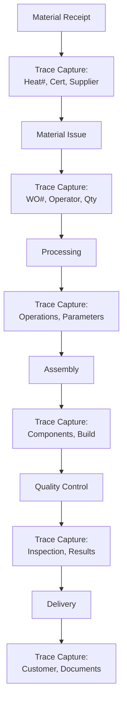

# Trace Module Development Plan for Fab.OS Platform
## Complete Material and Product Traceability System

### Version: 1.0
### Date: January 2025
### Status: Planning Phase

---

## Table of Contents

1. [Executive Summary](#1-executive-summary)
2. [Module Objectives](#2-module-objectives)
3. [Integration with Workflow System](#3-integration-with-workflow-system)
4. [Trace Data Model](#4-trace-data-model)
5. [Capture Architecture](#5-capture-architecture)
6. [Database Schema](#6-database-schema)
7. [Service Layer Design](#7-service-layer-design)
8. [UI Components](#8-ui-components)
9. [Reporting System](#9-reporting-system)
10. [Implementation Phases](#10-implementation-phases)
11. [Technical Requirements](#11-technical-requirements)
12. [Success Metrics](#12-success-metrics)

---

## 1. Executive Summary

The Trace Module provides complete material and product traceability throughout the Fab.OS workflow system, from raw material receipt through fabrication to final delivery. This module ensures AS5131 compliance, supports quality audits, and provides instant trace-forward and trace-backward capabilities.

### Key Capabilities
- **Material Traceability**: Track heat numbers, mill certificates, test reports
- **Process Traceability**: Capture who, what, when, where for all operations
- **Assembly Traceability**: Component genealogy for complex assemblies
- **Document Linking**: Attach certificates, photos, inspection reports
- **Compliance Reporting**: AS5131, ISO 9001, customer-specific requirements

### Integration Points
- Quote/Estimation → Initial material specifications
- Order → Customer traceability requirements
- Package → Batch/lot tracking at deliverable level
- Work Order → Operation-level capture
- ITP → Quality gate documentation
- Inventory → Material source tracking

---

## 2. Module Objectives

### Primary Objectives
1. **Complete Traceability**: Every item traceable from source to customer
2. **Regulatory Compliance**: Meet AS5131 and ISO 9001 requirements
3. **Quality Assurance**: Link all quality documents to items
4. **Rapid Recall**: Instant identification of affected items
5. **Customer Confidence**: Provide complete documentation packages

### Business Benefits
- Reduce audit preparation time by 80%
- Enable premium pricing for certified materials
- Minimize recall scope and costs
- Improve customer satisfaction with documentation
- Support continuous improvement with process data

### Technical Goals
- Real-time data capture at point of work
- Zero additional data entry (automatic capture)
- Sub-second trace queries on millions of records
- Mobile-friendly shop floor interfaces
- Integration with existing barcode/RFID systems

---

## 3. Integration with Workflow System

### 3.1 Quote/Estimation Phase
```
Trace Points:
- Material grade specifications
- Required certifications (MTR, 3.1, 3.2)
- Customer trace requirements
- Regulatory requirements identified
```

### 3.2 Order Phase
```
Trace Points:
- Customer PO requirements captured
- Delivery certification requirements
- Special inspection requirements
- Documentation package defined
```

### 3.3 Package Phase
```
Trace Points:
- Package batch/lot number assigned
- Items grouped for traceability
- Delivery bundle trace groups
- Pack bundle handling records
```

### 3.4 Work Order Phase
```
Trace Points:
- Material issue from inventory
- Heat number recording
- Operation completion records
- Resource/operator tracking
- Machine/tool usage
- Process parameters (welding amps, paint thickness)
```

### 3.5 ITP/Quality Phase
```
Trace Points:
- Inspection results linked
- Hold/witness point records
- NCR tracking
- Corrective action documentation
- Final inspection certificates
```

---

## 4. Trace Data Model

### 4.1 Core Trace Entity
```csharp
public class TraceRecord
{
    public int Id { get; set; }
    public Guid TraceId { get; set; } // Unique trace identifier
    public string TraceNumber { get; set; } // Human-readable: TRC-2025-000001
    
    // What we're tracing
    public TraceableType EntityType { get; set; }
    public int EntityId { get; set; }
    public string EntityReference { get; set; } // Order#, WO#, etc.
    
    // Hierarchy
    public Guid? ParentTraceId { get; set; }
    public virtual ICollection<TraceRecord> ChildTraces { get; set; }
    
    // When
    public DateTime CaptureDateTime { get; set; }
    public DateTime? EventDateTime { get; set; }
    
    // Who
    public int? UserId { get; set; }
    public string? OperatorName { get; set; }
    public string? Signature { get; set; }
    
    // Where
    public int? WorkCenterId { get; set; }
    public string? Location { get; set; }
    public string? MachineId { get; set; }
    
    // Status
    public TraceStatus Status { get; set; }
    public bool IsActive { get; set; }
    
    // Navigation
    public virtual User? User { get; set; }
    public virtual WorkCenter? WorkCenter { get; set; }
    public virtual ICollection<TraceMaterial> Materials { get; set; }
    public virtual ICollection<TraceDocument> Documents { get; set; }
    public virtual ICollection<TraceParameter> Parameters { get; set; }
}

public enum TraceableType
{
    RawMaterial,
    InventoryItem,
    ProcessedPart,
    Assembly,
    Package,
    WorkOrder,
    Operation,
    Inspection,
    Delivery
}

public enum TraceStatus
{
    Active,
    Completed,
    Quarantined,
    Released,
    Recalled,
    Scrapped
}
```

### 4.2 Material Trace
```csharp
public class TraceMaterial
{
    public int Id { get; set; }
    public int TraceRecordId { get; set; }
    
    // Material identification
    public int? CatalogueItemId { get; set; }
    public string MaterialCode { get; set; }
    public string Description { get; set; }
    
    // Source tracking
    public string? HeatNumber { get; set; }
    public string? BatchNumber { get; set; }
    public string? SerialNumber { get; set; }
    public string? Supplier { get; set; }
    public string? SupplierBatch { get; set; }
    
    // Certification
    public string? MillCertificate { get; set; }
    public CertificateType? CertType { get; set; } // 2.1, 2.2, 3.1, 3.2
    public DateTime? CertDate { get; set; }
    
    // Quantities
    public decimal Quantity { get; set; }
    public string Unit { get; set; }
    public decimal? Weight { get; set; }
    
    // Test data
    public string? ChemicalComposition { get; set; }
    public string? MechanicalProperties { get; set; }
    public string? TestResults { get; set; }
    
    public virtual TraceRecord TraceRecord { get; set; }
    public virtual CatalogueItem? CatalogueItem { get; set; }
}
```

### 4.3 Process Trace
```csharp
public class TraceProcess
{
    public int Id { get; set; }
    public int TraceRecordId { get; set; }
    
    // Operation details
    public int WorkOrderOperationId { get; set; }
    public string OperationCode { get; set; }
    public string OperationDescription { get; set; }
    
    // Timing
    public DateTime StartTime { get; set; }
    public DateTime? EndTime { get; set; }
    public decimal? DurationMinutes { get; set; }
    
    // Resources
    public int? OperatorId { get; set; }
    public string? OperatorName { get; set; }
    public int? MachineId { get; set; }
    public string? MachineName { get; set; }
    
    // Process parameters
    public virtual ICollection<TraceParameter> Parameters { get; set; }
    
    // Quality
    public bool? PassedInspection { get; set; }
    public string? InspectionNotes { get; set; }
    
    public virtual TraceRecord TraceRecord { get; set; }
    public virtual WorkOrderOperation WorkOrderOperation { get; set; }
}

public class TraceParameter
{
    public int Id { get; set; }
    public int TraceProcessId { get; set; }
    
    public string ParameterName { get; set; }
    public string ParameterValue { get; set; }
    public string? Unit { get; set; }
    public decimal? NumericValue { get; set; }
    
    // Common parameters
    public string? Category { get; set; } // Welding, Cutting, Painting
    
    public virtual TraceProcess TraceProcess { get; set; }
}
```

### 4.4 Assembly Trace (Genealogy)
```csharp
public class TraceAssembly
{
    public int Id { get; set; }
    public int TraceRecordId { get; set; }
    public int AssemblyId { get; set; }
    
    // Assembly identification
    public string AssemblyNumber { get; set; }
    public string? SerialNumber { get; set; }
    public DateTime AssemblyDate { get; set; }
    
    // Components used (genealogy)
    public virtual ICollection<TraceComponent> Components { get; set; }
    
    // Build details
    public int? BuildWorkOrderId { get; set; }
    public string? BuildLocation { get; set; }
    public string? BuildTeam { get; set; }
    
    public virtual TraceRecord TraceRecord { get; set; }
    public virtual Assembly Assembly { get; set; }
}

public class TraceComponent
{
    public int Id { get; set; }
    public int TraceAssemblyId { get; set; }
    
    // Component identification
    public Guid ComponentTraceId { get; set; } // Links to component's trace record
    public string ComponentType { get; set; }
    public string ComponentReference { get; set; }
    
    // Installation details
    public int Position { get; set; }
    public DateTime InstallDate { get; set; }
    public string? InstalledBy { get; set; }
    
    public virtual TraceAssembly TraceAssembly { get; set; }
}
```

### 4.5 Document Trace
```csharp
public class TraceDocument
{
    public int Id { get; set; }
    public int TraceRecordId { get; set; }
    
    public DocumentType DocumentType { get; set; }
    public string DocumentName { get; set; }
    public string? DocumentNumber { get; set; }
    
    // Storage
    public string? FilePath { get; set; }
    public byte[]? FileContent { get; set; }
    public string? CloudUrl { get; set; }
    
    // Metadata
    public DateTime UploadDate { get; set; }
    public int? UploadedById { get; set; }
    public string? Description { get; set; }
    
    // Verification
    public string? Checksum { get; set; }
    public bool IsVerified { get; set; }
    public DateTime? VerificationDate { get; set; }
    
    public virtual TraceRecord TraceRecord { get; set; }
}

public enum DocumentType
{
    MillCertificate,
    TestCertificate,
    InspectionReport,
    Photo,
    Drawing,
    WeldProcedure,
    NCR,
    DeliveryNote,
    Other
}
```

---

## 5. Capture Architecture

### 5.1 Capture Points



### 5.2 Capture Methods

#### Automatic Capture
- System events (material issue, operation complete)
- Barcode/RFID scanning
- Machine integration (PLC data)
- Time clock integration

#### Manual Capture
- Heat number entry
- Inspection results
- Parameter recording
- Photo uploads

#### Hybrid Capture
- Scan barcode + confirm details
- Auto-populate + manual verify
- Template + exceptions

### 5.3 Capture Service

```csharp
public interface ITraceService
{
    // Core capture
    Task<TraceRecord> CaptureTraceAsync(TraceCaptureDto capture);
    Task<TraceRecord> LinkParentChildAsync(Guid parentTrace, Guid childTrace);
    
    // Material tracking
    Task<TraceMaterial> RecordMaterialReceiptAsync(MaterialReceiptDto receipt);
    Task<TraceMaterial> RecordMaterialIssueAsync(MaterialIssueDto issue);
    
    // Process tracking
    Task<TraceProcess> RecordOperationStartAsync(int workOrderOpId, int operatorId);
    Task<TraceProcess> RecordOperationCompleteAsync(int traceProcessId, ProcessResultDto result);
    
    // Assembly tracking
    Task<TraceAssembly> RecordAssemblyBuildAsync(AssemblyBuildDto build);
    Task LinkComponentsToAssemblyAsync(int assemblyTraceId, List<Guid> componentTraces);
    
    // Document management
    Task<TraceDocument> AttachDocumentAsync(int traceId, DocumentUploadDto document);
    Task<bool> VerifyDocumentAsync(int documentId);
    
    // Queries
    Task<TraceRecord> GetTraceByIdAsync(Guid traceId);
    Task<List<TraceRecord>> TraceForwardAsync(Guid sourceTrace);
    Task<List<TraceRecord>> TraceBackwardAsync(Guid targetTrace);
    Task<TraceReportDto> GenerateTraceReportAsync(Guid traceId);
}
```

---

## 6. Database Schema

### 6.1 Core Tables

```sql
-- Main trace table
CREATE TABLE TraceRecords (
    Id INT IDENTITY(1,1) PRIMARY KEY,
    TraceId UNIQUEIDENTIFIER NOT NULL DEFAULT NEWID(),
    TraceNumber NVARCHAR(50) NOT NULL,
    EntityType INT NOT NULL,
    EntityId INT NOT NULL,
    EntityReference NVARCHAR(100),
    ParentTraceId UNIQUEIDENTIFIER NULL,
    CaptureDateTime DATETIME2 NOT NULL,
    EventDateTime DATETIME2 NULL,
    UserId INT NULL,
    OperatorName NVARCHAR(100),
    WorkCenterId INT NULL,
    Location NVARCHAR(100),
    MachineId NVARCHAR(50),
    Status INT NOT NULL,
    IsActive BIT NOT NULL DEFAULT 1,
    CreatedDate DATETIME2 DEFAULT GETUTCDATE(),
    CompanyId INT NOT NULL,
    
    FOREIGN KEY (UserId) REFERENCES Users(Id),
    FOREIGN KEY (WorkCenterId) REFERENCES WorkCenters(Id),
    INDEX IX_TraceRecords_TraceId (TraceId),
    INDEX IX_TraceRecords_EntityType_EntityId (EntityType, EntityId),
    INDEX IX_TraceRecords_ParentTraceId (ParentTraceId),
    INDEX IX_TraceRecords_CompanyId (CompanyId)
);

-- Material trace details
CREATE TABLE TraceMaterials (
    Id INT IDENTITY(1,1) PRIMARY KEY,
    TraceRecordId INT NOT NULL,
    CatalogueItemId INT NULL,
    MaterialCode NVARCHAR(50) NOT NULL,
    Description NVARCHAR(200),
    HeatNumber NVARCHAR(50),
    BatchNumber NVARCHAR(50),
    SerialNumber NVARCHAR(50),
    Supplier NVARCHAR(100),
    SupplierBatch NVARCHAR(50),
    MillCertificate NVARCHAR(100),
    CertType INT NULL,
    CertDate DATE NULL,
    Quantity DECIMAL(18,4) NOT NULL,
    Unit NVARCHAR(20) NOT NULL,
    Weight DECIMAL(18,4),
    ChemicalComposition NVARCHAR(MAX),
    MechanicalProperties NVARCHAR(MAX),
    TestResults NVARCHAR(MAX),
    
    FOREIGN KEY (TraceRecordId) REFERENCES TraceRecords(Id),
    FOREIGN KEY (CatalogueItemId) REFERENCES CatalogueItems(Id),
    INDEX IX_TraceMaterials_HeatNumber (HeatNumber),
    INDEX IX_TraceMaterials_BatchNumber (BatchNumber)
);

-- Process trace details
CREATE TABLE TraceProcesses (
    Id INT IDENTITY(1,1) PRIMARY KEY,
    TraceRecordId INT NOT NULL,
    WorkOrderOperationId INT NOT NULL,
    OperationCode NVARCHAR(20) NOT NULL,
    OperationDescription NVARCHAR(200),
    StartTime DATETIME2 NOT NULL,
    EndTime DATETIME2 NULL,
    DurationMinutes DECIMAL(10,2),
    OperatorId INT NULL,
    OperatorName NVARCHAR(100),
    MachineId INT NULL,
    MachineName NVARCHAR(100),
    PassedInspection BIT NULL,
    InspectionNotes NVARCHAR(500),
    
    FOREIGN KEY (TraceRecordId) REFERENCES TraceRecords(Id),
    FOREIGN KEY (WorkOrderOperationId) REFERENCES WorkOrderOperations(Id),
    INDEX IX_TraceProcesses_WorkOrderOperationId (WorkOrderOperationId)
);

-- Process parameters
CREATE TABLE TraceParameters (
    Id INT IDENTITY(1,1) PRIMARY KEY,
    TraceProcessId INT NOT NULL,
    ParameterName NVARCHAR(100) NOT NULL,
    ParameterValue NVARCHAR(200) NOT NULL,
    Unit NVARCHAR(20),
    NumericValue DECIMAL(18,4),
    Category NVARCHAR(50),
    
    FOREIGN KEY (TraceProcessId) REFERENCES TraceProcesses(Id),
    INDEX IX_TraceParameters_Category (Category)
);

-- Assembly genealogy
CREATE TABLE TraceAssemblies (
    Id INT IDENTITY(1,1) PRIMARY KEY,
    TraceRecordId INT NOT NULL,
    AssemblyId INT NOT NULL,
    AssemblyNumber NVARCHAR(50) NOT NULL,
    SerialNumber NVARCHAR(50),
    AssemblyDate DATETIME2 NOT NULL,
    BuildWorkOrderId INT NULL,
    BuildLocation NVARCHAR(100),
    BuildTeam NVARCHAR(100),
    
    FOREIGN KEY (TraceRecordId) REFERENCES TraceRecords(Id),
    FOREIGN KEY (AssemblyId) REFERENCES Assemblies(Id),
    INDEX IX_TraceAssemblies_SerialNumber (SerialNumber)
);

-- Assembly components
CREATE TABLE TraceComponents (
    Id INT IDENTITY(1,1) PRIMARY KEY,
    TraceAssemblyId INT NOT NULL,
    ComponentTraceId UNIQUEIDENTIFIER NOT NULL,
    ComponentType NVARCHAR(50) NOT NULL,
    ComponentReference NVARCHAR(100) NOT NULL,
    Position INT NOT NULL,
    InstallDate DATETIME2 NOT NULL,
    InstalledBy NVARCHAR(100),
    
    FOREIGN KEY (TraceAssemblyId) REFERENCES TraceAssemblies(Id),
    INDEX IX_TraceComponents_ComponentTraceId (ComponentTraceId)
);

-- Document attachments
CREATE TABLE TraceDocuments (
    Id INT IDENTITY(1,1) PRIMARY KEY,
    TraceRecordId INT NOT NULL,
    DocumentType INT NOT NULL,
    DocumentName NVARCHAR(200) NOT NULL,
    DocumentNumber NVARCHAR(50),
    FilePath NVARCHAR(500),
    FileContent VARBINARY(MAX),
    CloudUrl NVARCHAR(500),
    UploadDate DATETIME2 NOT NULL,
    UploadedById INT NULL,
    Description NVARCHAR(500),
    Checksum NVARCHAR(100),
    IsVerified BIT NOT NULL DEFAULT 0,
    VerificationDate DATETIME2 NULL,
    
    FOREIGN KEY (TraceRecordId) REFERENCES TraceRecords(Id),
    INDEX IX_TraceDocuments_DocumentType (DocumentType)
);
```

### 6.2 Views for Common Queries

```sql
-- Complete trace view
CREATE VIEW vw_CompleteTrace AS
SELECT 
    tr.TraceId,
    tr.TraceNumber,
    tr.EntityType,
    tr.EntityReference,
    tr.CaptureDateTime,
    tr.Status,
    tm.HeatNumber,
    tm.BatchNumber,
    tm.Supplier,
    tp.OperationCode,
    tp.StartTime,
    tp.EndTime,
    ta.AssemblyNumber,
    ta.SerialNumber
FROM TraceRecords tr
LEFT JOIN TraceMaterials tm ON tr.Id = tm.TraceRecordId
LEFT JOIN TraceProcesses tp ON tr.Id = tp.TraceRecordId
LEFT JOIN TraceAssemblies ta ON tr.Id = ta.TraceRecordId;

-- Material genealogy view
CREATE VIEW vw_MaterialGenealogy AS
WITH TraceHierarchy AS (
    SELECT 
        TraceId,
        ParentTraceId,
        EntityReference,
        0 as Level
    FROM TraceRecords
    WHERE ParentTraceId IS NULL
    
    UNION ALL
    
    SELECT 
        tr.TraceId,
        tr.ParentTraceId,
        tr.EntityReference,
        th.Level + 1
    FROM TraceRecords tr
    INNER JOIN TraceHierarchy th ON tr.ParentTraceId = th.TraceId
)
SELECT * FROM TraceHierarchy;
```

---

## 7. Service Layer Design

### 7.1 Trace Service Architecture

```csharp
public class TraceService : ITraceService
{
    private readonly ITraceRepository _traceRepository;
    private readonly IWorkflowService _workflowService;
    private readonly IDocumentService _documentService;
    private readonly INotificationService _notificationService;
    private readonly ILogger<TraceService> _logger;
    
    public async Task<TraceRecord> CaptureTraceAsync(TraceCaptureDto capture)
    {
        // Validate capture data
        var validation = await ValidateCaptureAsync(capture);
        if (!validation.IsValid)
            throw new ValidationException(validation.Errors);
        
        // Create trace record
        var trace = new TraceRecord
        {
            TraceId = Guid.NewGuid(),
            TraceNumber = await GenerateTraceNumberAsync(),
            EntityType = capture.EntityType,
            EntityId = capture.EntityId,
            EntityReference = capture.EntityReference,
            CaptureDateTime = DateTime.UtcNow,
            EventDateTime = capture.EventDateTime,
            UserId = capture.UserId,
            WorkCenterId = capture.WorkCenterId,
            Status = TraceStatus.Active
        };
        
        // Link to parent if specified
        if (capture.ParentTraceId.HasValue)
        {
            trace.ParentTraceId = capture.ParentTraceId.Value;
            await NotifyParentLinkAsync(trace.ParentTraceId.Value, trace.TraceId);
        }
        
        // Save trace
        await _traceRepository.AddAsync(trace);
        
        // Trigger workflow events
        await _workflowService.NotifyTraceCreatedAsync(trace);
        
        // Log event
        _logger.LogInformation($"Trace captured: {trace.TraceNumber} for {trace.EntityType} {trace.EntityReference}");
        
        return trace;
    }
    
    public async Task<List<TraceRecord>> TraceForwardAsync(Guid sourceTrace)
    {
        var results = new List<TraceRecord>();
        await TraceForwardRecursiveAsync(sourceTrace, results);
        return results;
    }
    
    private async Task TraceForwardRecursiveAsync(Guid parentTrace, List<TraceRecord> results)
    {
        var children = await _traceRepository.GetChildrenAsync(parentTrace);
        results.AddRange(children);
        
        foreach (var child in children)
        {
            await TraceForwardRecursiveAsync(child.TraceId, results);
        }
    }
    
    public async Task<TraceReportDto> GenerateTraceReportAsync(Guid traceId)
    {
        var trace = await _traceRepository.GetCompleteTraceAsync(traceId);
        if (trace == null)
            throw new NotFoundException($"Trace {traceId} not found");
        
        var report = new TraceReportDto
        {
            TraceId = trace.TraceId,
            TraceNumber = trace.TraceNumber,
            GeneratedDate = DateTime.UtcNow,
            GeneratedBy = _currentUser.Name
        };
        
        // Build genealogy tree
        report.GenealogyTree = await BuildGenealogyTreeAsync(traceId);
        
        // Collect all documents
        report.Documents = await CollectAllDocumentsAsync(traceId);
        
        // Generate summary
        report.Summary = GenerateTraceSummary(trace);
        
        return report;
    }
}
```

### 7.2 Capture Triggers

```csharp
public class TraceCaptureHandler : IEventHandler
{
    private readonly ITraceService _traceService;
    
    // Material receipt trigger
    public async Task HandleMaterialReceiptAsync(MaterialReceiptEvent evt)
    {
        var capture = new TraceCaptureDto
        {
            EntityType = TraceableType.RawMaterial,
            EntityId = evt.MaterialId,
            EntityReference = evt.PurchaseOrderNumber,
            EventDateTime = evt.ReceiptDate,
            UserId = evt.ReceivedBy,
            WorkCenterId = evt.WarehouseId
        };
        
        var trace = await _traceService.CaptureTraceAsync(capture);
        
        // Record material details
        await _traceService.RecordMaterialReceiptAsync(new MaterialReceiptDto
        {
            TraceRecordId = trace.Id,
            MaterialCode = evt.MaterialCode,
            HeatNumber = evt.HeatNumber,
            Supplier = evt.Supplier,
            MillCertificate = evt.CertificateNumber,
            Quantity = evt.Quantity
        });
    }
    
    // Work order operation trigger
    public async Task HandleOperationCompleteAsync(OperationCompleteEvent evt)
    {
        var capture = new TraceCaptureDto
        {
            EntityType = TraceableType.Operation,
            EntityId = evt.OperationId,
            EntityReference = evt.WorkOrderNumber,
            ParentTraceId = evt.MaterialTraceId,
            EventDateTime = evt.CompletionTime,
            UserId = evt.OperatorId,
            WorkCenterId = evt.WorkCenterId
        };
        
        var trace = await _traceService.CaptureTraceAsync(capture);
        
        // Record process details
        await _traceService.RecordOperationCompleteAsync(evt.TraceProcessId, new ProcessResultDto
        {
            EndTime = evt.CompletionTime,
            PassedInspection = evt.QualityCheck,
            Parameters = evt.ProcessParameters
        });
    }
}
```

---

## 8. UI Components

### 8.1 Trace Capture Component

```razor
@page "/trace/capture/{EntityType}/{EntityId}"

<div class="trace-capture-container">
    <h3>Capture Trace Data</h3>
    
    @if (EntityType == "Material")
    {
        <MaterialTraceCapture MaterialId="@EntityId" OnCaptured="@OnTraceCaptured" />
    }
    else if (EntityType == "Operation")
    {
        <OperationTraceCapture OperationId="@EntityId" OnCaptured="@OnTraceCaptured" />
    }
    else if (EntityType == "Assembly")
    {
        <AssemblyTraceCapture AssemblyId="@EntityId" OnCaptured="@OnTraceCaptured" />
    }
    
    <div class="trace-preview">
        <h4>Preview</h4>
        <TracePreview TraceData="@CurrentTrace" />
    </div>
    
    <div class="trace-actions">
        <button class="btn btn-primary" @onclick="SaveTrace">
            <i class="fas fa-save"></i> Save Trace
        </button>
        <button class="btn btn-secondary" @onclick="SaveAndNext">
            <i class="fas fa-arrow-right"></i> Save & Next
        </button>
    </div>
</div>

@code {
    [Parameter] public string EntityType { get; set; }
    [Parameter] public int EntityId { get; set; }
    
    private TraceCaptureDto CurrentTrace = new();
    
    private async Task SaveTrace()
    {
        var result = await TraceService.CaptureTraceAsync(CurrentTrace);
        await ShowNotification($"Trace {result.TraceNumber} saved successfully");
        NavigationManager.NavigateTo($"/trace/view/{result.TraceId}");
    }
}
```

### 8.2 Trace Viewer Component

```razor
@page "/trace/view/{TraceId}"

<div class="trace-viewer">
    <div class="trace-header">
        <h2>@TraceRecord.TraceNumber</h2>
        <span class="badge @GetStatusClass()">@TraceRecord.Status</span>
    </div>
    
    <div class="trace-tabs">
        <ul class="nav nav-tabs">
            <li class="nav-item">
                <a class="nav-link @(ActiveTab == "details" ? "active" : "")" 
                   @onclick='() => ActiveTab = "details"'>Details</a>
            </li>
            <li class="nav-item">
                <a class="nav-link @(ActiveTab == "genealogy" ? "active" : "")" 
                   @onclick='() => ActiveTab = "genealogy"'>Genealogy</a>
            </li>
            <li class="nav-item">
                <a class="nav-link @(ActiveTab == "documents" ? "active" : "")" 
                   @onclick='() => ActiveTab = "documents"'>Documents</a>
            </li>
            <li class="nav-item">
                <a class="nav-link @(ActiveTab == "timeline" ? "active" : "")" 
                   @onclick='() => ActiveTab = "timeline"'>Timeline</a>
            </li>
        </ul>
    </div>
    
    <div class="trace-content">
        @switch(ActiveTab)
        {
            case "details":
                <TraceDetails Trace="@TraceRecord" />
                break;
            case "genealogy":
                <TraceGenealogy TraceId="@TraceId" />
                break;
            case "documents":
                <TraceDocuments TraceId="@TraceId" />
                break;
            case "timeline":
                <TraceTimeline TraceId="@TraceId" />
                break;
        }
    </div>
    
    <div class="trace-actions">
        <button class="btn btn-primary" @onclick="GenerateReport">
            <i class="fas fa-file-pdf"></i> Generate Report
        </button>
        <button class="btn btn-info" @onclick="TraceForward">
            <i class="fas fa-arrow-right"></i> Trace Forward
        </button>
        <button class="btn btn-info" @onclick="TraceBackward">
            <i class="fas fa-arrow-left"></i> Trace Backward
        </button>
    </div>
</div>
```

### 8.3 Genealogy Tree Component

```razor
<div class="genealogy-tree">
    <svg width="@Width" height="@Height">
        @foreach(var node in Nodes)
        {
            <g transform="translate(@node.X, @node.Y)">
                <rect width="200" height="60" fill="@GetNodeColor(node.Type)" />
                <text x="100" y="25" text-anchor="middle">@node.Reference</text>
                <text x="100" y="45" text-anchor="middle" font-size="12">@node.Details</text>
            </g>
        }
        
        @foreach(var link in Links)
        {
            <line x1="@link.X1" y1="@link.Y1" 
                  x2="@link.X2" y2="@link.Y2" 
                  stroke="#666" stroke-width="2" />
        }
    </svg>
</div>

@code {
    [Parameter] public Guid TraceId { get; set; }
    
    private List<GenealogyNode> Nodes = new();
    private List<GenealogyLink> Links = new();
    
    protected override async Task OnInitializedAsync()
    {
        var genealogy = await TraceService.GetGenealogyAsync(TraceId);
        BuildVisualization(genealogy);
    }
}
```

---

## 9. Reporting System

### 9.1 Standard Reports

1. **Material Test Certificate (MTC)**
   - Heat number tracking
   - Chemical composition
   - Mechanical properties
   - Mill source

2. **Assembly Genealogy Report**
   - Component tree
   - Serial numbers
   - Build dates
   - Operator records

3. **Delivery Trace Package**
   - All items in delivery
   - Complete documentation
   - Quality records
   - Customer requirements met

4. **Compliance Audit Report**
   - AS5131 requirements
   - Evidence of compliance
   - Non-conformances
   - Corrective actions

### 9.2 Report Generation Service

```csharp
public class TraceReportService
{
    public async Task<byte[]> GenerateMTCReportAsync(Guid traceId)
    {
        var trace = await GetCompleteTraceAsync(traceId);
        var materials = await GetMaterialDataAsync(traceId);
        
        using (var document = new PdfDocument())
        {
            // Add header
            document.AddHeader("Material Test Certificate");
            document.AddSubHeader($"Trace: {trace.TraceNumber}");
            
            // Material details
            document.AddSection("Material Information");
            document.AddTable(new[] {
                new[] { "Heat Number", materials.HeatNumber },
                new[] { "Grade", materials.Grade },
                new[] { "Supplier", materials.Supplier },
                new[] { "Certificate", materials.CertificateNumber }
            });
            
            // Chemical composition
            document.AddSection("Chemical Composition");
            document.AddChemicalTable(materials.ChemicalData);
            
            // Mechanical properties
            document.AddSection("Mechanical Properties");
            document.AddMechanicalTable(materials.MechanicalData);
            
            // Signatures
            document.AddSignatureBlock();
            
            return document.ToByteArray();
        }
    }
}
```

---

## 10. Implementation Phases

### Phase 1: Foundation (Weeks 1-4)
- [ ] Create trace database schema
- [ ] Implement core trace entities
- [ ] Build capture service
- [ ] Create basic UI components
- [ ] Integration with existing workflow

### Phase 2: Material Tracking (Weeks 5-8)
- [ ] Material receipt capture
- [ ] Heat number tracking
- [ ] Certificate management
- [ ] Supplier integration
- [ ] Material issue tracking

### Phase 3: Process Tracking (Weeks 9-12)
- [ ] Operation capture
- [ ] Parameter recording
- [ ] Machine integration
- [ ] Operator tracking
- [ ] Time capture

### Phase 4: Assembly Genealogy (Weeks 13-16)
- [ ] Component tracking
- [ ] Assembly build capture
- [ ] Serial number generation
- [ ] Genealogy visualization
- [ ] Component substitution

### Phase 5: Quality Integration (Weeks 17-20)
- [ ] ITP point capture
- [ ] Inspection recording
- [ ] NCR tracking
- [ ] Document attachment
- [ ] Verification workflow

### Phase 6: Reporting (Weeks 21-24)
- [ ] MTC generation
- [ ] Genealogy reports
- [ ] Compliance reports
- [ ] Customer packages
- [ ] Audit trails

---

## 11. Technical Requirements

### 11.1 Performance Requirements
- Capture latency: < 100ms
- Query response: < 1 second for 1M records
- Report generation: < 5 seconds
- Concurrent users: 100+
- Data retention: 10 years minimum

### 11.2 Integration Requirements
- REST API for external systems
- Barcode/RFID scanner support
- ERP integration capability
- Document management system
- Email notifications

### 11.3 Security Requirements
- Role-based access control
- Audit logging
- Data encryption at rest
- Secure document storage
- Digital signatures

### 11.4 Compliance Requirements
- AS5131 traceability
- ISO 9001 records
- Customer specifications
- Regulatory requirements
- Data retention policies

---

## 12. Success Metrics

### 12.1 Business Metrics
- Audit preparation time: -80%
- Documentation errors: -95%
- Customer complaints: -60%
- Recall scope accuracy: +90%
- Premium pricing enabled: +5-10%

### 12.2 Technical Metrics
- Data capture rate: 99.9%
- System uptime: 99.95%
- Query performance: <1s
- Report accuracy: 100%
- User adoption: >90%

### 12.3 Quality Metrics
- Traceability gaps: 0%
- Document completeness: 100%
- Compliance violations: 0
- Customer satisfaction: >95%
- Audit findings: <5 minor

---

## Appendix A: Sample Trace Scenarios

### Scenario 1: Simple Handrail
1. Material received (316 SS, Heat# ABC123)
2. Issued to WO-2025-0001
3. Cut to length operation
4. Welding operation
5. Polishing operation
6. Quality inspection
7. Delivery to customer

### Scenario 2: Complex Assembly
1. Multiple materials received
2. Components processed separately
3. Sub-assemblies built
4. Main assembly constructed
5. Multiple quality gates
6. Serialization
7. Customer documentation package

### Scenario 3: Material Recall
1. Supplier notifies of defect
2. Query system for heat number
3. Identify all affected items
4. Trace forward to deliveries
5. Generate recall notices
6. Track corrective actions

---

## Appendix B: Integration Examples

### Barcode Scanner Integration
```javascript
// Scanner event handler
scanner.on('scan', async (barcode) => {
    const trace = await captureTrace({
        barcode: barcode,
        timestamp: new Date(),
        operator: currentUser,
        location: currentWorkCenter
    });
    
    showNotification(`Captured: ${trace.traceNumber}`);
});
```

### Machine PLC Integration
```csharp
// PLC data capture
plcConnection.OnDataReceived += async (sender, data) => {
    await TraceService.RecordParametersAsync(new ParameterData {
        WorkOrderId = data.WorkOrder,
        Parameters = new Dictionary<string, object> {
            ["WeldCurrent"] = data.Current,
            ["WeldVoltage"] = data.Voltage,
            ["WireSpeed"] = data.WireSpeed,
            ["GasFlow"] = data.GasFlow
        }
    });
};
```

---

*End of Trace Module Development Plan*