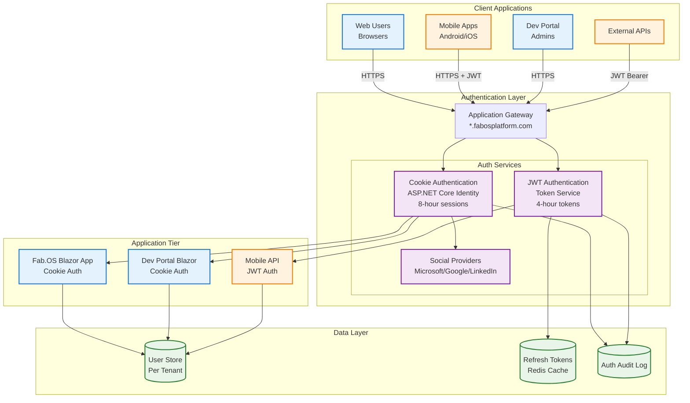
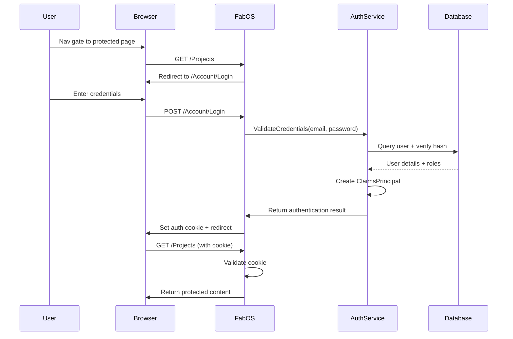
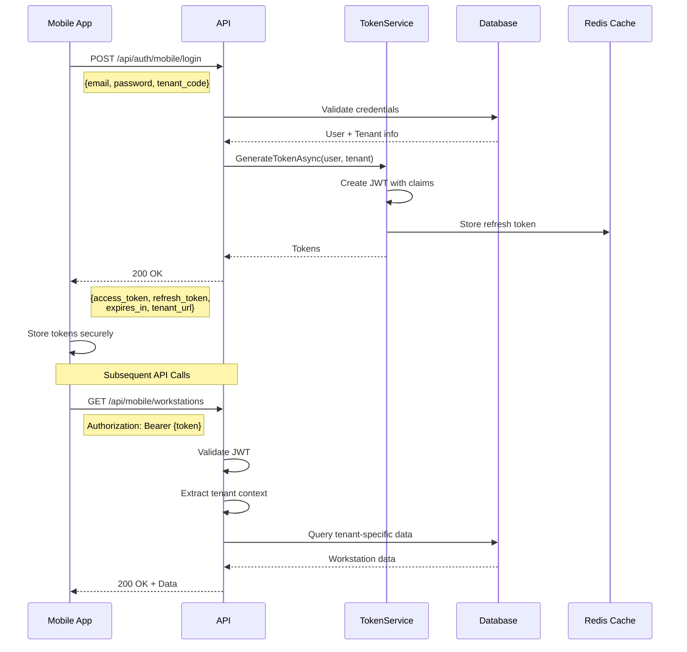
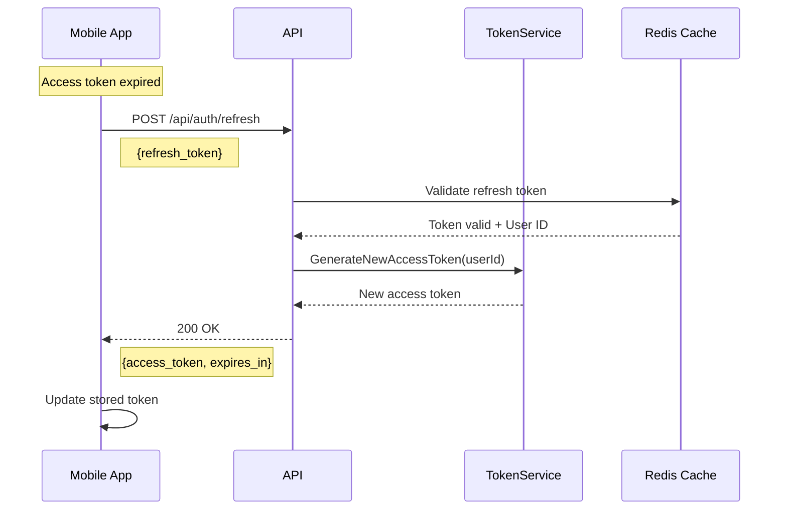

# Fab.OS Platform - Authentication Architecture

## Executive Summary

The Fab.OS platform implements a **dual authentication strategy** optimized for different client types, following Microsoft's best practices for enterprise SaaS applications. This architecture provides secure, scalable authentication while maintaining optimal user experience across web and mobile platforms.

## Architecture Overview



## Authentication Strategies

### 1. Cookie Authentication (Web Applications)

**Used For**: 
- Fab.OS Blazor Server application
- Dev Portal administration interface
- All browser-based interactions

**Implementation**:
```csharp
// Program.cs - Cookie Configuration
builder.Services.AddAuthentication(options =>
{
    options.DefaultScheme = CookieAuthenticationDefaults.AuthenticationScheme;
    options.DefaultChallengeScheme = CookieAuthenticationDefaults.AuthenticationScheme;
})
.AddCookie(options =>
{
    options.Cookie.Name = ".FabOS.Auth";
    options.Cookie.HttpOnly = true;  // XSS protection
    options.Cookie.SecurePolicy = CookieSecurePolicy.Always;  // HTTPS only
    options.Cookie.SameSite = SameSiteMode.Strict;  // CSRF protection
    options.LoginPath = "/Account/Login";
    options.LogoutPath = "/Account/Logout";
    options.ExpireTimeSpan = TimeSpan.FromHours(8);
    options.SlidingExpiration = true;
    options.Events = new CookieAuthenticationEvents
    {
        OnValidatePrincipal = SecurityStampValidator.ValidatePrincipalAsync
    };
});
```

**Benefits**:
- ✅ Perfect for Blazor Server (stateful connection)
- ✅ No token management in JavaScript
- ✅ Automatic sliding expiration
- ✅ Built-in CSRF protection
- ✅ Works seamlessly with SignalR

### 2. JWT Authentication (Mobile & API)

**Used For**:
- Android/iOS mobile applications  
- External API integrations
- Microservice communication

**Implementation**:
```csharp
// Program.cs - JWT Configuration
builder.Services.AddAuthentication()
    .AddJwtBearer("Bearer", options =>
    {
        options.TokenValidationParameters = new TokenValidationParameters
        {
            ValidateIssuer = true,
            ValidateAudience = true,
            ValidateLifetime = true,
            ValidateIssuerSigningKey = true,
            ValidIssuer = Configuration["JwtSettings:Issuer"],
            ValidAudience = Configuration["JwtSettings:Audience"],
            IssuerSigningKey = new SymmetricSecurityKey(
                Encoding.UTF8.GetBytes(Configuration["JwtSettings:SecretKey"])),
            ClockSkew = TimeSpan.FromMinutes(5)
        };
        
        options.Events = new JwtBearerEvents
        {
            OnTokenValidated = async context =>
            {
                // Add tenant context from token claims
                var tenantClaim = context.Principal.FindFirst("tenant_id");
                if (tenantClaim != null)
                {
                    context.HttpContext.Items["TenantId"] = tenantClaim.Value;
                }
            }
        };
    });
```

**Existing Authentication Services**:

Your platform already has a robust authentication infrastructure that we'll extend for mobile support:

```csharp
// Existing service interfaces in SteelEstimation.Core.Interfaces

// Primary authentication service - handles JWT generation and validation
public interface IFabOSAuthenticationService
{
    // JWT token generation and validation (already implemented)
    string GenerateJwtToken(User user);
    ClaimsPrincipal? ValidateJwtToken(string token);
    
    // Core authentication methods
    Task<AuthenticationResult> AuthenticateAsync(string email, string password, string productName = null);
    
    // Product access control
    Task<bool> UserHasProductAccessAsync(int userId, string productName);
    Task<List<string>> GetUserProductsAsync(int userId);
    Task<string?> GetUserProductRoleAsync(int userId, string productName);
    Task<bool> CheckConcurrentUserLimitAsync(string productName, int companyId, int userId);
}

// Multi-auth service - handles social login and account linking
public interface IMultiAuthService : IFabOSAuthenticationService
{
    // Social authentication (Microsoft, Google, LinkedIn)
    Task<AuthenticationResult> SignUpWithSocialAsync(string provider, ClaimsPrincipal externalPrincipal, string companyName = null);
    Task<AuthenticationResult> SignInWithSocialAsync(string provider, ClaimsPrincipal externalPrincipal, string productName = null);
    
    // Account linking capabilities
    Task<bool> LinkSocialAccountAsync(int userId, string provider, ClaimsPrincipal externalPrincipal);
    Task<bool> UnlinkSocialAccountAsync(int userId, string provider);
    Task<List<UserAuthMethod>> GetUserAuthMethodsAsync(int userId);
}
```

**Enhanced Token Service for Mobile**:
```csharp
// Extend existing FabOSAuthenticationService for mobile-specific needs
public class MobileTokenService : IMobileTokenService
{
    private readonly IFabOSAuthenticationService _authService;
    private readonly IMultiAuthService _multiAuthService;
    private readonly IConfiguration _configuration;
    private readonly ILogger<MobileTokenService> _logger;
    
    public async Task<AuthTokenResponse> GenerateTokenAsync(User user, Tenant tenant)
    {
        var tokenHandler = new JwtSecurityTokenHandler();
        var key = Encoding.ASCII.GetBytes(_configuration["JwtSettings:SecretKey"]);
        
        // Generate access token (4 hours for mobile)
        var accessTokenDescriptor = new SecurityTokenDescriptor
        {
            Subject = new ClaimsIdentity(new[]
            {
                new Claim(ClaimTypes.NameIdentifier, user.Id.ToString()),
                new Claim(ClaimTypes.Email, user.Email),
                new Claim(ClaimTypes.Name, $"{user.FirstName} {user.LastName}"),
                new Claim("tenant_id", tenant.Id),
                new Claim("tenant_code", tenant.Code),
                new Claim("company_id", user.CompanyId.ToString()),
                new Claim(ClaimTypes.Role, user.Role),
                new Claim("modules", string.Join(",", user.ModuleAccess))
            }),
            Expires = DateTime.UtcNow.AddHours(4),
            SigningCredentials = new SigningCredentials(
                new SymmetricSecurityKey(key),
                SecurityAlgorithms.HmacSha256Signature),
            Issuer = _configuration["JwtSettings:Issuer"],
            Audience = _configuration["JwtSettings:Audience"]
        };
        
        var accessToken = tokenHandler.CreateToken(accessTokenDescriptor);
        
        // Generate refresh token (30 days)
        var refreshToken = GenerateRefreshToken();
        await StoreRefreshTokenAsync(user.Id, refreshToken);
        
        return new AuthTokenResponse
        {
            AccessToken = tokenHandler.WriteToken(accessToken),
            RefreshToken = refreshToken,
            ExpiresIn = 14400, // 4 hours in seconds
            TokenType = "Bearer",
            TenantId = tenant.Id,
            TenantUrl = $"https://{tenant.Code}.fabosplatform.com"
        };
    }
    
    private string GenerateRefreshToken()
    {
        var randomNumber = new byte[32];
        using var rng = RandomNumberGenerator.Create();
        rng.GetBytes(randomNumber);
        return Convert.ToBase64String(randomNumber);
    }
}
```

**Benefits**:
- ✅ Stateless and scalable
- ✅ Works offline (until expiry)
- ✅ Standard for mobile SDKs
- ✅ Can be stored securely on device
- ✅ Supports refresh token pattern

## Authentication Flows

### Web Login Flow (Cookie-based)



### Mobile Login Flow (JWT-based)



### Token Refresh Flow



## Social Authentication Integration

### Supported Providers
- **Microsoft Account** (Azure AD)
- **Google Account**
- **LinkedIn** (Professional networks)

### Implementation
```csharp
// Social auth configuration (web only)
builder.Services.AddAuthentication()
    .AddMicrosoftAccount(options =>
    {
        options.ClientId = Configuration["Authentication:Microsoft:ClientId"];
        options.ClientSecret = Configuration["Authentication:Microsoft:ClientSecret"];
        options.SaveTokens = true;
    })
    .AddGoogle(options =>
    {
        options.ClientId = Configuration["Authentication:Google:ClientId"];
        options.ClientSecret = Configuration["Authentication:Google:ClientSecret"];
    })
    .AddLinkedIn(options =>
    {
        options.ClientId = Configuration["Authentication:LinkedIn:ClientId"];
        options.ClientSecret = Configuration["Authentication:LinkedIn:ClientSecret"];
    });
```

## Multi-Tenant Context

### Tenant Resolution
```csharp
public class TenantContextMiddleware
{
    public async Task InvokeAsync(HttpContext context, RequestDelegate next)
    {
        string tenantId = null;
        
        // For web requests - from subdomain
        if (context.Request.Host.Host.Contains(".fabosplatform.com"))
        {
            var subdomain = context.Request.Host.Host.Split('.')[0];
            tenantId = await ResolveTenantFromSubdomain(subdomain);
        }
        
        // For API requests - from JWT claim
        if (context.User.Identity.IsAuthenticated)
        {
            var tenantClaim = context.User.FindFirst("tenant_id");
            if (tenantClaim != null)
            {
                tenantId = tenantClaim.Value;
            }
        }
        
        if (!string.IsNullOrEmpty(tenantId))
        {
            context.Items["TenantId"] = tenantId;
        }
        
        await next(context);
    }
}
```

## Security Best Practices

### 1. Password Security
- **Algorithm**: PBKDF2 with HMACSHA256
- **Iterations**: 100,000
- **Salt**: 128-bit random per user
- **Hash**: 256-bit

### 2. Token Security
- **Access Token**: 4 hours (mobile), non-revocable
- **Refresh Token**: 30 days, revocable
- **Signing**: HMAC-SHA256
- **Storage**: Secure device storage (mobile), httpOnly cookies (web)

### 3. Transport Security
- **HTTPS**: Required for all endpoints
- **HSTS**: Enabled in production
- **Certificate Pinning**: Recommended for mobile apps

### 4. Rate Limiting
```csharp
// API rate limiting per tenant
services.AddRateLimiter(options =>
{
    options.GlobalLimiter = PartitionedRateLimiter.Create<HttpContext, string>(
        httpContext => RateLimitPartition.GetFixedWindowLimiter(
            partitionKey: httpContext.Items["TenantId"]?.ToString() ?? "anonymous",
            factory: partition => new FixedWindowRateLimiterOptions
            {
                AutoReplenishment = true,
                PermitLimit = 100,
                Window = TimeSpan.FromMinutes(1)
            }));
});
```

## Integration with Existing Services

### Leveraging Current Authentication Infrastructure

The platform's existing authentication services (FabOSAuthenticationService and MultiAuthService) already handle:
- ✅ JWT token generation (`GenerateJwtToken` method exists)
- ✅ JWT validation (`ValidateJwtToken` method exists)  
- ✅ Product access control (module licensing)
- ✅ Social authentication (Microsoft, Google, LinkedIn)
- ✅ Account linking and multiple auth methods
- ✅ Password hashing with PBKDF2-HMACSHA256

### Mobile Authentication Controller

```csharp
[ApiController]
[Route("api/auth")]
public class MobileAuthController : ControllerBase
{
    private readonly IFabOSAuthenticationService _authService;
    private readonly IMultiAuthService _multiAuthService;
    private readonly IMobileTokenService _mobileTokenService;
    
    [HttpPost("mobile/login")]
    public async Task<IActionResult> MobileLogin([FromBody] MobileLoginRequest request)
    {
        // Use existing authentication service
        var authResult = await _authService.AuthenticateAsync(
            request.Email, 
            request.Password,
            request.ProductName // "Estimate", "Trace", etc.
        );
        
        if (!authResult.Success)
            return Unauthorized(new { error = authResult.ErrorMessage });
        
        // Check product access using existing service
        if (!string.IsNullOrEmpty(request.ProductName))
        {
            var hasAccess = await _authService.UserHasProductAccessAsync(
                authResult.User.Id, 
                request.ProductName
            );
            
            if (!hasAccess)
                return Forbidden(new { error = "No access to requested product" });
        }
        
        // Generate mobile-specific token with refresh token
        var tokenResponse = await _mobileTokenService.GenerateMobileTokenAsync(
            authResult.User,
            request.DeviceId,
            request.Platform
        );
        
        return Ok(tokenResponse);
    }
    
    [HttpPost("mobile/social")]
    public async Task<IActionResult> MobileSocialLogin([FromBody] SocialLoginRequest request)
    {
        // Leverage existing MultiAuthService for social login
        var authResult = await _multiAuthService.SignInWithSocialAsync(
            request.Provider,
            request.ExternalToken,
            request.ProductName
        );
        
        if (!authResult.Success)
            return Unauthorized(new { error = authResult.ErrorMessage });
        
        // Generate mobile token
        var tokenResponse = await _mobileTokenService.GenerateMobileTokenAsync(
            authResult.User,
            request.DeviceId,
            request.Platform
        );
        
        return Ok(tokenResponse);
    }
}
```

## Controller Implementation

### Web Controllers (Cookie Auth)
```csharp
[Authorize] // Uses cookie authentication by default
public class ProjectController : Controller
{
    private readonly IProjectService _projectService;
    
    public async Task<IActionResult> Index()
    {
        var tenantId = HttpContext.Items["TenantId"]?.ToString();
        var projects = await _projectService.GetProjectsAsync(tenantId);
        return View(projects);
    }
}
```

### API Controllers (JWT Auth)
```csharp
[ApiController]
[Route("api/mobile/[controller]")]
[Authorize(AuthenticationSchemes = JwtBearerDefaults.AuthenticationScheme)]
public class WorkstationController : ControllerBase
{
    private readonly IWorkstationService _workstationService;
    
    [HttpGet]
    public async Task<IActionResult> GetWorkstations()
    {
        var tenantId = HttpContext.Items["TenantId"]?.ToString();
        var workstations = await _workstationService.GetForMobileAsync(tenantId);
        return Ok(workstations);
    }
}
```

### Mixed Authentication Controller
```csharp
[ApiController]
[Route("api/[controller]")]
public class DataController : ControllerBase
{
    [HttpGet("web")]
    [Authorize(AuthenticationSchemes = CookieAuthenticationDefaults.AuthenticationScheme)]
    public async Task<IActionResult> GetWebData()
    {
        // For Blazor components via fetch
    }
    
    [HttpGet("mobile")]
    [Authorize(AuthenticationSchemes = JwtBearerDefaults.AuthenticationScheme)]
    public async Task<IActionResult> GetMobileData()
    {
        // For mobile apps
    }
}
```

## Monitoring & Auditing

### Authentication Events
```csharp
public class AuthenticationAuditService
{
    public async Task LogAuthenticationEventAsync(AuthEvent authEvent)
    {
        var logEntry = new AuthenticationLog
        {
            UserId = authEvent.UserId,
            TenantId = authEvent.TenantId,
            EventType = authEvent.Type, // Login, Logout, TokenRefresh, Failed
            ClientType = authEvent.ClientType, // Web, Mobile, API
            IpAddress = authEvent.IpAddress,
            UserAgent = authEvent.UserAgent,
            Timestamp = DateTime.UtcNow,
            Success = authEvent.Success,
            FailureReason = authEvent.FailureReason
        };
        
        await _dbContext.AuthenticationLogs.AddAsync(logEntry);
        
        // Alert on suspicious activity
        if (authEvent.Type == AuthEventType.Failed)
        {
            await CheckForBruteForceAsync(authEvent);
        }
    }
}
```

### Metrics to Track
- Login success/failure rates per tenant
- Token refresh patterns
- Average session duration
- Authentication method usage (password vs social)
- Geographic distribution of logins
- Device types and platforms

## Existing Service Implementations

### Current Authentication Services in Production

```csharp
// SteelEstimation.Infrastructure.Services

// FabOSAuthenticationService.cs - Main authentication service
public class FabOSAuthenticationService : IFabOSAuthenticationService
{
    // Already implements:
    // - JWT generation with product claims
    // - Password validation with PBKDF2
    // - Product access checking
    // - Concurrent user limits
    // - Activity tracking
}

// MultiAuthService.cs - Social authentication handler  
public class MultiAuthService : IMultiAuthService, IFabOSAuthenticationService
{
    // Already implements:
    // - Microsoft account login
    // - Google account login (when enabled)
    // - LinkedIn login (when enabled)
    // - Account linking/unlinking
    // - Social login audit logging
}

// TokenService.cs - JWT token management
public class TokenService : ITokenService
{
    // Already implements:
    // - JWT token generation
    // - Token validation
    // - Claims management
}
```

### What Needs to Be Added for Mobile

```csharp
// New: MobileTokenService.cs
public class MobileTokenService : IMobileTokenService
{
    private readonly IFabOSAuthenticationService _authService;
    private readonly ITokenService _tokenService;
    private readonly IDbContext _context;
    
    public async Task<MobileAuthResponse> GenerateMobileTokenAsync(
        User user, string deviceId, string platform)
    {
        // 1. Use existing JWT generation
        var accessToken = _authService.GenerateJwtToken(user);
        
        // 2. Add mobile-specific claims
        var enhancedToken = AddMobileClaims(accessToken, deviceId, platform);
        
        // 3. Generate and store refresh token
        var refreshToken = GenerateRefreshToken();
        await StoreRefreshToken(user.Id, deviceId, refreshToken);
        
        // 4. Record device registration
        await RegisterDevice(user.Id, deviceId, platform);
        
        return new MobileAuthResponse
        {
            AccessToken = enhancedToken,
            RefreshToken = refreshToken,
            ExpiresIn = 14400, // 4 hours
            TenantCode = user.Company.Code
        };
    }
}
```

## Migration Path

### Phase 1: Current State (✅ Complete)
- Cookie authentication for web
- Basic user management
- Social login support

### Phase 2: Mobile API Addition (🔄 In Progress)
- Add JWT authentication scheme
- Create mobile-specific endpoints
- Implement token service
- Add refresh token support

### Phase 3: Enhanced Security (📋 Planned)
- Implement MFA/2FA
- Add device trust
- Biometric authentication support
- Adaptive authentication

### Phase 4: Advanced Features (🔮 Future)
- Single Sign-On (SSO)
- SAML support for enterprise
- Passwordless authentication
- Risk-based authentication

## Configuration

### appsettings.json
```json
{
  "Authentication": {
    "Cookie": {
      "Name": ".FabOS.Auth",
      "ExpireHours": 8,
      "SlidingExpiration": true,
      "HttpOnly": true,
      "SecurePolicy": "Always"
    },
    "Jwt": {
      "SecretKey": "your-256-bit-secret-key-stored-in-keyvault",
      "Issuer": "https://fabosplatform.com",
      "Audience": "https://api.fabosplatform.com",
      "AccessTokenExpireHours": 4,
      "RefreshTokenExpireDays": 30
    },
    "Microsoft": {
      "Enabled": true,
      "ClientId": "your-client-id",
      "ClientSecret": "your-secret"
    },
    "RateLimit": {
      "PermitLimit": 100,
      "Window": 60
    }
  }
}
```

## Troubleshooting Guide

### Common Issues

1. **Cookie not being set**
   - Check HTTPS configuration
   - Verify SameSite settings
   - Check domain configuration

2. **JWT token invalid**
   - Verify clock synchronization
   - Check issuer/audience match
   - Validate signing key

3. **Tenant context missing**
   - Ensure middleware order is correct
   - Check subdomain resolution
   - Verify JWT claims

4. **Social login failing**
   - Validate redirect URIs
   - Check client credentials
   - Verify provider configuration

## Security Checklist

- [ ] HTTPS enforced on all endpoints
- [ ] Passwords hashed with salt
- [ ] JWT secrets in Key Vault
- [ ] Rate limiting enabled
- [ ] Authentication logs monitored
- [ ] Failed login alerts configured
- [ ] Token expiry appropriate
- [ ] CORS properly configured
- [ ] Security headers implemented
- [ ] Regular security audits scheduled

## Conclusion

This dual authentication architecture provides:
- **Optimal UX** for both web and mobile users
- **Security** through appropriate methods per platform
- **Scalability** with stateless JWT for APIs
- **Flexibility** to support future authentication needs
- **Compliance** with industry standards and best practices

The architecture follows Microsoft's recommendations for enterprise SaaS applications while maintaining simplicity and developer productivity.