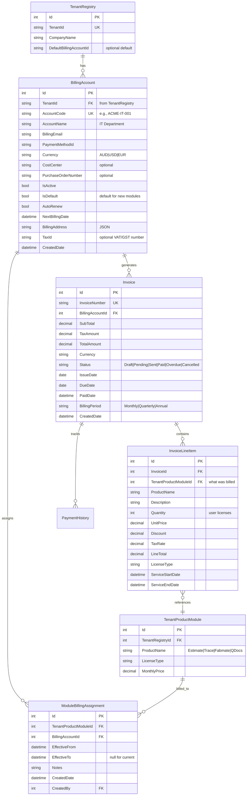

# Enhanced Multi-Account Billing Structure Design

## Current Limitation
The current design assumes one billing account per tenant, which is too restrictive for enterprise scenarios.

## Enhanced Billing Requirements
1. **Multiple Billing Accounts**: A tenant can have multiple billing accounts (e.g., different departments, cost centers)
2. **Module-Level Assignment**: Each module can be assigned to a different billing account
3. **Flexible Billing**: Support scenarios like:
   - IT department pays for Estimate & Trace
   - Operations pays for Fabmate
   - Quality department pays for QDocs
   - Or single account for everything

## Enhanced Billing ERD



## Usage Scenarios

### Scenario 1: Single Billing Account (Simple)
```
ACME Corp
├── Billing Account: "ACME-MAIN"
    ├── Estimate Module → ACME-MAIN
    ├── Trace Module → ACME-MAIN
    └── Fabmate Module → ACME-MAIN
```

### Scenario 2: Department-Based Billing (Enterprise)
```
ACME Corp
├── Billing Account: "ACME-IT" (IT@acme.com)
│   ├── Estimate Module
│   └── Trace Module
├── Billing Account: "ACME-OPS" (operations@acme.com)
│   └── Fabmate Module
└── Billing Account: "ACME-QA" (quality@acme.com)
    └── QDocs Module
```

### Scenario 3: Project-Based Billing
```
ACME Corp
├── Billing Account: "PROJECT-ALPHA" (PO# 12345)
│   ├── Estimate Module (10 users)
│   └── Trace Module (5 users)
└── Billing Account: "PROJECT-BETA" (PO# 67890)
    ├── Estimate Module (20 users)
    └── Fabmate Module (15 users)
```

## Implementation Details

### 1. Module Billing Assignment Service
```csharp
public interface IModuleBillingService
{
    // Assign a module to a billing account
    Task AssignModuleToBillingAccountAsync(
        int tenantProductModuleId, 
        int billingAccountId,
        DateTime effectiveFrom);
    
    // Get current billing account for a module
    Task<BillingAccount> GetModuleBillingAccountAsync(
        int tenantProductModuleId);
    
    // Transfer module to different billing account
    Task TransferModuleBillingAsync(
        int tenantProductModuleId,
        int fromAccountId,
        int toAccountId,
        DateTime transferDate);
    
    // Get billing history for a module
    Task<List<ModuleBillingHistory>> GetModuleBillingHistoryAsync(
        int tenantProductModuleId);
}
```

### 2. Invoice Generation Logic
```csharp
public async Task GenerateInvoicesAsync(DateTime billingDate)
{
    // Get all active billing accounts
    var billingAccounts = await GetActiveBillingAccountsAsync();
    
    foreach (var account in billingAccounts)
    {
        // Get all modules assigned to this billing account
        var assignedModules = await GetModulesForBillingAccountAsync(
            account.Id, billingDate);
        
        if (!assignedModules.Any()) continue;
        
        // Create invoice
        var invoice = new Invoice
        {
            BillingAccountId = account.Id,
            IssueDate = billingDate,
            DueDate = billingDate.AddDays(30),
            Status = "Draft"
        };
        
        // Add line items for each module
        foreach (var module in assignedModules)
        {
            invoice.LineItems.Add(new InvoiceLineItem
            {
                TenantProductModuleId = module.Id,
                ProductName = module.ProductName,
                Quantity = module.ActiveUsers,
                UnitPrice = module.MonthlyPrice,
                ServiceStartDate = billingDate,
                ServiceEndDate = billingDate.AddMonths(1).AddDays(-1)
            });
        }
        
        // Calculate totals
        invoice.SubTotal = invoice.LineItems.Sum(li => li.LineTotal);
        invoice.TaxAmount = CalculateTax(invoice.SubTotal, account.TaxRate);
        invoice.TotalAmount = invoice.SubTotal + invoice.TaxAmount;
        
        await SaveInvoiceAsync(invoice);
    }
}
```

### 3. UI Enhancements

#### Billing Account Management
```razor
@page "/tenant/{TenantId}/billing"

<h3>Billing Accounts for @TenantName</h3>

<button @onclick="AddBillingAccount">+ Add Billing Account</button>

<table>
    <thead>
        <tr>
            <th>Account Code</th>
            <th>Account Name</th>
            <th>Billing Email</th>
            <th>Assigned Modules</th>
            <th>Monthly Total</th>
            <th>Actions</th>
        </tr>
    </thead>
    <tbody>
        @foreach (var account in BillingAccounts)
        {
            <tr>
                <td>@account.AccountCode</td>
                <td>@account.AccountName</td>
                <td>@account.BillingEmail</td>
                <td>
                    @foreach (var module in account.AssignedModules)
                    {
                        <span class="badge">@module.ProductName</span>
                    }
                </td>
                <td>$@account.MonthlyTotal</td>
                <td>
                    <button @onclick="() => EditAccount(account)">Edit</button>
                    <button @onclick="() => ManageModules(account)">Manage Modules</button>
                </td>
            </tr>
        }
    </tbody>
</table>
```

#### Module Assignment Interface
```razor
<h4>Assign Modules to Billing Accounts</h4>

@foreach (var module in TenantModules)
{
    <div class="module-assignment">
        <label>@module.ProductName (@module.LicenseType)</label>
        <select @bind="module.BillingAccountId">
            <option value="">-- Select Billing Account --</option>
            @foreach (var account in BillingAccounts)
            {
                <option value="@account.Id">
                    @account.AccountName (@account.AccountCode)
                </option>
            }
        </select>
        <span class="price">$@module.MonthlyPrice/month</span>
    </div>
}
```

## Benefits of This Design

1. **Flexibility**: Supports any billing structure a tenant needs
2. **Enterprise Ready**: Handles complex corporate billing requirements
3. **Audit Trail**: ModuleBillingAssignment tracks billing history
4. **Department Budgeting**: Different departments can manage their own costs
5. **Project Accounting**: Assign modules to specific projects/cost centers
6. **Easy Transfers**: Move modules between billing accounts as needed

## Migration Strategy

For existing tenants with single billing accounts:
1. Create a default billing account using existing billing info
2. Assign all active modules to the default account
3. Allow them to create additional accounts and reassign as needed

```sql
-- Migration script
INSERT INTO BillingAccount (TenantId, AccountCode, AccountName, BillingEmail, IsDefault, IsActive)
SELECT 
    TenantId,
    CONCAT(TenantId, '-DEFAULT'),
    'Primary Billing Account',
    BillingEmail,
    1, -- IsDefault
    1  -- IsActive
FROM ExistingBillingInfo;

-- Assign all modules to default billing account
INSERT INTO ModuleBillingAssignment (TenantProductModuleId, BillingAccountId, EffectiveFrom)
SELECT 
    tpm.Id,
    ba.Id,
    GETUTCDATE()
FROM TenantProductModule tpm
INNER JOIN TenantRegistry tr ON tpm.TenantRegistryId = tr.Id
INNER JOIN BillingAccount ba ON ba.TenantId = tr.TenantId AND ba.IsDefault = 1;
```