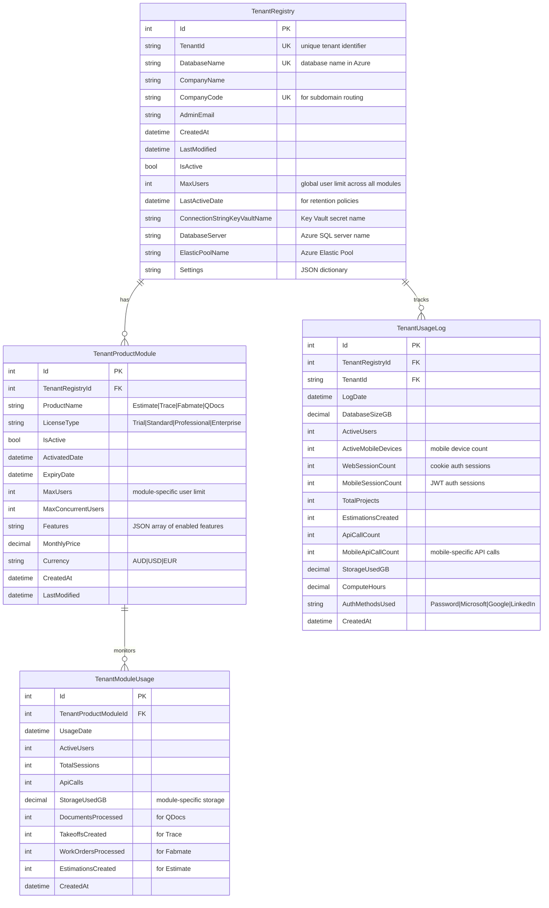

# Enhanced Tenant Registry with Product Module Tracking

## Problem Statement
The current Tenant Registry doesn't track which Fab.OS modules (Estimate, Trace, Fabmate, QDocs) are active for each tenant. This creates operational challenges:
- Cannot provision tenants with specific module access
- Cannot monitor module usage across tenants
- Cannot bill based on active modules
- Dev Portal cannot show module-specific analytics

## Enhanced Tenant Registry ERD



## Implementation Benefits

### 1. **Centralized Module Management**
- Track which modules each tenant has access to
- Enable/disable modules without touching tenant databases
- Module-specific licensing and expiry dates

### 2. **Enhanced Billing Capabilities**
- Bill per module with different pricing tiers
- Track module-specific usage metrics
- Generate invoices based on active modules

### 3. **Improved Dev Portal Analytics**
```sql
-- Example: Module adoption dashboard
SELECT 
    pm.ProductName,
    COUNT(DISTINCT tr.Id) as TotalTenants,
    SUM(CASE WHEN pm.IsActive = 1 THEN 1 ELSE 0 END) as ActiveTenants,
    AVG(mu.ActiveUsers) as AvgUsersPerModule,
    SUM(pm.MonthlyPrice) as MonthlyRevenue
FROM TenantProductModule pm
INNER JOIN TenantRegistry tr ON pm.TenantRegistryId = tr.Id
LEFT JOIN TenantModuleUsage mu ON pm.Id = mu.TenantProductModuleId
WHERE mu.UsageDate >= DATEADD(day, -30, GETUTCDATE())
GROUP BY pm.ProductName
```

### 4. **Tenant Provisioning Enhancement**
```csharp
public class TenantProvisionRequest
{
    public string TenantId { get; set; }
    public string CompanyName { get; set; }
    public string AdminEmail { get; set; }
    // SubscriptionTier removed - using module-specific licensing instead
    
    // NEW: Module configuration
    public List<ModuleConfiguration> Modules { get; set; }
}

public class ModuleConfiguration
{
    public string ProductName { get; set; } // Estimate, Trace, Fabmate, QDocs
    public string LicenseType { get; set; }
    public DateTime ExpiryDate { get; set; }
    public int MaxUsers { get; set; }
    public List<string> Features { get; set; }
    public decimal MonthlyPrice { get; set; }
}
```

## Migration Strategy

### Phase 1: Update Tenant Registry
```sql
-- Add TenantProductModule table to master database
CREATE TABLE TenantProductModule (
    Id INT IDENTITY(1,1) PRIMARY KEY,
    TenantRegistryId INT NOT NULL,
    ProductName NVARCHAR(50) NOT NULL,
    LicenseType NVARCHAR(50) NOT NULL DEFAULT 'Standard',
    IsActive BIT NOT NULL DEFAULT 1,
    ActivatedDate DATETIME2 NOT NULL DEFAULT GETUTCDATE(),
    ExpiryDate DATETIME2 NOT NULL,
    MaxUsers INT NOT NULL DEFAULT 5,
    MaxConcurrentUsers INT NOT NULL DEFAULT 5,
    Features NVARCHAR(MAX), -- JSON
    MonthlyPrice DECIMAL(10,2) NOT NULL DEFAULT 0,
    Currency NVARCHAR(3) NOT NULL DEFAULT 'AUD',
    CreatedAt DATETIME2 NOT NULL DEFAULT GETUTCDATE(),
    LastModified DATETIME2 NOT NULL DEFAULT GETUTCDATE(),
    
    CONSTRAINT FK_TenantProductModule_TenantRegistry 
        FOREIGN KEY (TenantRegistryId) REFERENCES TenantRegistry(Id),
    CONSTRAINT UQ_TenantProductModule_Tenant_Product 
        UNIQUE (TenantRegistryId, ProductName),
    INDEX IX_TenantProductModule_ProductName (ProductName),
    INDEX IX_TenantProductModule_IsActive (IsActive)
);
```

### Phase 2: Sync Existing Data
```sql
-- Populate from existing tenant databases
INSERT INTO TenantProductModule (TenantRegistryId, ProductName, LicenseType, ExpiryDate, MaxUsers)
SELECT 
    tr.Id,
    pl.ProductName,
    pl.LicenseType,
    pl.ValidUntil,
    pl.MaxConcurrentUsers
FROM TenantRegistry tr
CROSS APPLY (
    -- Query each tenant database for their ProductLicenses
    SELECT * FROM [${tr.DatabaseName}].dbo.ProductLicenses
    WHERE IsActive = 1
) pl
```

### Phase 3: Update Dev Portal
- Add module management UI
- Show module-specific metrics
- Enable module activation/deactivation
- Track module-specific billing

## Authentication Integration

Enhanced JWT claims to include module access:
```json
{
  "sub": "user123",
  "email": "john@acme.com",
  "companyId": "42",
  "tenantId": "acme-steel-works",
  "modules": {
    "Estimate": {
      "access": true,
      "role": "Senior Estimator",
      "features": ["time-tracking", "welding-dashboard"],
      "expiryDate": "2025-12-31"
    },
    "Trace": {
      "access": true,
      "role": "Viewer",
      "features": ["basic-takeoff"],
      "expiryDate": "2025-12-31"
    },
    "Fabmate": {
      "access": false
    },
    "QDocs": {
      "access": false
    }
  }
}
```

## Authentication & Mobile Device Support

### Mobile Device Registry
To support the dual authentication architecture (Cookies for web, JWT for mobile), we extend the registry:

```sql
-- Add to Master Registry database
CREATE TABLE MobileDeviceRegistry (
    Id INT IDENTITY(1,1) PRIMARY KEY,
    TenantRegistryId INT NOT NULL,
    UserId INT NOT NULL,
    DeviceId NVARCHAR(100) NOT NULL UNIQUE,
    DeviceName NVARCHAR(100),
    Platform NVARCHAR(20), -- 'Android' | 'iOS'
    AppVersion NVARCHAR(20),
    LastActiveDate DATETIME2,
    IsActive BIT DEFAULT 1,
    IsTrusted BIT DEFAULT 0,
    RefreshToken NVARCHAR(500), -- Encrypted
    RefreshTokenExpiry DATETIME2,
    RegisteredDate DATETIME2 DEFAULT GETUTCDATE(),
    LastModified DATETIME2 DEFAULT GETUTCDATE(),
    
    CONSTRAINT FK_MobileDevice_TenantRegistry 
        FOREIGN KEY (TenantRegistryId) REFERENCES TenantRegistry(Id)
);

-- Track authentication methods per tenant
CREATE TABLE TenantAuthenticationMetrics (
    Id INT IDENTITY(1,1) PRIMARY KEY,
    TenantRegistryId INT NOT NULL,
    MetricDate DATE NOT NULL,
    CookieAuthCount INT DEFAULT 0, -- Web logins
    JWTAuthCount INT DEFAULT 0, -- Mobile logins
    MicrosoftAuthCount INT DEFAULT 0,
    GoogleAuthCount INT DEFAULT 0,
    LinkedInAuthCount INT DEFAULT 0,
    FailedAuthCount INT DEFAULT 0,
    UniqueWebUsers INT DEFAULT 0,
    UniqueMobileUsers INT DEFAULT 0,
    CreatedAt DATETIME2 DEFAULT GETUTCDATE(),
    
    CONSTRAINT FK_AuthMetrics_TenantRegistry 
        FOREIGN KEY (TenantRegistryId) REFERENCES TenantRegistry(Id),
    CONSTRAINT UQ_AuthMetrics_Tenant_Date 
        UNIQUE (TenantRegistryId, MetricDate)
);
```

### JWT Claims for Mobile (Enhanced)
```json
{
  "sub": "user123",
  "email": "john@acme.com",
  "companyId": "42",
  "tenantId": "acme-steel-works",
  "tenantCode": "acme",
  "deviceId": "android-abc123",
  "platform": "Android",
  "authMethod": "Password",
  "modules": {
    "Estimate": {
      "access": true,
      "role": "Senior Estimator",
      "features": ["time-tracking", "welding-dashboard"],
      "expiryDate": "2025-12-31"
    },
    "Trace": {
      "access": true,
      "role": "Viewer",
      "features": ["basic-takeoff"],
      "expiryDate": "2025-12-31"
    }
  },
  "iat": 1640995200,
  "exp": 1641009600,  // 4 hours for mobile
  "iss": "FabOS",
  "aud": "api.fabosplatform.com"
}
```

## Summary

By enhancing the Tenant Registry to track module-level licensing and authentication metrics:
1. **Centralized Control** - Manage module access without touching tenant databases
2. **Better Analytics** - Track module adoption and usage patterns across web and mobile
3. **Flexible Billing** - Bill per module with usage-based pricing
4. **Improved UX** - Show users only the modules they have access to
5. **Easier Provisioning** - Configure module access during tenant creation
6. **Dual Authentication** - Support both cookie-based (web) and JWT-based (mobile) auth
7. **Device Management** - Track and manage mobile devices per tenant
8. **Security Monitoring** - Track authentication patterns and detect anomalies