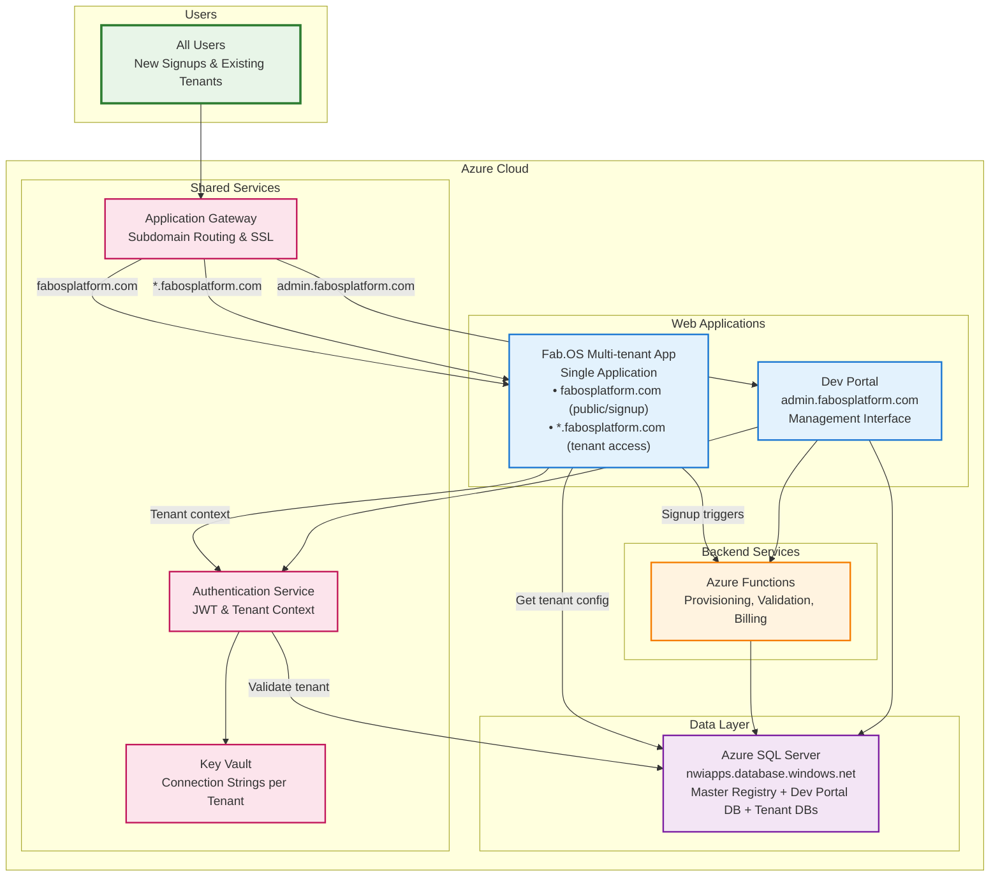

# Fab.OS Platform - High-Level Architecture Overview

## Cloud Infrastructure & Services Diagram

## Platform Components Breakdown

### **Frontend Applications (Azure App Services)**

#### **1. Fab.OS Multi-tenant Application** 
- **URLs**: 
  - `fabosplatform.com` or `www.fabosplatform.com` - Marketing website with signup/login links
  - `fabosplatform.com/signup` - Integrated signup flow
  - `fabosplatform.com/login` - Central login (redirects to tenant)
  - `{tenant-code}.fabosplatform.com` - Direct tenant access (bookmarkable)
- **Technology**: Blazor Server (single codebase)
- **Architecture**: True multi-tenant SaaS application with dual-path workflow
- **Tenant Detection**: Based on subdomain at runtime
- **Core Workflow Paths**:
  - **Simple Quote Path**: Customer Request → Quote (5 min) → Order → Package → Work Orders
  - **Complex Estimation Path**: Customer Request → Estimation → Order → Project → Multiple Packages → Work Orders
- **User Flows**:
  - **New users**: Land on fabosplatform.com → Click signup → Complete registration → Redirect to their new tenant subdomain
  - **Existing users**: Either use fabosplatform.com/login OR directly access bookmarked {tenant}.fabosplatform.com
- **Features**: 
  - **Public routes** (fabosplatform.com/*):
    - Marketing landing page
    - Signup flow with validation
    - Central login portal
    - Module selection during signup
  - **Tenant routes** ({tenant}.fabosplatform.com/*):
    - **Quote System**: Quick pricing for simple jobs (repairs, small projects)
    - **Estimation System**: Detailed multi-package project planning
    - **Order Management**: Commercial tracking from quote/estimation to delivery
    - **Work Order System**: Production floor management and tracking
    - **Module Access**: Estimate, Trace, Fabmate, QDocs modules
    - Tenant-specific database connection
    - Isolated data access
    - Direct bookmarkable access

#### **2. Dev Portal**
- **URL**: `admin.fabosplatform.com` 
- **Technology**: Blazor Server (separate application)
- **Purpose**: Multi-tenant management interface
- **Features**: Tenant monitoring, billing management, support tools

### **Backend Services (Azure Functions)**

#### **1. Tenant Provisioning Service**
- **Trigger**: HTTP from Main Fab.OS App
- **Functions**: Database creation, schema deployment, Key Vault setup
- **Scaling**: Consumption plan for cost efficiency

#### **2. Signup Validation API**
- **Trigger**: HTTP from Main Fab.OS App
- **Functions**: Email/domain conflict detection, suggestion generation
- **Scaling**: Premium plan for low latency

#### **3. Billing & Invoicing Service**
- **Trigger**: Timer (monthly/quarterly)
- **Functions**: Invoice generation, payment processing
- **Scaling**: Consumption plan

#### **4. Metrics Collection Service**
- **Trigger**: Timer (hourly)
- **Functions**: Database metrics, usage analytics
- **Scaling**: Consumption plan

### **Database Layer (Azure SQL)**

#### **Master Registry Database**
- **Server**: `nwiapps.database.windows.net`
- **Name**: `sqldb-fabos-master`
- **Purpose**: Central tenant catalog (Microsoft pattern)
- **Tables**: TenantRegistry, TenantProductModule, TenantModuleUsage

#### **Dev Portal Database**
- **Server**: `nwiapps.database.windows.net`
- **Name**: `sqldb-fabos-devportal`
- **Purpose**: Management data, billing, metrics cache
- **Tables**: BillingAccounts, Invoices, TenantMetricsCache

#### **Tenant Databases**
- **Server**: `nwiapps.database.windows.net`
- **Naming**: `sqldb-tenant-{company-code}`
- **Purpose**: Isolated per-tenant data with complete workflow system
- **Core Workflow Entities**:
  - **Quote System**: Quotes, QuoteLineItems (simple jobs)
  - **Estimation System**: Estimations, EstimationPackages (complex projects)
  - **Order Management**: Orders, OrderLineItems (commercial tracking)
  - **Work Orders**: WorkOrders, WorkOrderOperations, WorkOrderResources
  - **Production**: WorkCenters, Resources, Machines
  - **Quality**: ITP points, inspections, compliance tracking
- **Legacy Entities**: Companies, Users, Projects, Packages (enhanced with workflow integration)
- **Optimization**: Azure Elastic Pool for cost sharing

### **Shared Azure Services**

#### **Application Gateway**
- **Purpose**: SSL termination, routing, WAF protection
- **Routing**: Subdomain-based tenant resolution (*.fabosplatform.com)
- **Features**: Auto-scaling, health probes

#### **Azure Key Vault**
- **Purpose**: Connection string management, secrets storage
- **Integration**: All services retrieve connection strings securely
- **Features**: Access policies, audit logging

#### **Fab.OS Auth Service**
- **Purpose**: Dual authentication strategy for different clients
- **Web Authentication**: Cookie-based for Blazor Server applications
- **Mobile/API Authentication**: JWT tokens with tenant context
- **Features**: Social login (Microsoft, Google, LinkedIn), MFA ready, product licensing validation
- **Architecture**: Unified service with multiple authentication schemes

#### **Azure CDN**
- **Purpose**: Static asset delivery (CSS, JS, images)
- **Integration**: All web applications
- **Features**: Global edge locations, compression

### **Monitoring & Analytics**

#### **Application Insights**
- **Purpose**: Application performance monitoring, telemetry
- **Integration**: All applications and functions
- **Features**: Custom metrics, alerts, dashboards

#### **Log Analytics**
- **Purpose**: Centralized logging and analysis  
- **Integration**: Aggregates from Application Insights
- **Features**: KQL queries, automated alerts

## Key Architecture Benefits

### **Scalability**
- Single multi-tenant app scales horizontally
- Tenant isolation at database level (not app level)
- Subdomain-based tenant resolution
- Azure Functions auto-scale based on demand
- Elastic Pool optimizes database costs
- CDN provides global performance

### **Security**
- Public/private separation (main app vs tenant apps)
- Database-per-tenant complete isolation
- Key Vault for all secrets management
- Application Gateway provides WAF protection
- Dual authentication: Cookies for web (XSS protection), JWT for mobile/API
- Role-based access control with tenant context

### **Cost Optimization**
- **Single App Service** for ALL tenants (massive savings)
- True multi-tenant architecture (not instance-per-tenant)
- Elastic Pool shares database resources
- Azure Functions consumption pricing
- CDN reduces bandwidth costs
- Horizontal scaling only when needed

### **Operational Excellence**
- Single application to deploy and maintain
- Centralized monitoring with Application Insights
- Automated provisioning with Azure Functions
- Dev Portal provides unified management
- Tenant context switching at runtime
- Modern signup experience prevents conflicts

### **Azure Native Integration**
- Follows Microsoft multi-tenant best practices
- Uses Azure SQL, App Services, Functions natively
- Integrated monitoring and logging
- Elastic scaling capabilities

This architecture provides enterprise-grade multi-tenancy while leveraging Azure's platform capabilities for optimal performance, security, and cost efficiency.