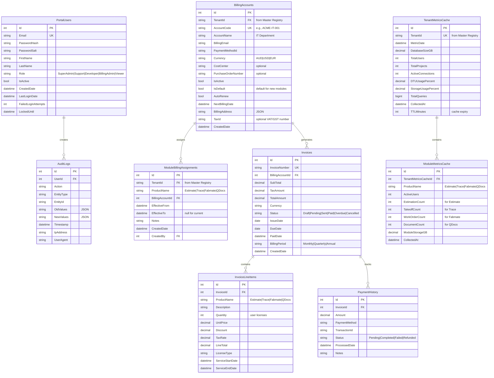

# Fab.OS Multi-Tenant Architecture - Complete ERD Documentation

## Executive Summary

This document presents the complete Entity Relationship Diagrams (ERDs) for the Fab.OS multi-tenant platform architecture. The design implements Microsoft Azure's recommended "Tenant Catalog" pattern with database-per-tenant isolation, providing enterprise-grade scalability, security, and maintainability.

### Key Architecture Decisions
- **Direct Registry Access**: Dev Portal queries Master Tenant Registry directly (no data duplication)
- **Module-Based Licensing**: Granular control over product access (Estimate, Trace, Fabmate, QDocs)
- **Database-Per-Tenant**: Complete data isolation for security and compliance
- **Single Source of Truth**: Master Tenant Registry is the authoritative source for all tenant information

## Table of Contents
1. [Dev Portal Management Database ERD](#1-dev-portal-management-database-erd-direct-registry-access)
2. [Master Tenant Registry ERD](#2-master-tenant-registry-erd-enhanced-with-module-tracking)
3. [Individual Tenant Database ERD](#3-individual-tenant-database-erd-per-tenant-schema)
4. [Complete Multi-Tenant Architecture Overview](#4-complete-multi-tenant-architecture-overview-direct-registry-access)
5. [Multi-Tenant Authentication & Authorization Flow](#5-multi-tenant-authentication--authorization-flow)
6. [Microsoft Azure Best Practices Alignment](#6-microsoft-azure-best-practices-alignment)
7. [Implementation Guidelines](#7-implementation-guidelines)

## 1. Dev Portal Management Database ERD (Direct Registry Access)

The Dev Portal serves as the central management interface, implementing the "Direct Registry Access" pattern for real-time tenant information.



### Direct Access Architecture with Enhanced Billing


## 2. Master Tenant Registry ERD (Enhanced with Module Tracking)

The Master Tenant Registry implements Microsoft's "Tenant Catalog" pattern, serving as the single source of truth for all tenant information.


## 3. Individual Tenant Database ERD (Per-Tenant Schema)

Each tenant receives a complete, isolated database with full business logic and data structures.


## 4. Complete Multi-Tenant Architecture Overview (Direct Registry Access)

```mermaid
graph TB
    subgraph "Azure Cloud Infrastructure"
        subgraph "Application Layer"
            FabOS[Fab.OS Multi-tenant App<br/>Single Blazor Server Application<br/>• fabosplatform.com (marketing/signup/login)<br/>• {tenant}.fabosplatform.com (direct tenant access)]  
            DevPortal[Dev Portal Web App<br/>admin.fabosplatform.com<br/>- Tenant Management<br/>- Billing & Analytics<br/>- Support Interface]
            DevPortalDB[(Dev Portal Database<br/>sqldb-fabos-devportal<br/>Billing & Metrics Cache Only)]
            
            DevPortal -.-> DevPortalDB
        end
        
        subgraph "Tenant Registry Layer"
            MasterDB[(Master Database<br/>- TenantRegistry<br/>- TenantProductModule<br/>- TenantModuleUsage)]
            KeyVault[Azure Key Vault<br/>Connection Strings per Tenant]
            
            FabOS ==>|Validate Signup & Get Tenant Config| MasterDB
            DevPortal ==>|Direct Query| MasterDB
            FabOS -.-> KeyVault
            DevPortal -.-> KeyVault
        end
        
        subgraph "Tenant Provisioning"
            ProvisioningFunc[Azure Functions<br/>- Tenant Provisioning<br/>- Database Creation<br/>- Schema Deployment]
            AzureSQL[Azure SQL Server<br/>nwiapps.database.windows.net]
            
            ProvisioningFunc -.-> AzureSQL
            ProvisioningFunc -.-> KeyVault
            ProvisioningFunc -.-> MasterDB
        end
        
        subgraph "Tenant Databases (Isolated)"
            TenantA_DB[(Tenant A Database<br/>sqldb-tenant-acme<br/>ACME Steel Works)]
            TenantB_DB[(Tenant B Database<br/>sqldb-tenant-steelco<br/>SteelCo Industries)]
            TenantC_DB[(Tenant C Database<br/>sqldb-tenant-metalworks<br/>MetalWorks Ltd)]
        end
        
        subgraph "Shared Services"
            FabOSAuth[Fab.OS Auth Service<br/>- JWT with Tenant Context<br/>- Product Licensing<br/>- Social Login]
            AppGateway[Application Gateway<br/>- Subdomain Routing<br/>- SSL Termination<br/>- WAF]
            CDN[Azure CDN<br/>Static Assets]
        end
    end
    
    subgraph "External Users"
        NewUser[New Users<br/>Via marketing site]
        AdminUser[Support Admin<br/>DevPortal Access]
        ExistingUser[Existing Users<br/>Direct bookmark or login]
    end
    
    %% User Access Flows
    NewUser -->|"fabosplatform.com"| AppGateway
    ExistingUser -->|"Bookmark: acme.fabosplatform.com"| AppGateway
    ExistingUser -->|"Or: fabosplatform.com/login"| AppGateway
    AdminUser -->|"admin.fabosplatform.com"| AppGateway
    
    %% Gateway Routing based on subdomain
    AppGateway -->|"fabosplatform.com/*"| FabOS
    AppGateway -->|"{tenant}.fabosplatform.com"| FabOS
    AppGateway -->|"admin.fabosplatform.com"| DevPortal
    
    %% Tenant Context Flow
    FabOS -->|"Subdomain: acme"| TenantA_DB
    FabOS -->|"Subdomain: steelco"| TenantB_DB
    FabOS -->|"Subdomain: metalworks"| TenantC_DB
    
    %% Signup and Provisioning Flow
    FabOS -->|"Trigger Provisioning"| ProvisioningFunc
    
    %% Authentication Flow
    FabOS -.->|"Get tenant context"| FabOSAuth
    FabOSAuth -.->|"Validate against tenant DB"| TenantA_DB
    FabOSAuth -.->|"Validate against tenant DB"| TenantB_DB
    FabOSAuth -.->|"Validate against tenant DB"| TenantC_DB
    
    %% Direct Registry Access
    DevPortal ==>|"Query all tenants"| MasterDB
    FabOS ==>|"Update tenant status"| MasterDB
    
    %% Monitoring Flow
    DevPortal -.->|"Metrics Collection"| TenantA_DB
    DevPortal -.->|"Metrics Collection"| TenantB_DB
    DevPortal -.->|"Metrics Collection"| TenantC_DB
    
    %% Data Isolation Boundaries
    classDef multiTenantApp fill:#ffeb3b,stroke:#f57f17,stroke-width:3px
    classDef tenantDB fill:#e1f5fe,stroke:#01579b,stroke-width:3px
    classDef managementLayer fill:#f3e5f5,stroke:#4a148c,stroke-width:2px
    classDef sharedService fill:#e8f5e8,stroke:#1b5e20,stroke-width:2px
    classDef directAccess stroke:#ff6b6b,stroke-width:4px,stroke-dasharray: 5 5
    classDef user fill:#fff3e0,stroke:#ff6f00,stroke-width:2px
    
    class FabOS multiTenantApp
    class TenantA_DB,TenantB_DB,TenantC_DB tenantDB
    class DevPortal,DevPortalDB managementLayer
    class MasterDB directAccess,managementLayer
    class FabOSAuth,AppGateway,CDN sharedService
    class NewUser,AdminUser,TenantUsers user
```

### Key Architecture Changes

1. **Single Multi-tenant Application**: One Fab.OS app serves ALL tenants based on subdomain
2. **Subdomain-based Routing**: Runtime tenant detection (fab-os.com vs {tenant}.fab-os.com)
3. **Direct Registry Access**: Both Fab.OS app and Dev Portal query Master Registry directly
4. **No Duplicate Data**: Dev Portal only stores billing data and metrics cache
5. **Dynamic Database Connection**: Connection string resolved per request based on subdomain
6. **Enhanced Billing**: Multiple billing accounts per tenant with module-level assignment
7. **True SaaS Architecture**: Massive cost savings with single application deployment

## 5. Multi-Tenant Authentication & Authorization Flow


## Authentication Architecture

### Dual Authentication Strategy

The platform implements a dual authentication strategy optimized for different client types:

#### **Cookie Authentication (Blazor Web Apps)**
- Used for: Fab.OS main app, Dev Portal, all web interfaces
- Benefits: Stateful, sliding expiration, XSS protection via httpOnly
- Session: 8-hour timeout with sliding window
- Perfect for SignalR/Blazor Server connections

#### **JWT Authentication (Mobile & API)**
- Used for: Android/iOS apps, external API integrations
- Benefits: Stateless, offline support, standard mobile pattern
- Token lifetime: 4 hours with refresh token support
- Contains tenant context and module permissions

### JWT Token Structure (Mobile/API Only)

```json
{
  "sub": "user123",
  "email": "john@acme.com",
  "companyId": "42",
  "tenantId": "acme-steel-works",
  "tenantCode": "acme",
  "products": [
    {
      "name": "Estimate",
      "role": "Senior Estimator",
      "features": ["time-tracking", "welding-dashboard"]
    },
    {
      "name": "Trace", 
      "role": "Viewer",
      "features": ["basic-tracking"]
    }
  ],
  "roles": ["Senior Estimator"],
  "deviceId": "android-device-123",  // For mobile tracking
  "iat": 1640995200,
  "exp": 1641009600,  // 4 hours for mobile
  "iss": "FabOS",
  "aud": "api.fabosplatform.com"
}
```

## 6. Microsoft Azure Best Practices Alignment

Our architecture aligns with Microsoft's documented best practices for multi-tenant SaaS applications:

### Tenant Catalog Pattern ✅
Microsoft recommends: *"The catalog is a database that maintains the mapping between tenants and their data"*
- Our **Master Tenant Registry** implements this pattern
- Direct queries avoid data corruption risks
- Single source of truth for tenant information

### Database-Per-Tenant Isolation ✅
Microsoft states: *"Provides strong tenant isolation... easier to customize schema for individual tenants"*
- Complete data isolation per tenant
- Simplified compliance and security
- Per-tenant backup and restore capabilities

### Elastic Pool Support ✅
Microsoft guidance: *"Elastic pools enable you to share compute resources between multiple databases"*
- `ElasticPoolName` field in registry
- Cost optimization for small tenants
- Resource sharing with isolation

### Module-Based Licensing ✅
Implements Microsoft's "Hybrid approach" allowing:
- Flexible pricing per module
- Gradual feature rollout
- Per-tenant customization

### Security Best Practices ✅
- Row-level security within tenant databases
- Key Vault for connection string management
- Read-only access for monitoring
- Comprehensive audit logging

## 7. Implementation Guidelines

### Phase 1: Core Infrastructure
1. Deploy Master Tenant Registry database
2. Implement TenantRegistry and TenantProductModule tables
3. Set up Azure Key Vault integration
4. Configure cross-database access permissions
5. **Implement Signup Validation Service** for modern conflict detection

### Phase 2: Platform Development
1. Build Main Fab.OS App with landing page at fab-os.com
2. Implement integrated signup flow with validation
3. Remove MonitoredDatabases table from Dev Portal
4. Implement TenantRegistryService for direct queries
5. Add caching layer for performance

### Phase 3: Tenant Provisioning
1. Build Azure Functions for automated provisioning
2. Implement database creation templates
3. Automate schema deployment
4. Create tenant onboarding workflows

### Phase 4: Module Management
1. Implement module activation/deactivation
2. Build usage tracking per module
3. Create billing integration with multiple accounts
4. Add module-specific analytics
5. Implement module-to-billing-account assignment
6. Build billing account management UI

### Key Implementation Notes

#### Direct Registry Access Benefits
- **Real-time data**: Always current tenant information
- **No sync issues**: Eliminates data duplication problems
- **Simplified architecture**: Fewer moving parts
- **Better performance**: Targeted queries with caching

#### Caching Strategy
- Cache expensive metrics (database size, user counts)
- Short TTL (60 minutes) for freshness
- Cache invalidation on tenant updates
- Separate cache per metric type

#### Security Considerations
- Dev Portal uses read-only access to tenant databases
- All updates go through proper APIs
- Connection strings stored in Key Vault
- Tenant isolation enforced at database level

## Summary

This architecture provides a robust, scalable foundation for the Fab.OS multi-tenant platform:

### Key Benefits
1. **Complete Isolation**: Database-per-tenant ensures data security
2. **Flexible Licensing**: Module-based approach supports various business models
3. **Enterprise Billing**: Multiple billing accounts with module-level assignment
4. **Modern Signup Experience**: Prevents duplicates with user-friendly conflict resolution
5. **Operational Excellence**: Centralized management with distributed execution
6. **Azure Alignment**: Follows Microsoft's documented best practices
7. **Future-Proof**: Supports growth from tens to thousands of tenants
8. **Department Control**: Different departments can manage their own module costs

### Architecture Principles
- **Single Source of Truth**: Master Tenant Registry enables real-time validation
- **Direct Access**: No data duplication between systems
- **Module Granularity**: Fine-grained control over features
- **Cache for Performance**: Strategic caching of expensive operations
- **Security by Design**: Multiple layers of isolation and access control
- **Modern UX**: Email/domain conflict detection with clear resolution paths

### Signup Validation Integration
The Master Tenant Registry's unique constraints naturally support:
- **Email conflict detection**: Query `AdminEmail` field
- **Domain analysis**: Pattern matching on email domains  
- **Company code validation**: Check `CompanyCode` uniqueness
- **Real-time suggestions**: Generate alternatives for taken codes

### True Multi-tenant SaaS Architecture
The single Fab.OS application provides:
- **Marketing website** (fabosplatform.com): Landing page with signup/login links
- **Integrated signup** (fabosplatform.com/signup): Full validation and provisioning
- **Dual login options**:
  - Central login (fabosplatform.com/login) - identifies tenant and redirects
  - Direct tenant login ({tenant}.fabosplatform.com) - bookmarkable for regular users
- **Subdomain-based tenant detection**: Runtime resolution of tenant context
- **Dynamic database switching**: Connection resolved per request based on subdomain
- **Massive cost savings**: One application serves unlimited tenants
- **Simplified operations**: Single deployment, update, and monitoring

### User Experience Flows
1. **New Users**: Marketing site → Signup → Provision → Redirect to tenant
2. **Existing Users (Bookmark)**: Direct to acme.fabosplatform.com → Tenant login
3. **Existing Users (Central)**: fabosplatform.com/login → Identify tenant → Redirect

The architecture implements a true multi-tenant SaaS pattern with flexible access patterns, supporting unlimited growth while maintaining operational simplicity, security, and cost efficiency.