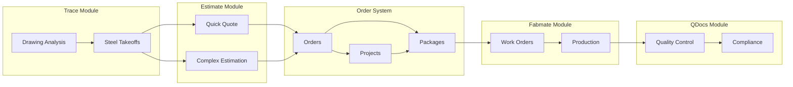

# Fab.OS Platform - Updated Module Definitions
## Workflow-Based Module Architecture

### Version: 2.0
### Date: September 2025
### Status: Implementation Ready

---

## **🎯 Module Overview with Dual-Path Workflow**

The Fab.OS platform implements a **dual-path workflow system** that efficiently handles both simple repairs and complex projects through four integrated modules.

### **Core Workflow Paths**

#### **Simple Path**: `Customer Request → Quote → Order → Package → Work Orders`
**For**: Repairs, small jobs, quick turnarounds (5-10 minutes)

#### **Complex Path**: `Customer Request → Estimation → Order → Project → Multiple Packages → Work Orders`
**For**: Large projects, detailed planning, multiple phases

---

## **📋 Module 1: Estimate Module**
**Dual-Path Quoting & Estimation System**

### **1a. Quick Quote System**
**Purpose**: Rapid pricing for simple jobs and repairs
**Target Users**: Sales, Project Managers, Customer Service

**Core Features**:
- **5-Minute Quote Creation**: Streamlined interface for simple jobs
- **Single Package Focus**: No complex breakdown required
- **Template-Based Pricing**: Pre-configured rates and markups
- **Direct Line Items**: Materials + Labor + Overhead = Total
- **Instant Approval Workflow**: Quote → Order → Production
- **Mobile-Friendly**: Tablet/phone accessible for field quotes

**Entity Structure**:
```csharp
Quote → QuoteLineItems → Order → Package → WorkOrders
```

### **1b. Complex Estimation System**
**Purpose**: Detailed project planning and multi-package costing
**Target Users**: Senior Estimators, Project Managers, Engineers

**Core Features**:
- **Multi-Package Planning**: Break large projects into deliverable phases
- **Detailed Cost Breakdown**: Material, labor, overhead, margin analysis
- **Resource Planning**: Capacity and timeline considerations
- **Revision Management**: Track estimation changes and alternatives
- **What-If Scenarios**: Multiple pricing options and alternatives
- **Integration with Trace**: Import takeoff data for accurate quantities

**Entity Structure**:
```csharp
Estimation → EstimationPackages → Order → Project → Packages → WorkOrders
```

**Database Integration**:
```sql
-- New entities for workflow
Quotes, QuoteLineItems, Estimations, EstimationPackages, Orders

-- Enhanced existing entities  
Projects (linked to Orders), Packages (enhanced with Order relationships)
```

---

## **📐 Module 2: Trace Module** 
**Drawing Analysis, Measurement & Steel Takeoffs**

**Purpose**: Automated CAD analysis and comprehensive steel takeoffs that feed the Estimate Module
**Target Users**: Draftspeople, Estimators, Engineers, Detailers

**Core Features**:
- **Drawing Upload & Management**: Multi-format CAD support (DWG, PDF, DXF)
- **Scale Calibration**: Accurate measurement setup from scaled drawings
- **Digital Measurement Tools**: Rulers, area calculation, angle measurement
- **Automated Beam Detection**: AI-powered steel member identification
- **Comprehensive Takeoffs**: Quantity extraction with specifications
- **Material Lists**: Automated BOM generation for estimation
- **Integration Export**: Direct feed to Quote/Estimation systems
- **Drawing Markup**: Annotation and revision tracking

**Workflow Integration**:
```
Drawing Upload → Analysis → Takeoffs → Export to Estimate Module
├── Simple Jobs: Takeoff → Quick Quote
└── Complex Projects: Takeoff → Estimation Package
```

**Database Integration**:
```sql
TraceDrawings, TraceMeasurements, TraceBeamDetections, TraceTakeoffItems
-- Links to Quote/Estimation systems for quantity import
```

---

## **🏭 Module 3: Fabmate Module**
**Manufacturing Planning & Production Management**

**Purpose**: Shop floor management receiving work from approved Orders
**Target Users**: Production Managers, Machine Operators, Schedulers

**Core Features**:
- **Work Order Generation**: From approved Orders/Packages
- **Resource Management**: People, machines, work centers
- **Production Scheduling**: Job sequencing and capacity planning
- **Shop Floor Tracking**: Real-time progress and efficiency
- **Quality Integration**: Built-in ITP (Inspection Test Points)
- **Machine Management**: Equipment efficiency and maintenance

**Workflow Integration**:
```
Approved Order → Package → Work Order Creation → Production Planning
├── Work Center Assignment
├── Resource Allocation  
├── Operation Sequencing
└── Quality Control Points
```

**Database Integration**:
```sql
-- Enhanced workflow entities
WorkOrders, WorkOrderOperations, WorkOrderResources
WorkCenters, Resources, MachineAssignments

-- Existing entities (enhanced)
MachineCenters, WorkCenters (linked to workflow)
```

---

## **📋 Module 4: QDocs Module**
**Quality Documentation & Compliance System**

**Purpose**: Quality control integrated throughout the workflow process
**Target Users**: Quality Inspectors, Compliance Officers, Project Managers

**Core Features**:
- **ITP Integration**: Inspection points automatically triggered by work orders
- **Welding Documentation**: Connection specs and inspection records
- **Compliance Tracking**: Industry standards (AWS, AISC, AS5131)
- **Material Certification**: Traceability and mill test certificates
- **Non-Conformance Management**: Issue tracking and resolution
- **Audit Trail**: Complete documentation history

**Workflow Integration**:
```
Work Order Operations → ITP Points → Quality Inspections → Compliance Records
├── Automatic triggers from production
├── Hold points for critical operations
└── Final inspection before delivery
```

**Database Integration**:
```sql
-- New quality entities
PackageITP, ITPPoints, QualityInspections, ComplianceRecords

-- Enhanced existing
WeldingConnections (linked to quality workflow)
```

---

## **🔗 Module Integration Architecture**

### **Complete Workflow Integration**:


### **Data Flow Summary**:
1. **Trace** provides quantities to **Estimate**
2. **Estimate** creates Quotes/Estimations that become **Orders**
3. **Orders** contain Packages that generate **Work Orders**
4. **Fabmate** manages Work Order execution
5. **QDocs** provides quality control throughout

---

## **💰 Module Licensing Model**

### **Starter** - Quick Quote Focus
- **Estimate Module**: Quote system only
- **Basic workflow**: Quote → Order → Package
- **3 users, 10 active orders**

### **Professional** - Full Estimation + Takeoffs
- **Estimate Module**: Quote + Estimation systems
- **Trace Module**: Full drawing analysis and takeoffs
- **Enhanced workflow**: Complete dual-path system
- **10 users, unlimited orders**

### **Enterprise** - Complete Production Management
- **All Modules**: Estimate + Trace + Fabmate + QDocs
- **Full workflow**: Quote/Estimation → Order → Work Orders → Quality
- **Unlimited users, advanced analytics**

### **Custom** - Department-Specific
- **Pick Individual Modules** based on departmental needs
- **Department-specific billing** through enhanced billing system

---

## **🚀 Implementation Impact**

### **Benefits of Workflow-Based Architecture**:
1. **Efficiency**: Simple jobs complete in minutes vs hours
2. **Scalability**: Same system handles $500 repairs and $5M projects  
3. **Integration**: Seamless data flow between modules
4. **Quality**: Built-in compliance and traceability
5. **Flexibility**: Customers pay only for modules they use

### **Migration Strategy**:
1. **Phase 1**: Add workflow entities (Quote, Estimation, Order, WorkOrder)
2. **Phase 2**: Enhance existing entities with workflow relationships
3. **Phase 3**: Build module-specific UI around workflow
4. **Phase 4**: Implement cross-module integration and licensing

This updated architecture positions Fab.OS as a true workflow-based platform rather than just a collection of estimation tools.
